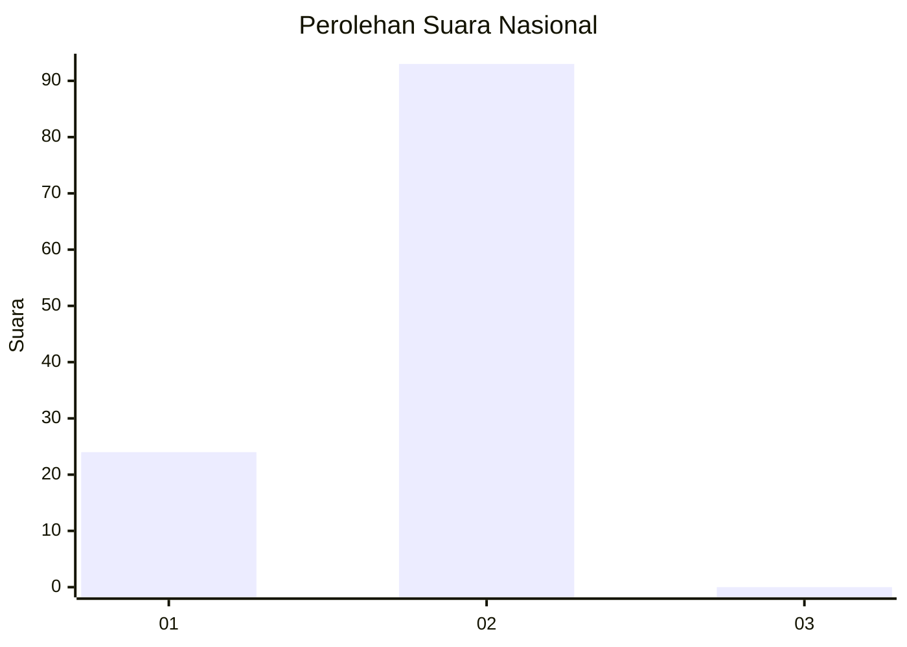
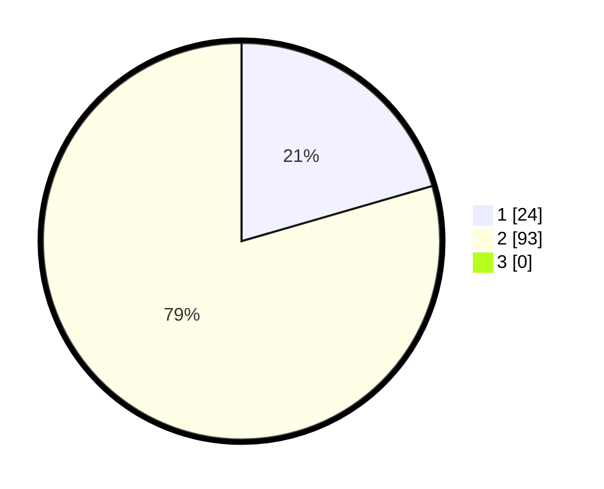

# Hasil

## Grafik

## Tabel

| No.    | Nama Paslon    | Suara | Suara (raw) | Persentase |
|:------ |:-------------- | -----:| -----------:| ----------:|
| 100025 | ANIES MUHAIMIN | 24    | [24][p-1]   | 20,51      |
| 100026 | PRABOWO GIBRAN | 93    | [93][p-2]   | 79,49      |
| 100027 | GANJAR MAHFUD  | 0     | [0][p-3]    | 0,00       |

[p-1]: https://github.com/gigit-pemilu/pemilu-2024/blob/main/pilpres/hitung-suara/sub/31-dki-jakarta/sub/72-jakarta-utara/sub/02-tanjung-priok/sub/1005-kebon-bawang/sub/003-tps/sub/paslon-1.txt
[p-2]: https://github.com/gigit-pemilu/pemilu-2024/blob/main/pilpres/hitung-suara/sub/31-dki-jakarta/sub/72-jakarta-utara/sub/02-tanjung-priok/sub/1005-kebon-bawang/sub/003-tps/sub/paslon-2.txt
[p-3]: https://github.com/gigit-pemilu/pemilu-2024/blob/main/pilpres/hitung-suara/sub/31-dki-jakarta/sub/72-jakarta-utara/sub/02-tanjung-priok/sub/1005-kebon-bawang/sub/003-tps/sub/paslon-3.txt

## Foto C Plano

https://sirekap-obj-formc.kpu.go.id/20c9/pemilu/ppwp/31/72/02/10/05/3172021005003-20240214-222139--859d90e2-4d17-46e6-a6ea-c648121cf66f.jpg

https://sirekap-obj-formc.kpu.go.id/20c9/pemilu/ppwp/31/72/02/10/05/3172021005003-20240214-223211--5bed990f-2858-4841-aa1b-b01804081343.jpg

https://sirekap-obj-formc.kpu.go.id/20c9/pemilu/ppwp/31/72/02/10/05/3172021005003-20240214-223233--a31cf242-badb-4771-94d4-dbee04ff6c63.jpg

## Metadata

| Key        | Value               |
| ---------- | ------------------- |
| Time Stamp | 2024-02-21 16:00:00 |

