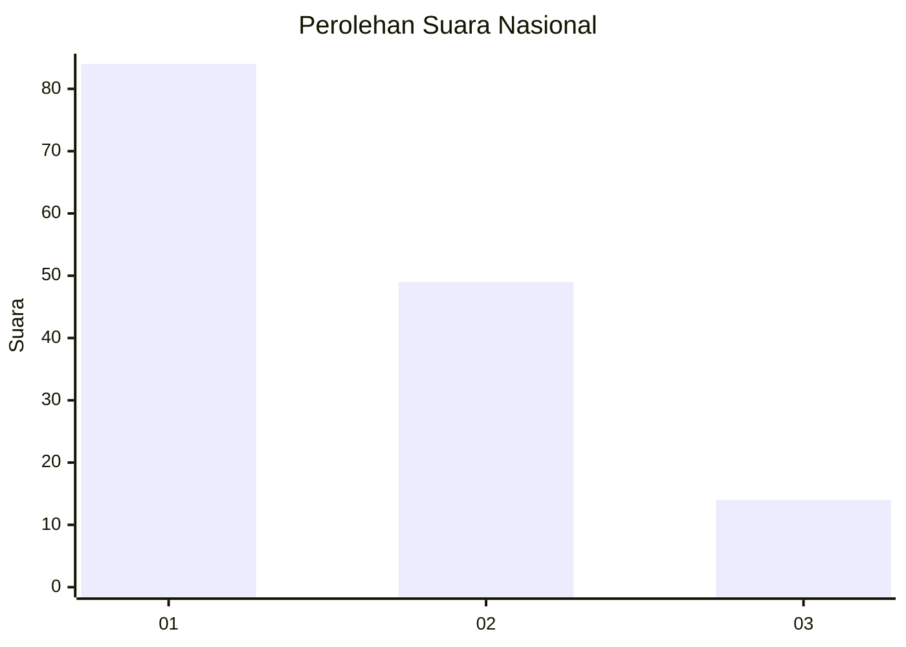
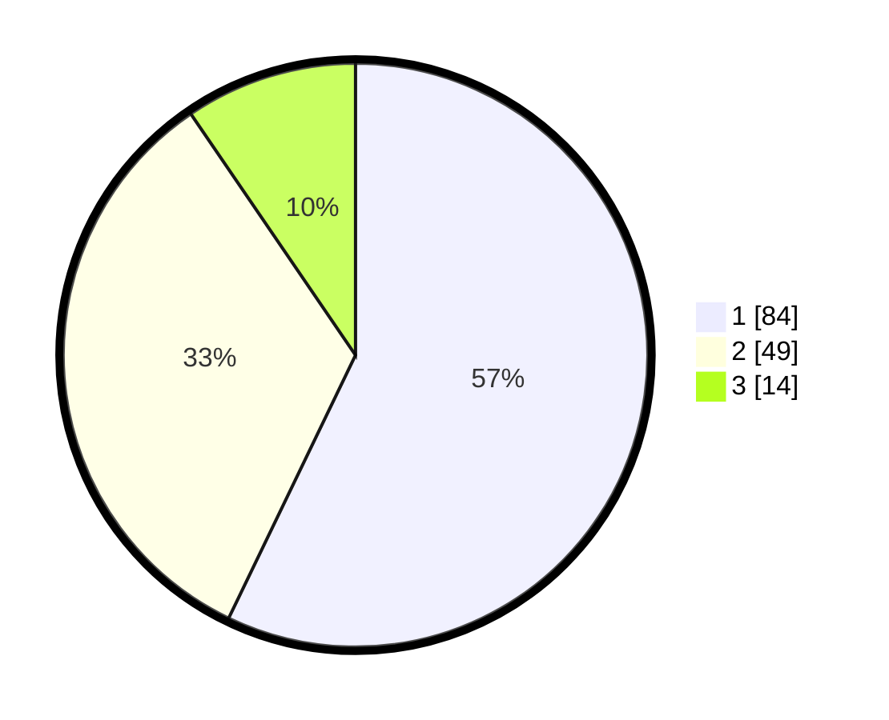

# Hasil

## Grafik

## Tabel

| No.    | Nama Paslon    | Suara | Suara (raw) | Persentase |
|:------ |:-------------- | -----:| -----------:| ----------:|
| 100025 | ANIES MUHAIMIN | 84    | [84][p-1]   | 57,14      |
| 100026 | PRABOWO GIBRAN | 49    | [49][p-2]   | 33,33      |
| 100027 | GANJAR MAHFUD  | 14    | [14][p-3]   | 9,52       |

[p-1]: https://github.com/gigit-pemilu/pemilu-2024/blob/main/pilpres/hitung-suara/sub/31-dki-jakarta/sub/72-jakarta-utara/sub/02-tanjung-priok/sub/1005-kebon-bawang/sub/021-tps/sub/paslon-1.txt
[p-2]: https://github.com/gigit-pemilu/pemilu-2024/blob/main/pilpres/hitung-suara/sub/31-dki-jakarta/sub/72-jakarta-utara/sub/02-tanjung-priok/sub/1005-kebon-bawang/sub/021-tps/sub/paslon-2.txt
[p-3]: https://github.com/gigit-pemilu/pemilu-2024/blob/main/pilpres/hitung-suara/sub/31-dki-jakarta/sub/72-jakarta-utara/sub/02-tanjung-priok/sub/1005-kebon-bawang/sub/021-tps/sub/paslon-3.txt

## Foto C Plano

https://sirekap-obj-formc.kpu.go.id/1b75/pemilu/ppwp/31/72/02/10/05/3172021005021-20240215-014310--385be7df-b815-4a8e-9f27-d25b5aed56fe.jpg

https://sirekap-obj-formc.kpu.go.id/1b75/pemilu/ppwp/31/72/02/10/05/3172021005021-20240215-002905--b5ce6a71-e4fa-4682-8494-ad2c6a2b6c87.jpg

https://sirekap-obj-formc.kpu.go.id/1b75/pemilu/ppwp/31/72/02/10/05/3172021005021-20240215-014342--728c9e5a-a24a-49d8-8c1d-97a589802eab.jpg

## Metadata

| Key        | Value               |
| ---------- | ------------------- |
| Time Stamp | 2024-02-16 11:00:29 |

## DATA PEMILIH TETAP

Jumlah pemilih dalam DPT: **220**.
 * L: **20**.
 * P: **0**.

## DATA PENGGUNA HAK PILIH

Jumlah pengguna hak pilih dalam DPT: **642**.
 * L: **832**.
 * P: **870**.

Jumlah pengguna hak pilih dalam DPTb: **888**.
 * L: **883**.
 * P: **848**.

Jumlah pengguna hak pilih dalam DPK: **888**.
 * L: **478**.
 * P: **885**.

Jumlah pengguna hak pilih: **450**.
 * L: **880**.
 * P: **298**.

## JUMLAH SUARA SAH DAN TIDAK SAH

JUMLAH SELURUH SUARA SAH: **147**.

JUMLAH SUARA TIDAK SAH: **3**.

JUMLAH SELURUH SUARA SAH DAN SUARA TIDAK SAH: **150**.

