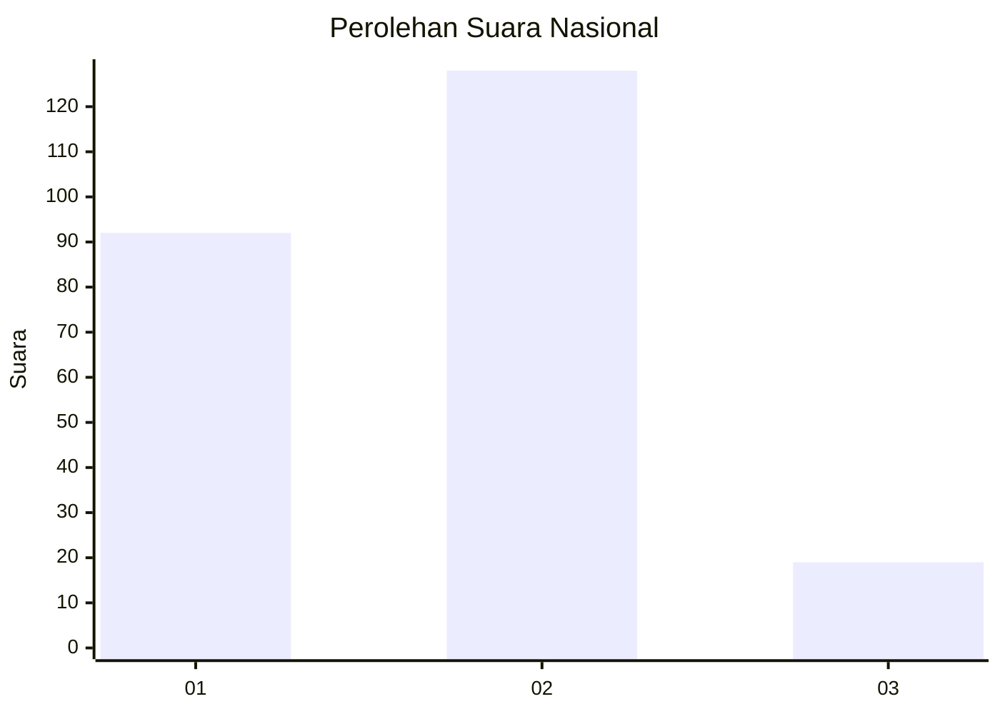
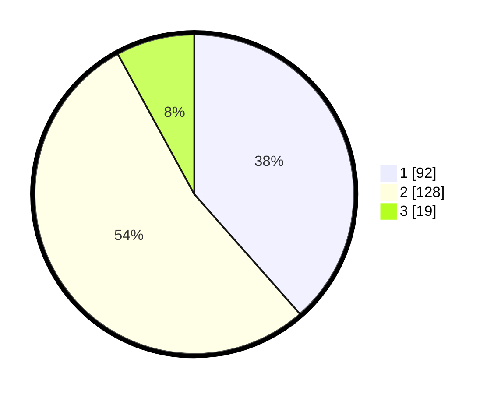

# Hasil

## Grafik

## Tabel

| No.    | Nama Paslon    | Suara | Suara (raw) | Persentase |
|:------ |:-------------- | -----:| -----------:| ----------:|
| 100025 | ANIES MUHAIMIN | 92    | [92][p-1]   | 38,49      |
| 100026 | PRABOWO GIBRAN | 128   | [128][p-2]  | 53,56      |
| 100027 | GANJAR MAHFUD  | 19    | [19][p-3]   | 7,95       |

[p-1]: https://github.com/gigit-pemilu/pemilu-2024/blob/main/pilpres/hitung-suara/sub/31-dki-jakarta/sub/72-jakarta-utara/sub/02-tanjung-priok/sub/1005-kebon-bawang/sub/069-tps/sub/paslon-1.txt
[p-2]: https://github.com/gigit-pemilu/pemilu-2024/blob/main/pilpres/hitung-suara/sub/31-dki-jakarta/sub/72-jakarta-utara/sub/02-tanjung-priok/sub/1005-kebon-bawang/sub/069-tps/sub/paslon-2.txt
[p-3]: https://github.com/gigit-pemilu/pemilu-2024/blob/main/pilpres/hitung-suara/sub/31-dki-jakarta/sub/72-jakarta-utara/sub/02-tanjung-priok/sub/1005-kebon-bawang/sub/069-tps/sub/paslon-3.txt

## Foto C Plano

https://sirekap-obj-formc.kpu.go.id/a15e/pemilu/ppwp/31/72/02/10/05/3172021005069-20240214-194606--53c5b957-82d3-4b78-9d73-4b41df5e8970.jpg

https://sirekap-obj-formc.kpu.go.id/a15e/pemilu/ppwp/31/72/02/10/05/3172021005069-20240214-192247--a1038c96-f906-4d06-891d-e79a9c68118b.jpg

https://sirekap-obj-formc.kpu.go.id/a15e/pemilu/ppwp/31/72/02/10/05/3172021005069-20240214-192345--4ff43fd5-da49-41f4-b6d6-a7c6f6f64fb5.jpg

## Metadata

| Key        | Value               |
| ---------- | ------------------- |
| Time Stamp | 2024-02-21 16:00:00 |

