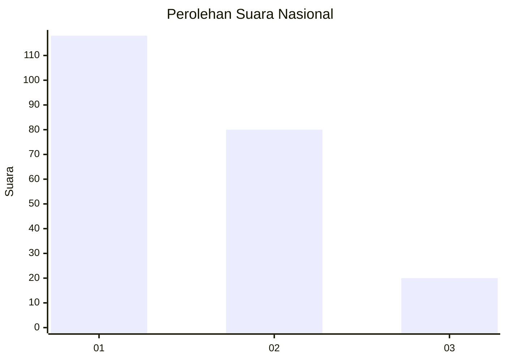
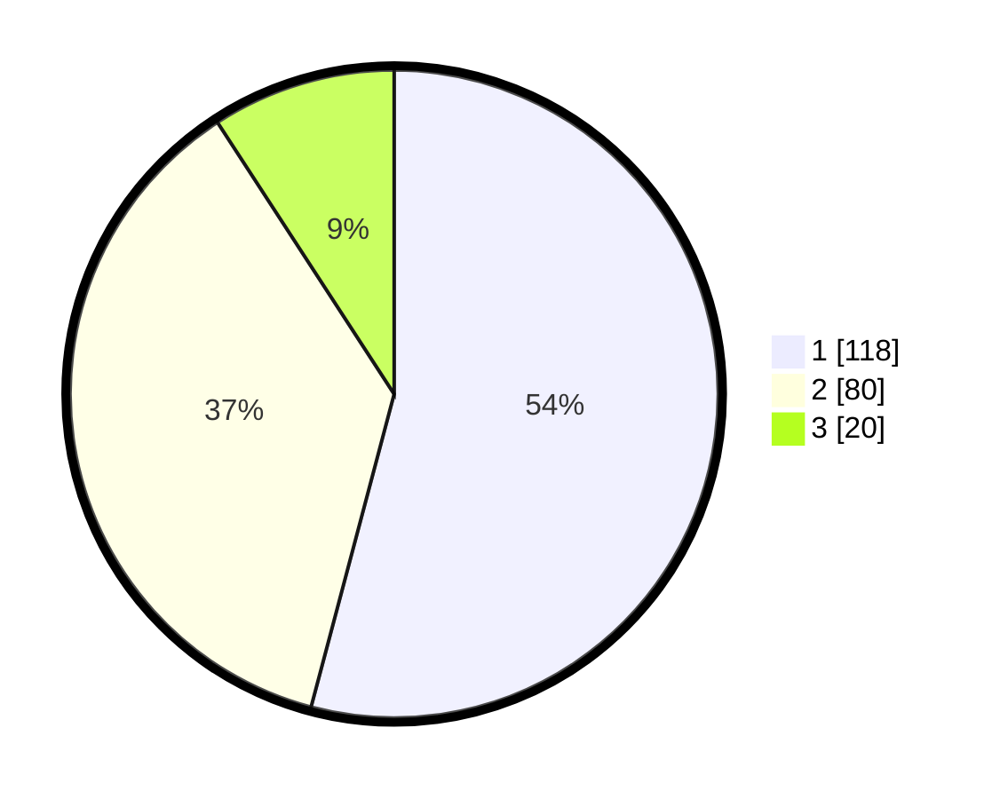

# Hasil

## Grafik

## Tabel

| No.    | Nama Paslon    | Suara | Suara (raw) | Persentase |
|:------ |:-------------- | -----:| -----------:| ----------:|
| 100025 | ANIES MUHAIMIN | 118   | [118][p-1]  | 54,13      |
| 100026 | PRABOWO GIBRAN | 80    | [80][p-2]   | 36,70      |
| 100027 | GANJAR MAHFUD  | 20    | [20][p-3]   | 9,17       |

[p-1]: https://github.com/gigit-pemilu/pemilu-2024/blob/main/pilpres/hitung-suara/sub/31-dki-jakarta/sub/72-jakarta-utara/sub/02-tanjung-priok/sub/1005-kebon-bawang/sub/098-tps/sub/paslon-1.txt
[p-2]: https://github.com/gigit-pemilu/pemilu-2024/blob/main/pilpres/hitung-suara/sub/31-dki-jakarta/sub/72-jakarta-utara/sub/02-tanjung-priok/sub/1005-kebon-bawang/sub/098-tps/sub/paslon-2.txt
[p-3]: https://github.com/gigit-pemilu/pemilu-2024/blob/main/pilpres/hitung-suara/sub/31-dki-jakarta/sub/72-jakarta-utara/sub/02-tanjung-priok/sub/1005-kebon-bawang/sub/098-tps/sub/paslon-3.txt

## Foto C Plano

https://sirekap-obj-formc.kpu.go.id/fe03/pemilu/ppwp/31/72/02/10/05/3172021005098-20240214-231042--4625e475-69a0-4f85-899d-6d517f383069.jpg

https://sirekap-obj-formc.kpu.go.id/fe03/pemilu/ppwp/31/72/02/10/05/3172021005098-20240214-231228--f41e9dc1-4cce-4984-8ae4-268123471575.jpg

https://sirekap-obj-formc.kpu.go.id/fe03/pemilu/ppwp/31/72/02/10/05/3172021005098-20240214-231310--6f5cd49c-36d8-421f-810d-864019299391.jpg

## Metadata

| Key        | Value               |
| ---------- | ------------------- |
| Time Stamp | 2024-02-21 14:00:00 |

