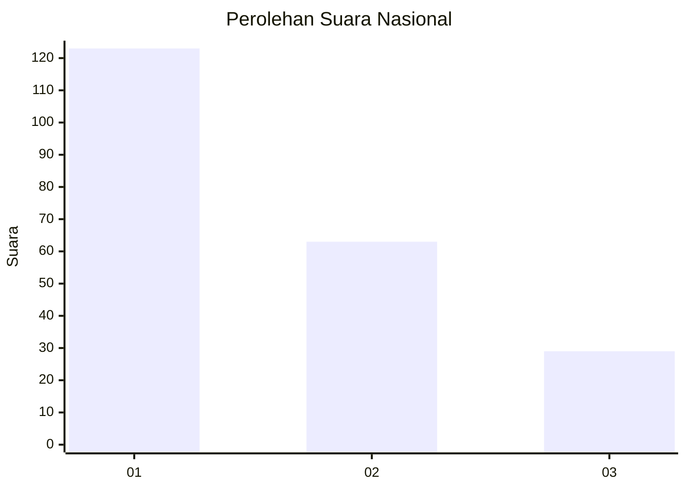
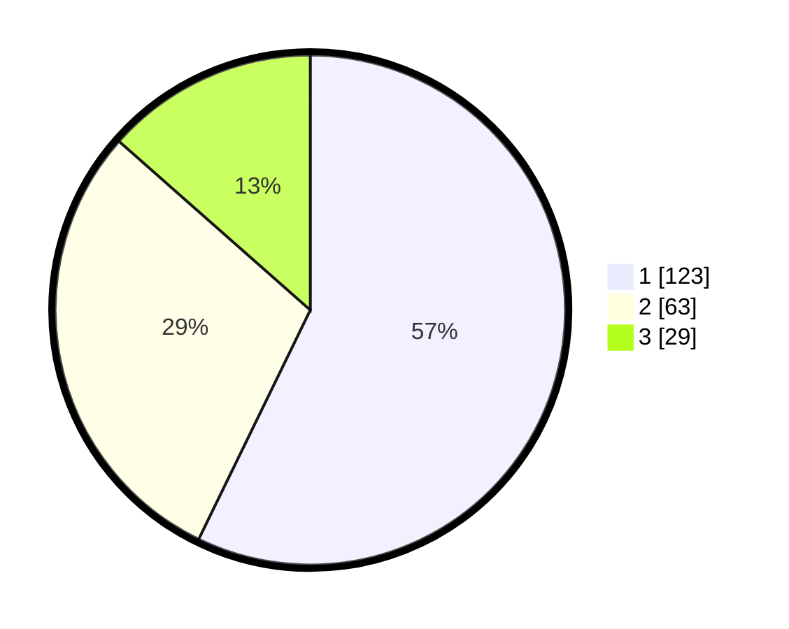

# Hasil

## Grafik

## Tabel

| No.    | Nama Paslon    | Suara | Suara (raw) | Persentase |
|:------ |:-------------- | -----:| -----------:| ----------:|
| 100025 | ANIES MUHAIMIN | 123   | [123][p-1]  | 57,21      |
| 100026 | PRABOWO GIBRAN | 63    | [63][p-2]   | 29,30      |
| 100027 | GANJAR MAHFUD  | 29    | [29][p-3]   | 13,49      |

[p-1]: https://github.com/gigit-pemilu/pemilu-2024/blob/main/pilpres/hitung-suara/sub/31-dki-jakarta/sub/72-jakarta-utara/sub/02-tanjung-priok/sub/1005-kebon-bawang/sub/160-tps/sub/paslon-1.txt
[p-2]: https://github.com/gigit-pemilu/pemilu-2024/blob/main/pilpres/hitung-suara/sub/31-dki-jakarta/sub/72-jakarta-utara/sub/02-tanjung-priok/sub/1005-kebon-bawang/sub/160-tps/sub/paslon-2.txt
[p-3]: https://github.com/gigit-pemilu/pemilu-2024/blob/main/pilpres/hitung-suara/sub/31-dki-jakarta/sub/72-jakarta-utara/sub/02-tanjung-priok/sub/1005-kebon-bawang/sub/160-tps/sub/paslon-3.txt

## Foto C Plano

https://sirekap-obj-formc.kpu.go.id/5f14/pemilu/ppwp/31/72/02/10/05/3172021005160-20240214-233425--87ed6723-04cc-44a3-9eff-9eafc7dac8e7.jpg

https://sirekap-obj-formc.kpu.go.id/5f14/pemilu/ppwp/31/72/02/10/05/3172021005160-20240214-233548--a449cb34-5e0e-4c4d-a21a-43b7dddbd0d6.jpg

https://sirekap-obj-formc.kpu.go.id/5f14/pemilu/ppwp/31/72/02/10/05/3172021005160-20240214-234357--f7f99696-aed4-4336-9323-0cf05397cc5b.jpg

## Metadata

| Key        | Value               |
| ---------- | ------------------- |
| Time Stamp | 2024-02-21 16:00:00 |

