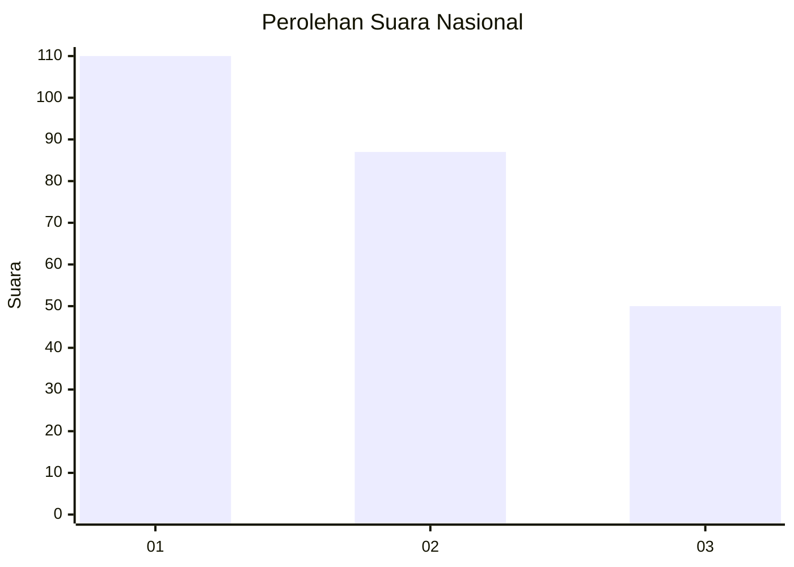
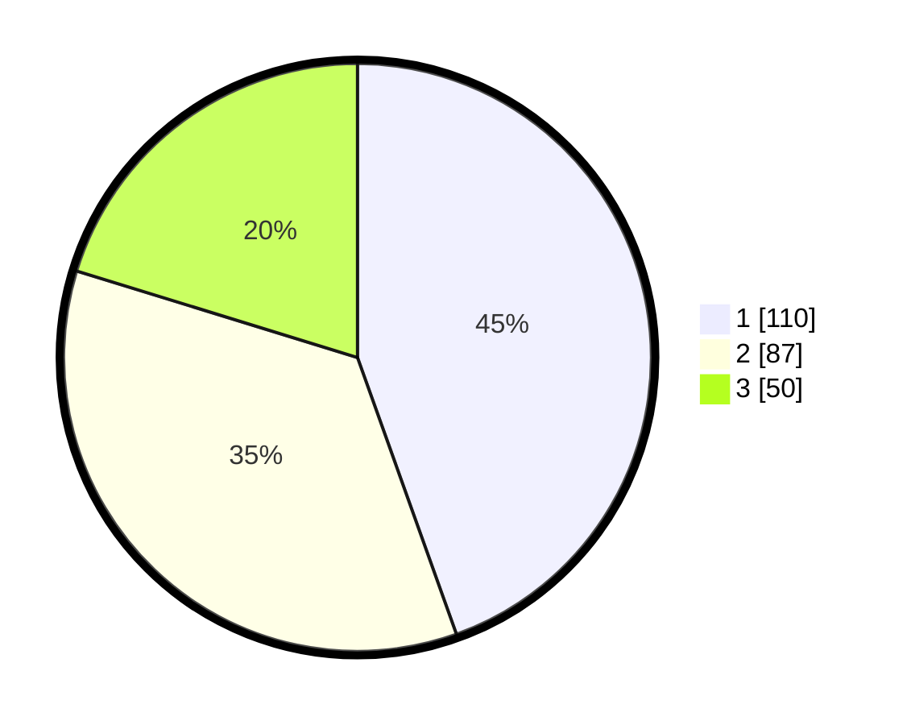

# Hasil

## Grafik

## Tabel

| No.    | Nama Paslon    | Suara | Suara (raw) | Persentase |
|:------ |:-------------- | -----:| -----------:| ----------:|
| 100025 | ANIES MUHAIMIN | 110   | [110][p-1]  | 44,53      |
| 100026 | PRABOWO GIBRAN | 87    | [87][p-2]   | 35,22      |
| 100027 | GANJAR MAHFUD  | 50    | [50][p-3]   | 20,24      |

[p-1]: https://github.com/gigit-pemilu/pemilu-2024/blob/main/pilpres/hitung-suara/sub/31-dki-jakarta/sub/72-jakarta-utara/sub/02-tanjung-priok/sub/1006-sunter-agung/sub/003-tps/sub/paslon-1.txt
[p-2]: https://github.com/gigit-pemilu/pemilu-2024/blob/main/pilpres/hitung-suara/sub/31-dki-jakarta/sub/72-jakarta-utara/sub/02-tanjung-priok/sub/1006-sunter-agung/sub/003-tps/sub/paslon-2.txt
[p-3]: https://github.com/gigit-pemilu/pemilu-2024/blob/main/pilpres/hitung-suara/sub/31-dki-jakarta/sub/72-jakarta-utara/sub/02-tanjung-priok/sub/1006-sunter-agung/sub/003-tps/sub/paslon-3.txt

## Foto C Plano

https://sirekap-obj-formc.kpu.go.id/4569/pemilu/ppwp/31/72/02/10/06/3172021006003-20240215-002305--18dcb86d-a0e0-4e07-a59a-4b9245e29148.jpg

https://sirekap-obj-formc.kpu.go.id/4569/pemilu/ppwp/31/72/02/10/06/3172021006003-20240220-194637--b63d6eb1-9293-4165-8c6a-79a8280e508a.jpg

https://sirekap-obj-formc.kpu.go.id/4569/pemilu/ppwp/31/72/02/10/06/3172021006003-20240220-194737--184c9553-8ac2-4949-8ab8-627b292928b5.jpg

## Metadata

| Key        | Value               |
| ---------- | ------------------- |
| Time Stamp | 2024-02-21 13:00:00 |

