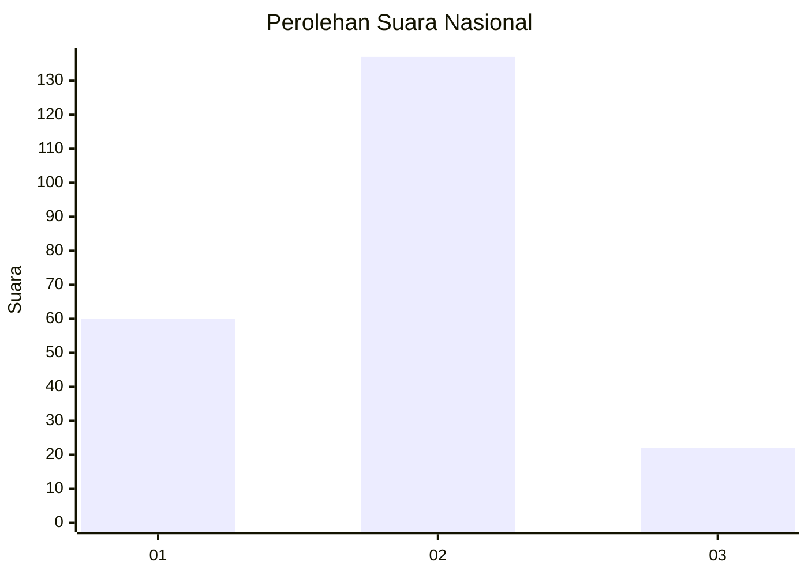
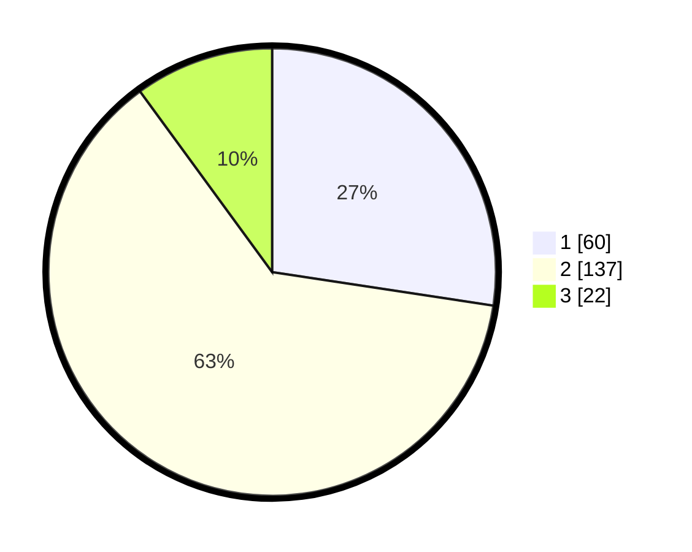

# Hasil

## Grafik

## Tabel

| No.    | Nama Paslon    | Suara | Suara (raw) | Persentase |
|:------ |:-------------- | -----:| -----------:| ----------:|
| 100025 | ANIES MUHAIMIN | 60    | [60][p-1]   | 27,40      |
| 100026 | PRABOWO GIBRAN | 137   | [137][p-2]  | 62,56      |
| 100027 | GANJAR MAHFUD  | 22    | [22][p-3]   | 10,05      |

[p-1]: https://github.com/gigit-pemilu/pemilu-2024/blob/main/pilpres/hitung-suara/sub/31-dki-jakarta/sub/72-jakarta-utara/sub/02-tanjung-priok/sub/1006-sunter-agung/sub/006-tps/sub/paslon-1.txt
[p-2]: https://github.com/gigit-pemilu/pemilu-2024/blob/main/pilpres/hitung-suara/sub/31-dki-jakarta/sub/72-jakarta-utara/sub/02-tanjung-priok/sub/1006-sunter-agung/sub/006-tps/sub/paslon-2.txt
[p-3]: https://github.com/gigit-pemilu/pemilu-2024/blob/main/pilpres/hitung-suara/sub/31-dki-jakarta/sub/72-jakarta-utara/sub/02-tanjung-priok/sub/1006-sunter-agung/sub/006-tps/sub/paslon-3.txt

## Foto C Plano

https://sirekap-obj-formc.kpu.go.id/08be/pemilu/ppwp/31/72/02/10/06/3172021006006-20240215-020401--f2ea8516-9d9d-43cf-aa95-0dd39e9de627.jpg

https://sirekap-obj-formc.kpu.go.id/08be/pemilu/ppwp/31/72/02/10/06/3172021006006-20240215-020545--e88c2c1c-dcc5-4fcd-a0bb-2d32402504ff.jpg

https://sirekap-obj-formc.kpu.go.id/08be/pemilu/ppwp/31/72/02/10/06/3172021006006-20240215-020632--60025e61-a5d9-4b7b-bd30-5a4d5535d28c.jpg

## Metadata

| Key        | Value               |
| ---------- | ------------------- |
| Time Stamp | 2024-02-21 13:00:00 |

