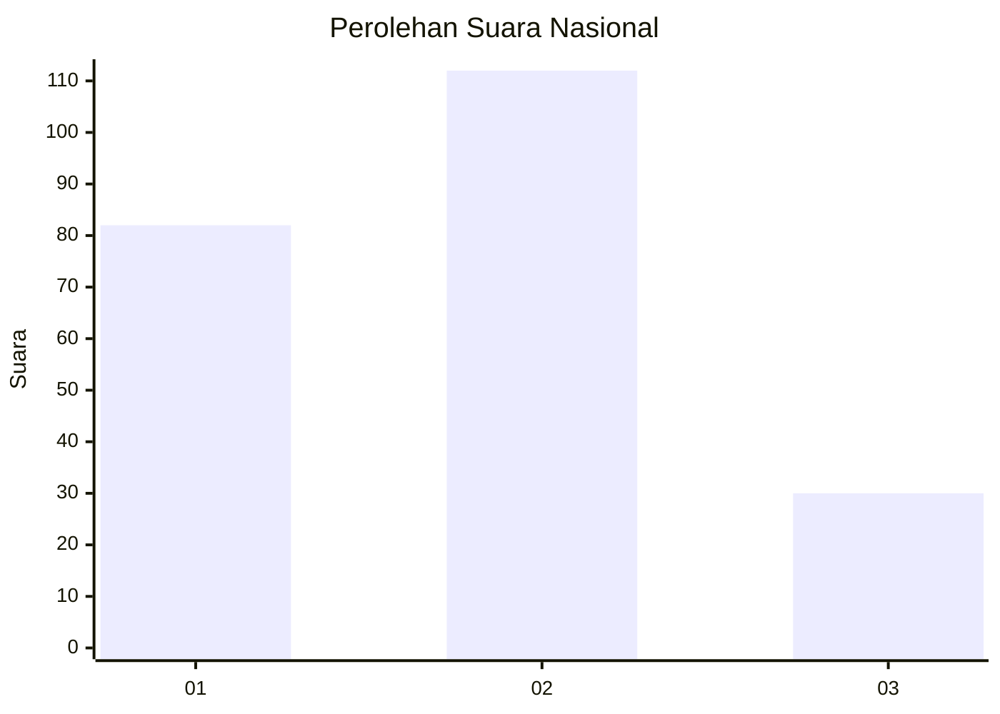
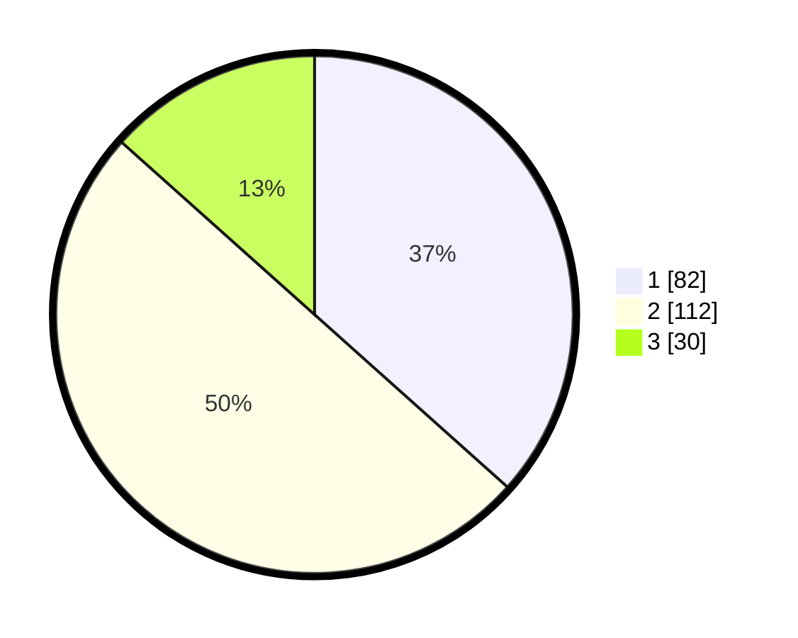

# Hasil

## Grafik

## Tabel

| No.    | Nama Paslon    | Suara | Suara (raw) | Persentase |
|:------ |:-------------- | -----:| -----------:| ----------:|
| 100025 | ANIES MUHAIMIN | 82    | [82][p-1]   | 36,61      |
| 100026 | PRABOWO GIBRAN | 112   | [112][p-2]  | 50,00      |
| 100027 | GANJAR MAHFUD  | 30    | [30][p-3]   | 13,39      |

[p-1]: https://github.com/gigit-pemilu/pemilu-2024/blob/main/pilpres/hitung-suara/sub/31-dki-jakarta/sub/72-jakarta-utara/sub/02-tanjung-priok/sub/1006-sunter-agung/sub/012-tps/sub/paslon-1.txt
[p-2]: https://github.com/gigit-pemilu/pemilu-2024/blob/main/pilpres/hitung-suara/sub/31-dki-jakarta/sub/72-jakarta-utara/sub/02-tanjung-priok/sub/1006-sunter-agung/sub/012-tps/sub/paslon-2.txt
[p-3]: https://github.com/gigit-pemilu/pemilu-2024/blob/main/pilpres/hitung-suara/sub/31-dki-jakarta/sub/72-jakarta-utara/sub/02-tanjung-priok/sub/1006-sunter-agung/sub/012-tps/sub/paslon-3.txt

## Foto C Plano

https://sirekap-obj-formc.kpu.go.id/a748/pemilu/ppwp/31/72/02/10/06/3172021006012-20240214-214031--f073a1a7-56fd-4a72-af9d-aa66da577f89.jpg

https://sirekap-obj-formc.kpu.go.id/a748/pemilu/ppwp/31/72/02/10/06/3172021006012-20240214-233141--ab6f4d57-8083-49c0-878a-e4d375e15b32.jpg

https://sirekap-obj-formc.kpu.go.id/a748/pemilu/ppwp/31/72/02/10/06/3172021006012-20240214-214208--0e864c0a-c0d8-40c5-ab2d-64717db7a62a.jpg

## Metadata

| Key        | Value               |
| ---------- | ------------------- |
| Time Stamp | 2024-02-21 14:00:00 |

