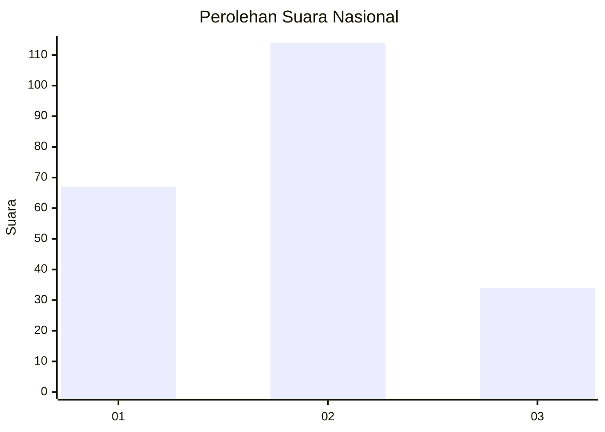
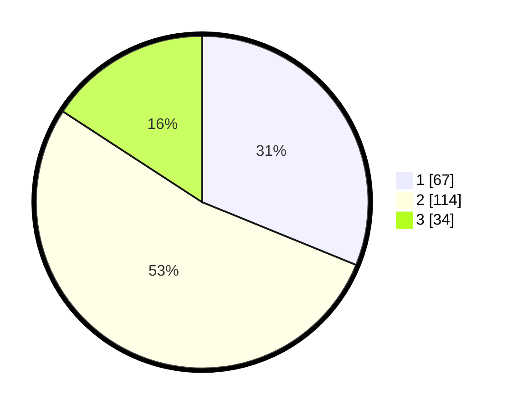

# Hasil

## Grafik

## Tabel

| No.    | Nama Paslon    | Suara | Suara (raw) | Persentase |
|:------ |:-------------- | -----:| -----------:| ----------:|
| 100025 | ANIES MUHAIMIN | 67    | [67][p-1]   | 31,16      |
| 100026 | PRABOWO GIBRAN | 114   | [114][p-2]  | 53,02      |
| 100027 | GANJAR MAHFUD  | 34    | [34][p-3]   | 15,81      |

[p-1]: https://github.com/gigit-pemilu/pemilu-2024/blob/main/pilpres/hitung-suara/sub/31-dki-jakarta/sub/72-jakarta-utara/sub/02-tanjung-priok/sub/1006-sunter-agung/sub/015-tps/sub/paslon-1.txt
[p-2]: https://github.com/gigit-pemilu/pemilu-2024/blob/main/pilpres/hitung-suara/sub/31-dki-jakarta/sub/72-jakarta-utara/sub/02-tanjung-priok/sub/1006-sunter-agung/sub/015-tps/sub/paslon-2.txt
[p-3]: https://github.com/gigit-pemilu/pemilu-2024/blob/main/pilpres/hitung-suara/sub/31-dki-jakarta/sub/72-jakarta-utara/sub/02-tanjung-priok/sub/1006-sunter-agung/sub/015-tps/sub/paslon-3.txt

## Foto C Plano

https://sirekap-obj-formc.kpu.go.id/7995/pemilu/ppwp/31/72/02/10/06/3172021006015-20240215-011528--d8acc1cb-0155-4274-b730-6c66ec93d3c8.jpg

https://sirekap-obj-formc.kpu.go.id/7995/pemilu/ppwp/31/72/02/10/06/3172021006015-20240215-032955--4213c11e-0df0-4800-8e47-55e4f875e842.jpg

https://sirekap-obj-formc.kpu.go.id/7995/pemilu/ppwp/31/72/02/10/06/3172021006015-20240214-232124--298bd322-bc32-4aa4-b19a-17d69e1e44f3.jpg

## Metadata

| Key        | Value               |
| ---------- | ------------------- |
| Time Stamp | 2024-02-21 13:00:00 |

