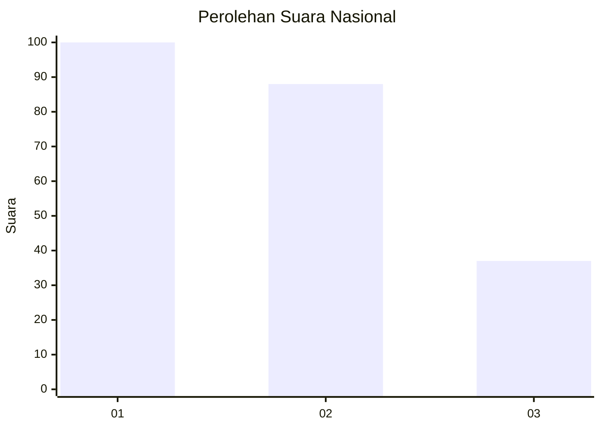
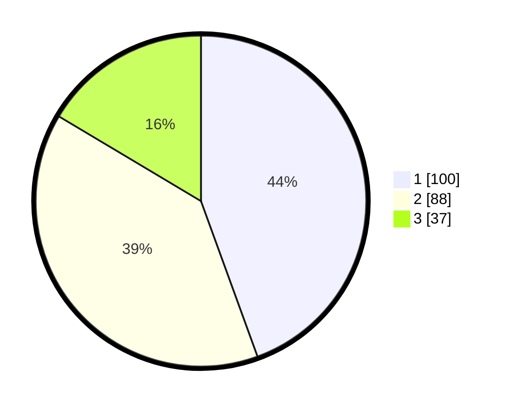

# Hasil

## Grafik

## Tabel

| No.    | Nama Paslon    | Suara | Suara (raw) | Persentase |
|:------ |:-------------- | -----:| -----------:| ----------:|
| 100025 | ANIES MUHAIMIN | 100   | [100][p-1]  | 44,44      |
| 100026 | PRABOWO GIBRAN | 88    | [88][p-2]   | 39,11      |
| 100027 | GANJAR MAHFUD  | 37    | [37][p-3]   | 16,44      |

[p-1]: https://github.com/gigit-pemilu/pemilu-2024/blob/main/pilpres/hitung-suara/sub/31-dki-jakarta/sub/72-jakarta-utara/sub/02-tanjung-priok/sub/1006-sunter-agung/sub/020-tps/sub/paslon-1.txt
[p-2]: https://github.com/gigit-pemilu/pemilu-2024/blob/main/pilpres/hitung-suara/sub/31-dki-jakarta/sub/72-jakarta-utara/sub/02-tanjung-priok/sub/1006-sunter-agung/sub/020-tps/sub/paslon-2.txt
[p-3]: https://github.com/gigit-pemilu/pemilu-2024/blob/main/pilpres/hitung-suara/sub/31-dki-jakarta/sub/72-jakarta-utara/sub/02-tanjung-priok/sub/1006-sunter-agung/sub/020-tps/sub/paslon-3.txt

## Foto C Plano

https://sirekap-obj-formc.kpu.go.id/f7d7/pemilu/ppwp/31/72/02/10/06/3172021006020-20240214-214205--391b1d6f-9fbd-4f58-8846-682970151d97.jpg

https://sirekap-obj-formc.kpu.go.id/f7d7/pemilu/ppwp/31/72/02/10/06/3172021006020-20240214-214825--a3667616-b2ee-4c85-934e-f012612eca7b.jpg

https://sirekap-obj-formc.kpu.go.id/f7d7/pemilu/ppwp/31/72/02/10/06/3172021006020-20240214-214849--2c7699cf-b90e-4a19-812d-2807cd5add63.jpg

## Metadata

| Key        | Value               |
| ---------- | ------------------- |
| Time Stamp | 2024-02-21 17:00:00 |

