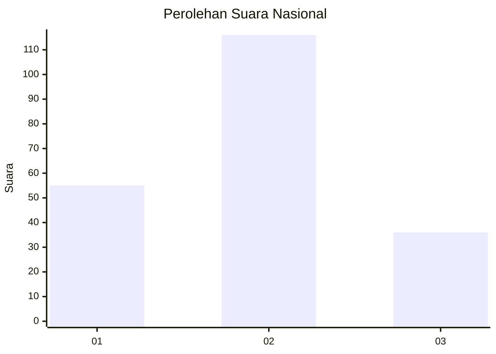
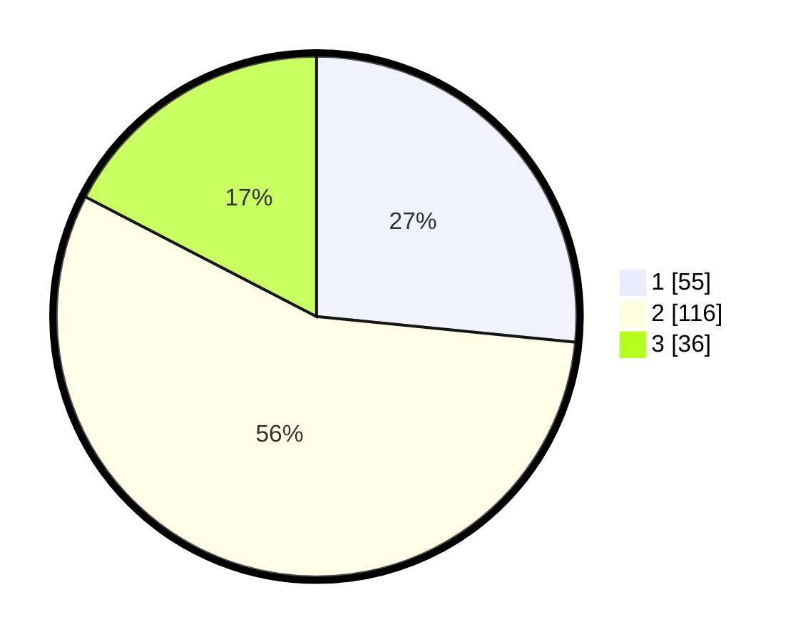

# Hasil

## Grafik

## Tabel

| No.    | Nama Paslon    | Suara | Suara (raw) | Persentase |
|:------ |:-------------- | -----:| -----------:| ----------:|
| 100025 | ANIES MUHAIMIN | 55    | [55][p-1]   | 26,57      |
| 100026 | PRABOWO GIBRAN | 116   | [116][p-2]  | 56,04      |
| 100027 | GANJAR MAHFUD  | 36    | [36][p-3]   | 17,39      |

[p-1]: https://github.com/gigit-pemilu/pemilu-2024/blob/main/pilpres/hitung-suara/sub/31-dki-jakarta/sub/72-jakarta-utara/sub/02-tanjung-priok/sub/1006-sunter-agung/sub/026-tps/sub/paslon-1.txt
[p-2]: https://github.com/gigit-pemilu/pemilu-2024/blob/main/pilpres/hitung-suara/sub/31-dki-jakarta/sub/72-jakarta-utara/sub/02-tanjung-priok/sub/1006-sunter-agung/sub/026-tps/sub/paslon-2.txt
[p-3]: https://github.com/gigit-pemilu/pemilu-2024/blob/main/pilpres/hitung-suara/sub/31-dki-jakarta/sub/72-jakarta-utara/sub/02-tanjung-priok/sub/1006-sunter-agung/sub/026-tps/sub/paslon-3.txt

## Foto C Plano

https://sirekap-obj-formc.kpu.go.id/3c1c/pemilu/ppwp/31/72/02/10/06/3172021006026-20240214-192029--ed369868-b825-4a46-b20d-215c950bdfb4.jpg

https://sirekap-obj-formc.kpu.go.id/3c1c/pemilu/ppwp/31/72/02/10/06/3172021006026-20240214-192614--146e1544-6c59-417c-af2f-782160821d73.jpg

https://sirekap-obj-formc.kpu.go.id/3c1c/pemilu/ppwp/31/72/02/10/06/3172021006026-20240214-192924--712dfda8-21df-4c33-8b36-0e427f550ca0.jpg

## Metadata

| Key        | Value               |
| ---------- | ------------------- |
| Time Stamp | 2024-02-24 22:31:28 |

