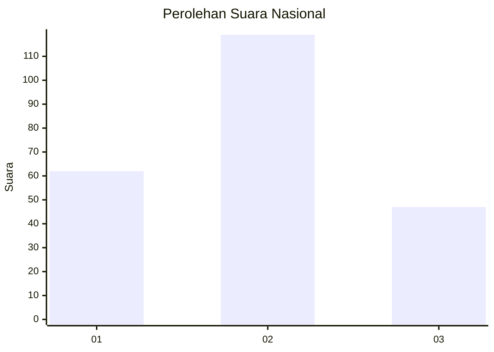
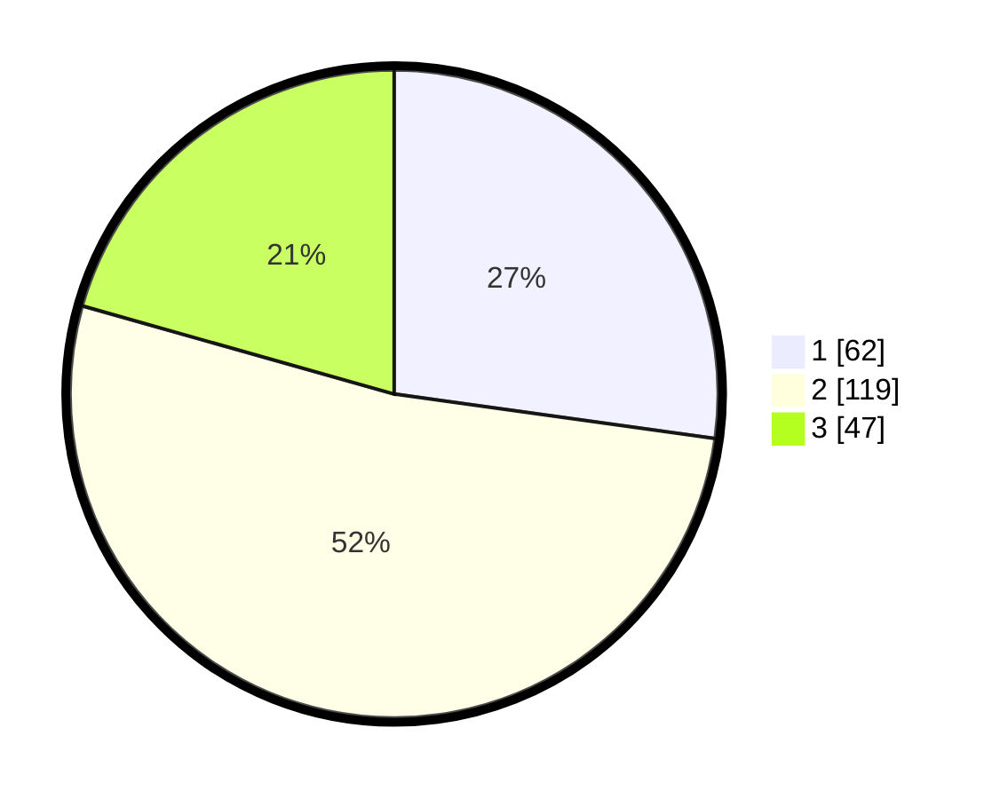

# Hasil

## Grafik

## Tabel

| No.    | Nama Paslon    | Suara | Suara (raw) | Persentase |
|:------ |:-------------- | -----:| -----------:| ----------:|
| 100025 | ANIES MUHAIMIN | 62    | [62][p-1]   | 27,19      |
| 100026 | PRABOWO GIBRAN | 119   | [119][p-2]  | 52,19      |
| 100027 | GANJAR MAHFUD  | 47    | [47][p-3]   | 20,61      |

[p-1]: https://github.com/gigit-pemilu/pemilu-2024/blob/main/pilpres/hitung-suara/sub/31-dki-jakarta/sub/72-jakarta-utara/sub/02-tanjung-priok/sub/1006-sunter-agung/sub/036-tps/sub/paslon-1.txt
[p-2]: https://github.com/gigit-pemilu/pemilu-2024/blob/main/pilpres/hitung-suara/sub/31-dki-jakarta/sub/72-jakarta-utara/sub/02-tanjung-priok/sub/1006-sunter-agung/sub/036-tps/sub/paslon-2.txt
[p-3]: https://github.com/gigit-pemilu/pemilu-2024/blob/main/pilpres/hitung-suara/sub/31-dki-jakarta/sub/72-jakarta-utara/sub/02-tanjung-priok/sub/1006-sunter-agung/sub/036-tps/sub/paslon-3.txt

## Foto C Plano

https://sirekap-obj-formc.kpu.go.id/63f9/pemilu/ppwp/31/72/02/10/06/3172021006036-20240214-160139--44522665-d7ad-4726-9ce3-0697f160b730.jpg

https://sirekap-obj-formc.kpu.go.id/63f9/pemilu/ppwp/31/72/02/10/06/3172021006036-20240214-155141--8a2b523f-963b-42f3-86b0-96fab9233564.jpg

https://sirekap-obj-formc.kpu.go.id/63f9/pemilu/ppwp/31/72/02/10/06/3172021006036-20240214-160150--b8799f36-16ae-408b-9355-2c8b33b73ac4.jpg

## Metadata

| Key        | Value               |
| ---------- | ------------------- |
| Time Stamp | 2024-02-21 15:00:00 |

