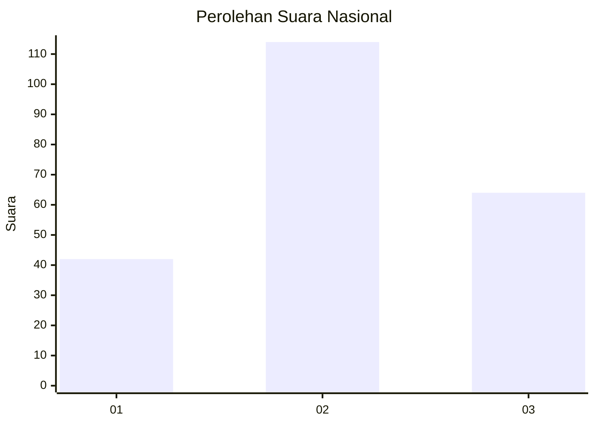
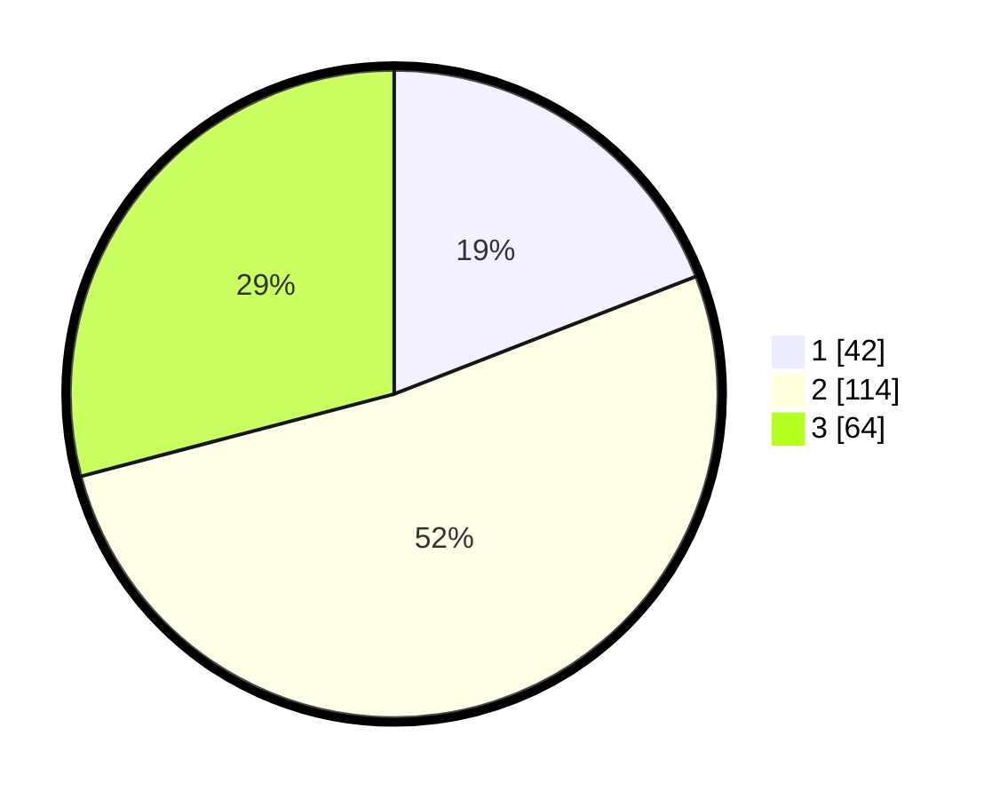

# Hasil

## Grafik

## Tabel

| No.    | Nama Paslon    | Suara | Suara (raw) | Persentase |
|:------ |:-------------- | -----:| -----------:| ----------:|
| 100025 | ANIES MUHAIMIN | 42    | [42][p-1]   | 19,09      |
| 100026 | PRABOWO GIBRAN | 114   | [114][p-2]  | 51,82      |
| 100027 | GANJAR MAHFUD  | 64    | [64][p-3]   | 29,09      |

[p-1]: https://github.com/gigit-pemilu/pemilu-2024/blob/main/pilpres/hitung-suara/sub/31-dki-jakarta/sub/72-jakarta-utara/sub/02-tanjung-priok/sub/1006-sunter-agung/sub/082-tps/sub/paslon-1.txt
[p-2]: https://github.com/gigit-pemilu/pemilu-2024/blob/main/pilpres/hitung-suara/sub/31-dki-jakarta/sub/72-jakarta-utara/sub/02-tanjung-priok/sub/1006-sunter-agung/sub/082-tps/sub/paslon-2.txt
[p-3]: https://github.com/gigit-pemilu/pemilu-2024/blob/main/pilpres/hitung-suara/sub/31-dki-jakarta/sub/72-jakarta-utara/sub/02-tanjung-priok/sub/1006-sunter-agung/sub/082-tps/sub/paslon-3.txt

## Foto C Plano

https://sirekap-obj-formc.kpu.go.id/f4b6/pemilu/ppwp/31/72/02/10/06/3172021006082-20240214-232109--fdde01de-8b51-4529-9d59-b4edc349154d.jpg

https://sirekap-obj-formc.kpu.go.id/f4b6/pemilu/ppwp/31/72/02/10/06/3172021006082-20240214-232143--c571a6d6-e3c8-4af8-89e9-b7fb9fa7814e.jpg

https://sirekap-obj-formc.kpu.go.id/f4b6/pemilu/ppwp/31/72/02/10/06/3172021006082-20240214-232231--2790800d-485e-450e-83cd-f622827eca06.jpg

## Metadata

| Key        | Value               |
| ---------- | ------------------- |
| Time Stamp | 2024-02-15 17:30:25 |

