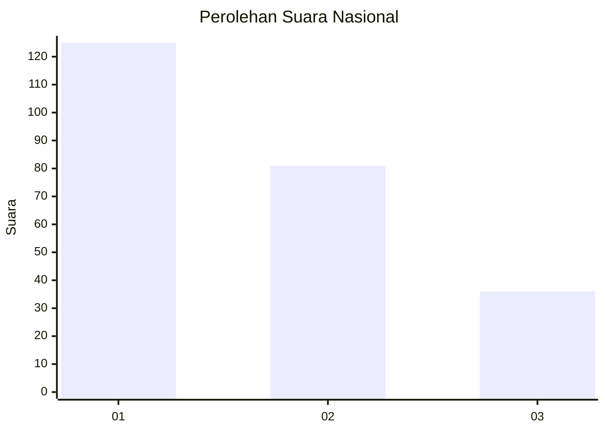
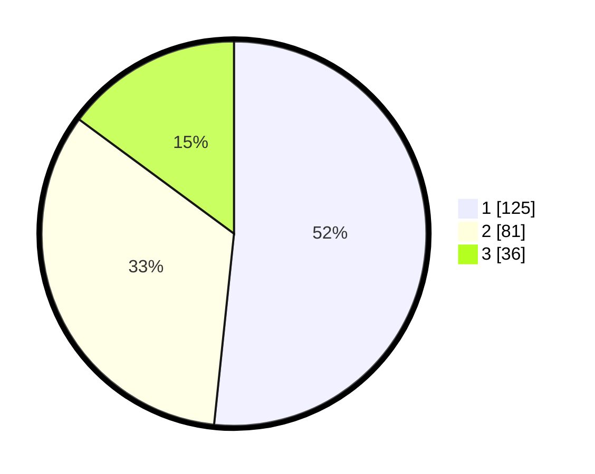

# Hasil

## Grafik

## Tabel

| No.    | Nama Paslon    | Suara | Suara (raw) | Persentase |
|:------ |:-------------- | -----:| -----------:| ----------:|
| 100025 | ANIES MUHAIMIN | 125   | [125][p-1]  | 51,65      |
| 100026 | PRABOWO GIBRAN | 81    | [81][p-2]   | 33,47      |
| 100027 | GANJAR MAHFUD  | 36    | [36][p-3]   | 14,88      |

[p-1]: https://github.com/gigit-pemilu/pemilu-2024/blob/main/pilpres/hitung-suara/sub/31-dki-jakarta/sub/72-jakarta-utara/sub/02-tanjung-priok/sub/1006-sunter-agung/sub/086-tps/sub/paslon-1.txt
[p-2]: https://github.com/gigit-pemilu/pemilu-2024/blob/main/pilpres/hitung-suara/sub/31-dki-jakarta/sub/72-jakarta-utara/sub/02-tanjung-priok/sub/1006-sunter-agung/sub/086-tps/sub/paslon-2.txt
[p-3]: https://github.com/gigit-pemilu/pemilu-2024/blob/main/pilpres/hitung-suara/sub/31-dki-jakarta/sub/72-jakarta-utara/sub/02-tanjung-priok/sub/1006-sunter-agung/sub/086-tps/sub/paslon-3.txt

## Foto C Plano

https://sirekap-obj-formc.kpu.go.id/d784/pemilu/ppwp/31/72/02/10/06/3172021006086-20240215-002145--39e20630-fef4-4815-a533-e53f81a1dd08.jpg

https://sirekap-obj-formc.kpu.go.id/d784/pemilu/ppwp/31/72/02/10/06/3172021006086-20240215-002353--fa7ba383-9104-4ce1-82e9-47035e07ef61.jpg

https://sirekap-obj-formc.kpu.go.id/d784/pemilu/ppwp/31/72/02/10/06/3172021006086-20240215-002411--4ed0127b-e919-46d3-8662-b21f83eb50c9.jpg

## Metadata

| Key        | Value               |
| ---------- | ------------------- |
| Time Stamp | 2024-02-21 17:00:00 |

