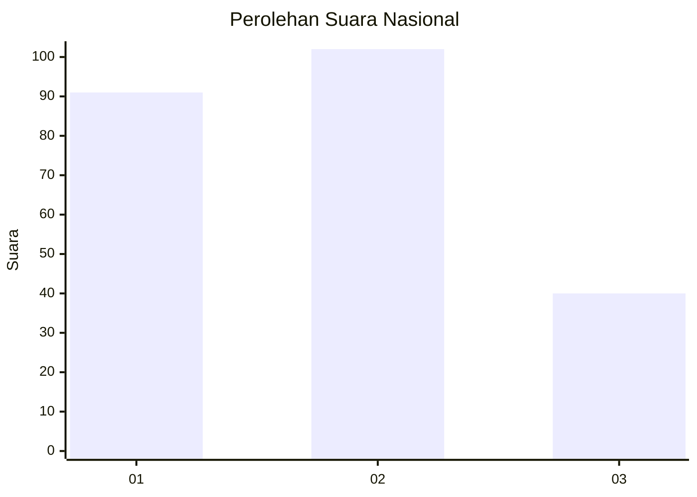
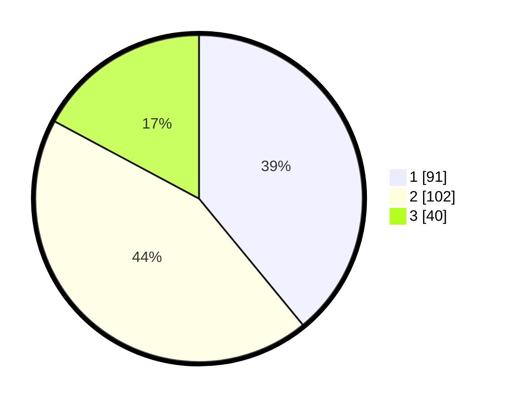

# Hasil

## Grafik

## Tabel

| No.    | Nama Paslon    | Suara | Suara (raw) | Persentase |
|:------ |:-------------- | -----:| -----------:| ----------:|
| 100025 | ANIES MUHAIMIN | 91    | [91][p-1]   | 39,06      |
| 100026 | PRABOWO GIBRAN | 102   | [102][p-2]  | 43,78      |
| 100027 | GANJAR MAHFUD  | 40    | [40][p-3]   | 17,17      |

[p-1]: https://github.com/gigit-pemilu/pemilu-2024/blob/main/pilpres/hitung-suara/sub/31-dki-jakarta/sub/72-jakarta-utara/sub/02-tanjung-priok/sub/1006-sunter-agung/sub/095-tps/sub/paslon-1.txt
[p-2]: https://github.com/gigit-pemilu/pemilu-2024/blob/main/pilpres/hitung-suara/sub/31-dki-jakarta/sub/72-jakarta-utara/sub/02-tanjung-priok/sub/1006-sunter-agung/sub/095-tps/sub/paslon-2.txt
[p-3]: https://github.com/gigit-pemilu/pemilu-2024/blob/main/pilpres/hitung-suara/sub/31-dki-jakarta/sub/72-jakarta-utara/sub/02-tanjung-priok/sub/1006-sunter-agung/sub/095-tps/sub/paslon-3.txt

## Foto C Plano

https://sirekap-obj-formc.kpu.go.id/d94e/pemilu/ppwp/31/72/02/10/06/3172021006095-20240214-220808--a59e7975-450f-427b-aee2-22d68fa37a08.jpg

https://sirekap-obj-formc.kpu.go.id/d94e/pemilu/ppwp/31/72/02/10/06/3172021006095-20240214-221006--881c9a4b-f1d5-41c6-be75-0f96b08bd6aa.jpg

https://sirekap-obj-formc.kpu.go.id/d94e/pemilu/ppwp/31/72/02/10/06/3172021006095-20240214-221143--760311b4-f6e3-4104-a5ca-26884cf3b2d0.jpg

## Metadata

| Key        | Value               |
| ---------- | ------------------- |
| Time Stamp | 2024-02-21 17:00:00 |

