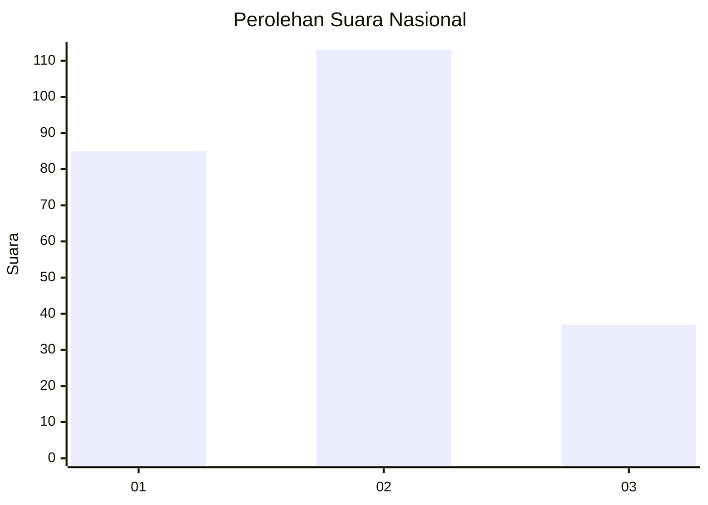
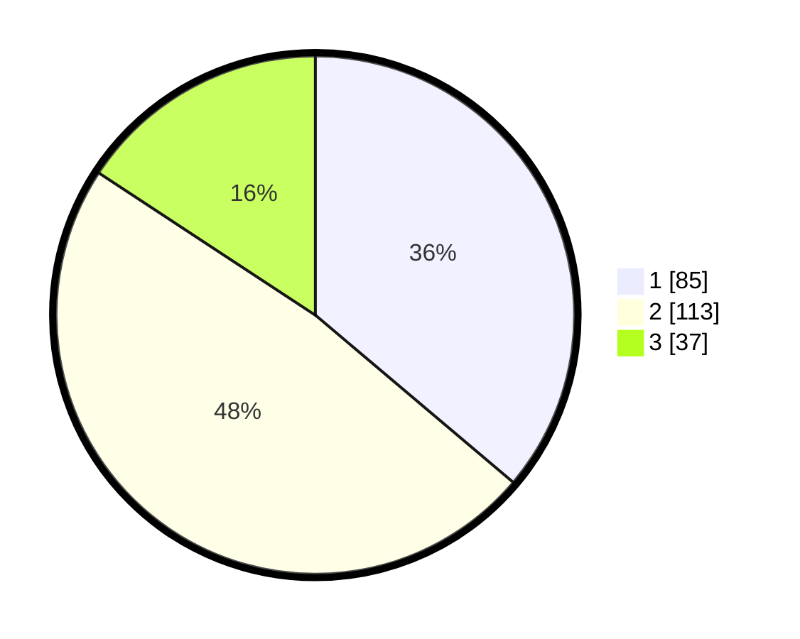

# Hasil

## Grafik

## Tabel

| No.    | Nama Paslon    | Suara | Suara (raw) | Persentase |
|:------ |:-------------- | -----:| -----------:| ----------:|
| 100025 | ANIES MUHAIMIN | 85    | [85][p-1]   | 36,17      |
| 100026 | PRABOWO GIBRAN | 113   | [113][p-2]  | 48,09      |
| 100027 | GANJAR MAHFUD  | 37    | [37][p-3]   | 15,74      |

[p-1]: https://github.com/gigit-pemilu/pemilu-2024/blob/main/pilpres/hitung-suara/sub/31-dki-jakarta/sub/72-jakarta-utara/sub/02-tanjung-priok/sub/1006-sunter-agung/sub/104-tps/sub/paslon-1.txt
[p-2]: https://github.com/gigit-pemilu/pemilu-2024/blob/main/pilpres/hitung-suara/sub/31-dki-jakarta/sub/72-jakarta-utara/sub/02-tanjung-priok/sub/1006-sunter-agung/sub/104-tps/sub/paslon-2.txt
[p-3]: https://github.com/gigit-pemilu/pemilu-2024/blob/main/pilpres/hitung-suara/sub/31-dki-jakarta/sub/72-jakarta-utara/sub/02-tanjung-priok/sub/1006-sunter-agung/sub/104-tps/sub/paslon-3.txt

## Foto C Plano

https://sirekap-obj-formc.kpu.go.id/0a5a/pemilu/ppwp/31/72/02/10/06/3172021006104-20240215-030920--da6ecddd-c5e8-4b21-85c7-3db6cc7be699.jpg

https://sirekap-obj-formc.kpu.go.id/0a5a/pemilu/ppwp/31/72/02/10/06/3172021006104-20240215-031120--9f57f8f4-cf45-4817-b6f3-6ec662a7f3bc.jpg

https://sirekap-obj-formc.kpu.go.id/0a5a/pemilu/ppwp/31/72/02/10/06/3172021006104-20240215-031255--1d7fd587-ca9a-4f0b-a828-914d4bfec9a0.jpg

## Metadata

| Key        | Value               |
| ---------- | ------------------- |
| Time Stamp | 2024-02-21 17:00:00 |

