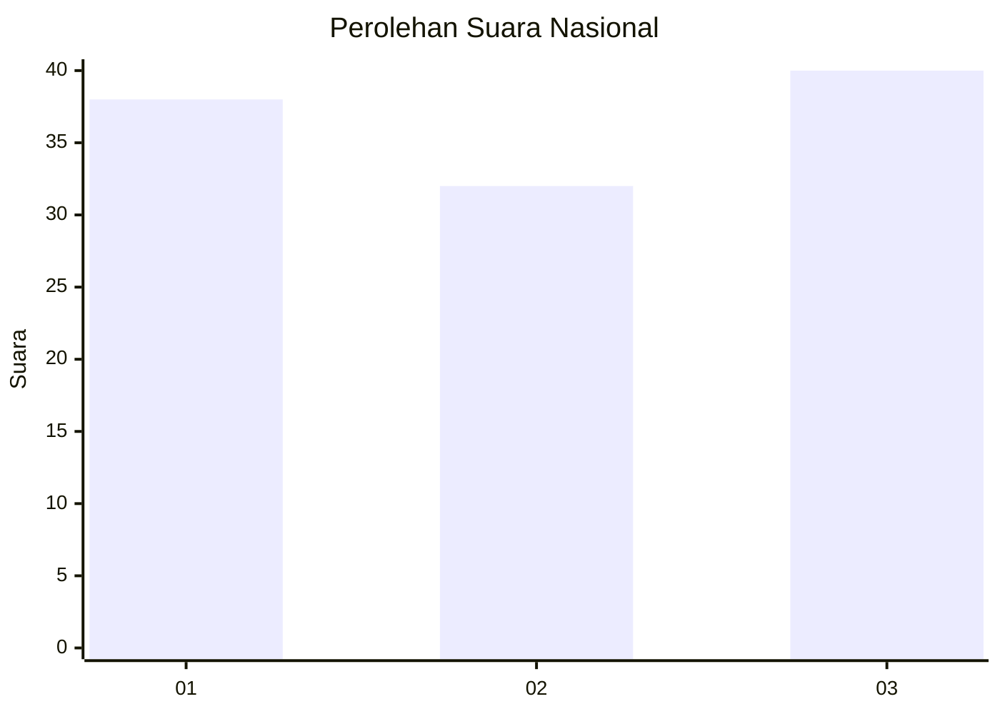
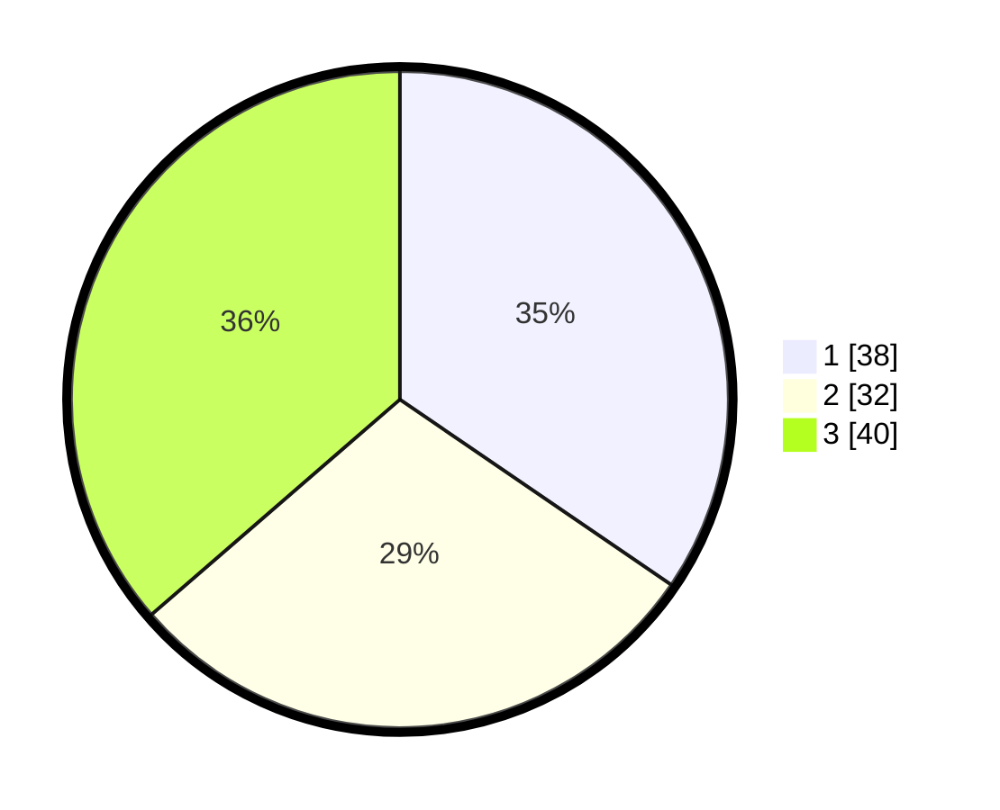

# Hasil

## Grafik

## Tabel

| No. | Nama Paslon    | Suara | Suara (raw) | Persentase |
|:--- |:-------------- | -----:| -----------:| ----------:|
| 1   | ANIES MUHAIMIN | 38    | [38][p-1]   | 34,55      |
| 2   | PRABOWO GIBRAN | 32    | [32][p-2]   | 29,09      |
| 3   | GANJAR MAHFUD  | 40    | [40][p-3]   | 36,36      |

[p-1]: https://github.com/gigit-pemilu/pemilu-2024/blob/main/pilpres/hitung-suara/sub/31-dki-jakarta/sub/72-jakarta-utara/sub/02-tanjung-priok/sub/1006-sunter-agung/sub/113-tps/sub/paslon-1.txt
[p-2]: https://github.com/gigit-pemilu/pemilu-2024/blob/main/pilpres/hitung-suara/sub/31-dki-jakarta/sub/72-jakarta-utara/sub/02-tanjung-priok/sub/1006-sunter-agung/sub/113-tps/sub/paslon-2.txt
[p-3]: https://github.com/gigit-pemilu/pemilu-2024/blob/main/pilpres/hitung-suara/sub/31-dki-jakarta/sub/72-jakarta-utara/sub/02-tanjung-priok/sub/1006-sunter-agung/sub/113-tps/sub/paslon-3.txt

## Foto C Plano

https://sirekap-obj-formc.kpu.go.id/627b/pemilu/ppwp/31/72/02/10/06/3172021006113-20240214-201307--ef05b56b-591d-40d8-8421-67ee33079f5d.jpg

https://sirekap-obj-formc.kpu.go.id/627b/pemilu/ppwp/31/72/02/10/06/3172021006113-20240214-201332--b343e27e-1338-496d-9b07-fbfbb2ef311b.jpg

https://sirekap-obj-formc.kpu.go.id/627b/pemilu/ppwp/31/72/02/10/06/3172021006113-20240214-201359--09244e54-f1f6-4dd4-b26a-a08a35a4c97c.jpg

## Metadata

| Key        | Value               |
| ---------- | ------------------- |
| Time Stamp | 2024-02-21 17:00:00 |

