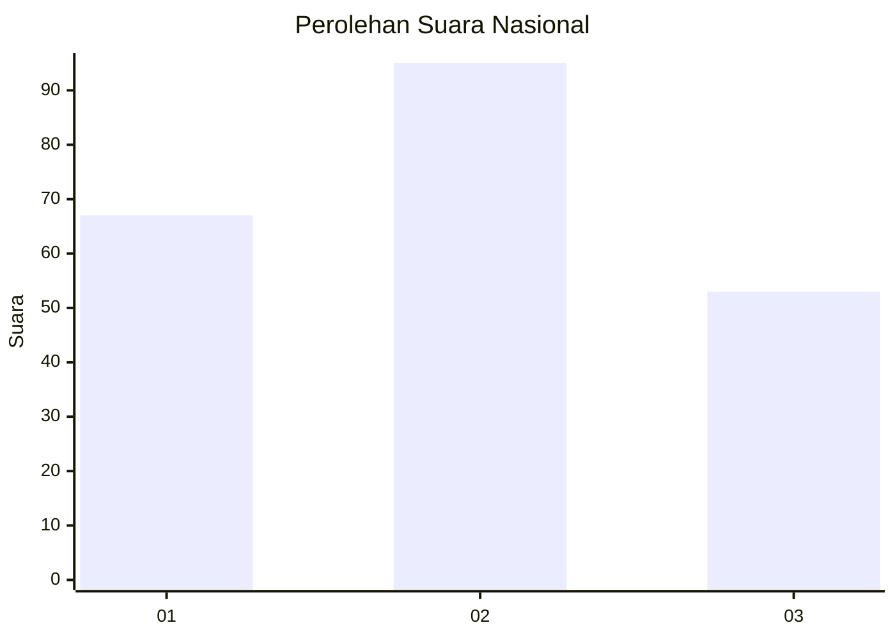
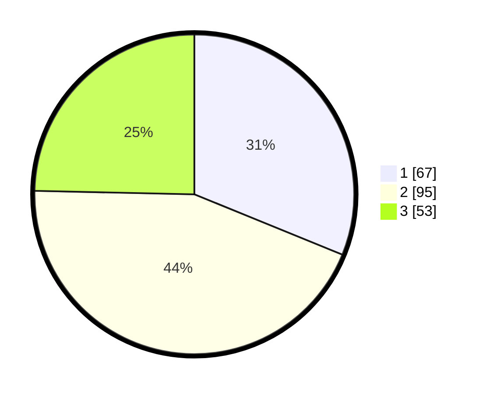

# Hasil

## Grafik

## Tabel

| No.    | Nama Paslon    | Suara | Suara (raw) | Persentase |
|:------ |:-------------- | -----:| -----------:| ----------:|
| 100025 | ANIES MUHAIMIN | 67    | [67][p-1]   | 31,16      |
| 100026 | PRABOWO GIBRAN | 95    | [95][p-2]   | 44,19      |
| 100027 | GANJAR MAHFUD  | 53    | [53][p-3]   | 24,65      |

[p-1]: https://github.com/gigit-pemilu/pemilu-2024/blob/main/pilpres/hitung-suara/sub/31-dki-jakarta/sub/72-jakarta-utara/sub/02-tanjung-priok/sub/1006-sunter-agung/sub/124-tps/sub/paslon-1.txt
[p-2]: https://github.com/gigit-pemilu/pemilu-2024/blob/main/pilpres/hitung-suara/sub/31-dki-jakarta/sub/72-jakarta-utara/sub/02-tanjung-priok/sub/1006-sunter-agung/sub/124-tps/sub/paslon-2.txt
[p-3]: https://github.com/gigit-pemilu/pemilu-2024/blob/main/pilpres/hitung-suara/sub/31-dki-jakarta/sub/72-jakarta-utara/sub/02-tanjung-priok/sub/1006-sunter-agung/sub/124-tps/sub/paslon-3.txt

## Foto C Plano

https://sirekap-obj-formc.kpu.go.id/18dd/pemilu/ppwp/31/72/02/10/06/3172021006124-20240215-211030--12164dcc-20b8-4a30-8fa6-062f56f77169.jpg

https://sirekap-obj-formc.kpu.go.id/18dd/pemilu/ppwp/31/72/02/10/06/3172021006124-20240215-221226--f1316b9a-dfa9-4338-838f-fa842d4d80c7.jpg

https://sirekap-obj-formc.kpu.go.id/18dd/pemilu/ppwp/31/72/02/10/06/3172021006124-20240215-211726--fbb7063c-f97a-46ce-9170-a4a4bfd23eeb.jpg

## Metadata

| Key        | Value               |
| ---------- | ------------------- |
| Time Stamp | 2024-02-21 16:00:00 |

