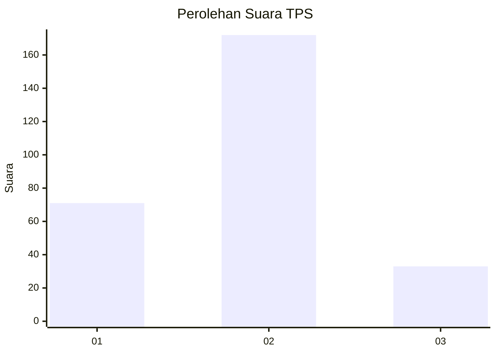
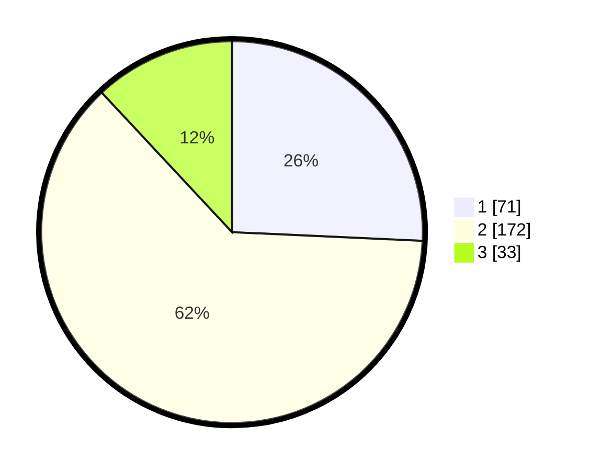

# Hasil

## Grafik

## Tabel

| No. | Nama Paslon    | Suara | Suara (raw) | Persentase |
|:--- |:-------------- | -----:| -----------:| ----------:|
| 1   | ANIES MUHAIMIN | 71    | [71][p-1]   | 25,72      |
| 2   | PRABOWO GIBRAN | 172   | [172][p-2]  | 62,32      |
| 3   | GANJAR MAHFUD  | 33    | [33][p-3]   | 11,96      |

[p-1]: https://github.com/gigit-pemilu/pemilu-2024-31-dki-jakarta/blob/main/pilpres/hitung-suara/sub/31-dki-jakarta/sub/72-jakarta-utara/sub/02-tanjung-priok/sub/1006-sunter-agung/sub/135-tps/sub/paslon-1.txt
[p-2]: https://github.com/gigit-pemilu/pemilu-2024-31-dki-jakarta/blob/main/pilpres/hitung-suara/sub/31-dki-jakarta/sub/72-jakarta-utara/sub/02-tanjung-priok/sub/1006-sunter-agung/sub/135-tps/sub/paslon-2.txt
[p-3]: https://github.com/gigit-pemilu/pemilu-2024-31-dki-jakarta/blob/main/pilpres/hitung-suara/sub/31-dki-jakarta/sub/72-jakarta-utara/sub/02-tanjung-priok/sub/1006-sunter-agung/sub/135-tps/sub/paslon-3.txt

## Foto C Plano

https://sirekap-obj-formc.kpu.go.id/01bb/pemilu/ppwp/31/72/02/10/06/3172021006135-20240214-211853--ec8b5db6-2c2f-47b3-a422-87b6120d998b.jpg

https://sirekap-obj-formc.kpu.go.id/01bb/pemilu/ppwp/31/72/02/10/06/3172021006135-20240214-211224--ac99d5c6-77e4-4413-85c6-e2fab4d29856.jpg

https://sirekap-obj-formc.kpu.go.id/01bb/pemilu/ppwp/31/72/02/10/06/3172021006135-20240214-212036--8cdab43c-37ad-45c1-ad2a-8ed3d5a8bb7b.jpg

## Metadata

| Key        | Value               |
| ---------- | ------------------- |
| Time Stamp | 2024-02-21 17:00:00 |

