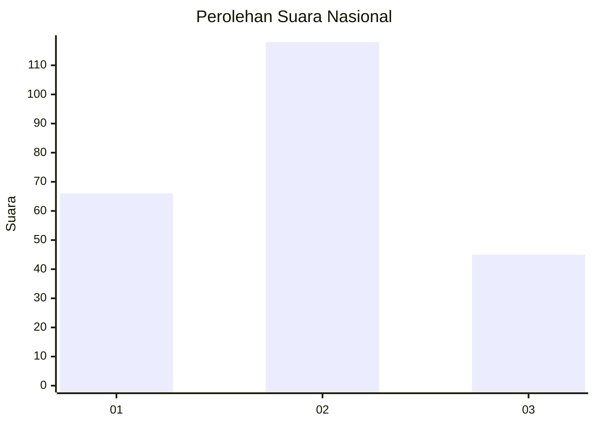
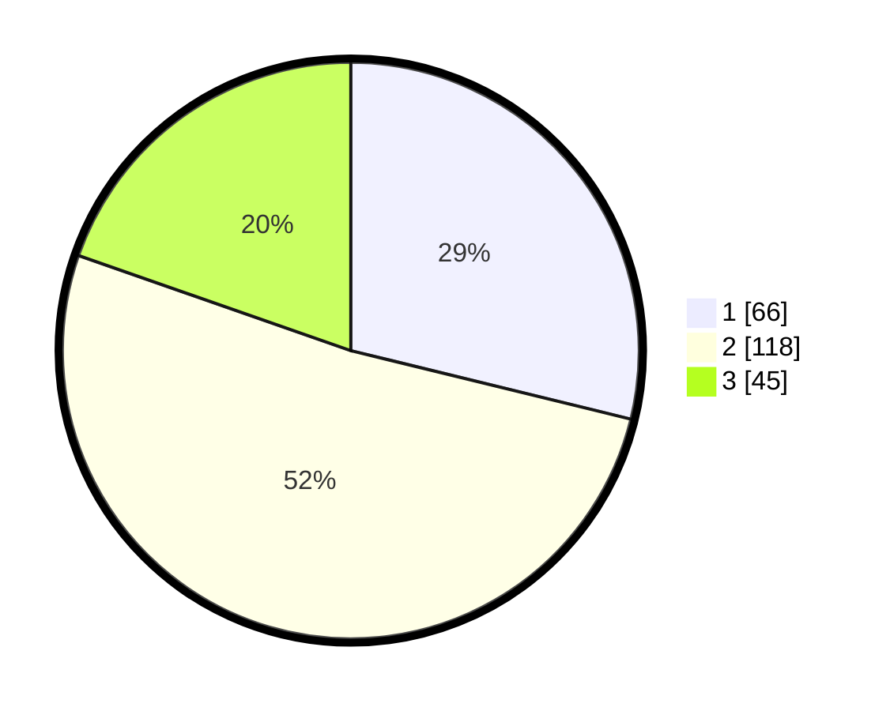

# Hasil

## Grafik

## Tabel

| No.    | Nama Paslon    | Suara | Suara (raw) | Persentase |
|:------ |:-------------- | -----:| -----------:| ----------:|
| 100025 | ANIES MUHAIMIN | 66    | [66][p-1]   | 28,82      |
| 100026 | PRABOWO GIBRAN | 118   | [118][p-2]  | 51,53      |
| 100027 | GANJAR MAHFUD  | 45    | [45][p-3]   | 19,65      |

[p-1]: https://github.com/gigit-pemilu/pemilu-2024/blob/main/pilpres/hitung-suara/sub/31-dki-jakarta/sub/72-jakarta-utara/sub/02-tanjung-priok/sub/1006-sunter-agung/sub/136-tps/sub/paslon-1.txt
[p-2]: https://github.com/gigit-pemilu/pemilu-2024/blob/main/pilpres/hitung-suara/sub/31-dki-jakarta/sub/72-jakarta-utara/sub/02-tanjung-priok/sub/1006-sunter-agung/sub/136-tps/sub/paslon-2.txt
[p-3]: https://github.com/gigit-pemilu/pemilu-2024/blob/main/pilpres/hitung-suara/sub/31-dki-jakarta/sub/72-jakarta-utara/sub/02-tanjung-priok/sub/1006-sunter-agung/sub/136-tps/sub/paslon-3.txt

## Foto C Plano

https://sirekap-obj-formc.kpu.go.id/972b/pemilu/ppwp/31/72/02/10/06/3172021006136-20240215-030615--2124cc21-b062-4d17-98c8-96a68e6c9478.jpg

https://sirekap-obj-formc.kpu.go.id/972b/pemilu/ppwp/31/72/02/10/06/3172021006136-20240215-030745--ee613943-fb3d-44b0-a214-a5701621ab90.jpg

https://sirekap-obj-formc.kpu.go.id/972b/pemilu/ppwp/31/72/02/10/06/3172021006136-20240217-002153--6709c3d7-f9f9-4683-899e-b0f25b5c8f09.jpg

## Metadata

| Key        | Value               |
| ---------- | ------------------- |
| Time Stamp | 2024-02-21 16:00:00 |

