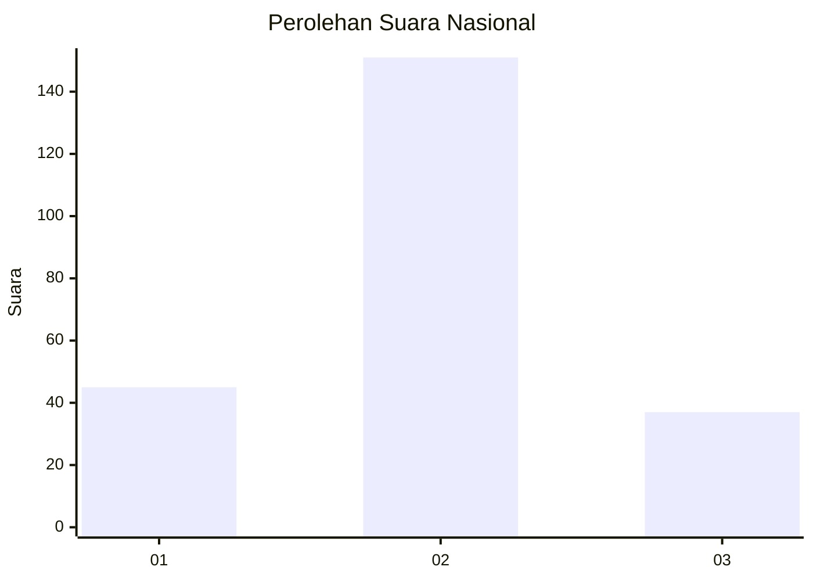
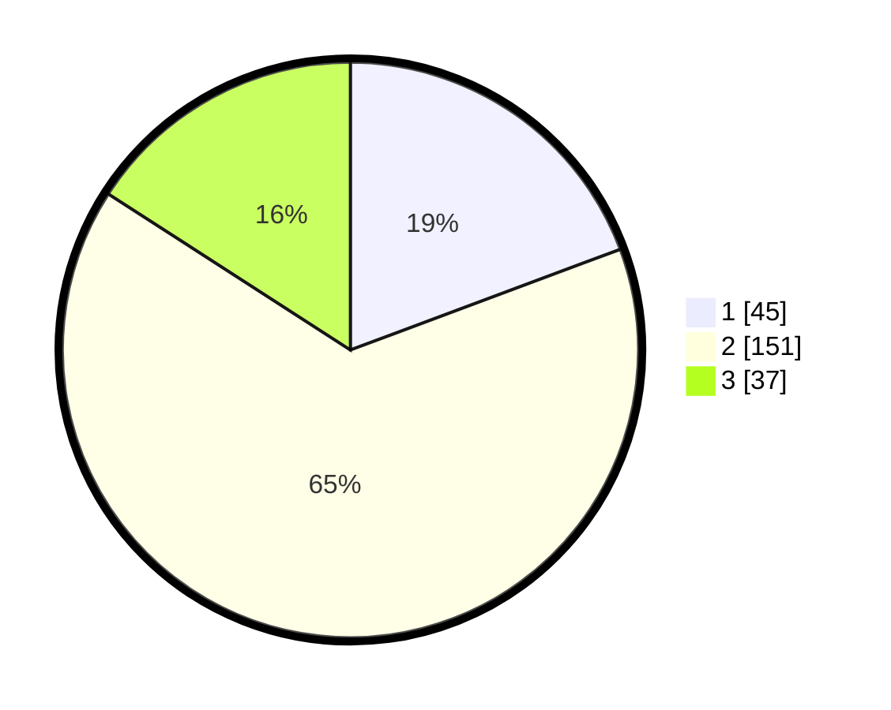

# Hasil

## Grafik

## Tabel

| No.    | Nama Paslon    | Suara | Suara (raw) | Persentase |
|:------ |:-------------- | -----:| -----------:| ----------:|
| 100025 | ANIES MUHAIMIN | 45    | [45][p-1]   | 19,31      |
| 100026 | PRABOWO GIBRAN | 151   | [151][p-2]  | 64,81      |
| 100027 | GANJAR MAHFUD  | 37    | [37][p-3]   | 15,88      |

[p-1]: https://github.com/gigit-pemilu/pemilu-2024/blob/main/pilpres/hitung-suara/sub/31-dki-jakarta/sub/72-jakarta-utara/sub/02-tanjung-priok/sub/1006-sunter-agung/sub/140-tps/sub/paslon-1.txt
[p-2]: https://github.com/gigit-pemilu/pemilu-2024/blob/main/pilpres/hitung-suara/sub/31-dki-jakarta/sub/72-jakarta-utara/sub/02-tanjung-priok/sub/1006-sunter-agung/sub/140-tps/sub/paslon-2.txt
[p-3]: https://github.com/gigit-pemilu/pemilu-2024/blob/main/pilpres/hitung-suara/sub/31-dki-jakarta/sub/72-jakarta-utara/sub/02-tanjung-priok/sub/1006-sunter-agung/sub/140-tps/sub/paslon-3.txt

## Foto C Plano

https://sirekap-obj-formc.kpu.go.id/8408/pemilu/ppwp/31/72/02/10/06/3172021006140-20240215-010000--cc321c71-1af9-47b4-b046-ef2c315c65e9.jpg

https://sirekap-obj-formc.kpu.go.id/8408/pemilu/ppwp/31/72/02/10/06/3172021006140-20240215-010120--bfa7ea1c-73a8-443a-921f-d698b446c878.jpg

https://sirekap-obj-formc.kpu.go.id/8408/pemilu/ppwp/31/72/02/10/06/3172021006140-20240215-010213--066284b0-8750-40af-8789-f1047cfd230f.jpg

## Metadata

| Key        | Value               |
| ---------- | ------------------- |
| Time Stamp | 2024-02-21 17:00:00 |

