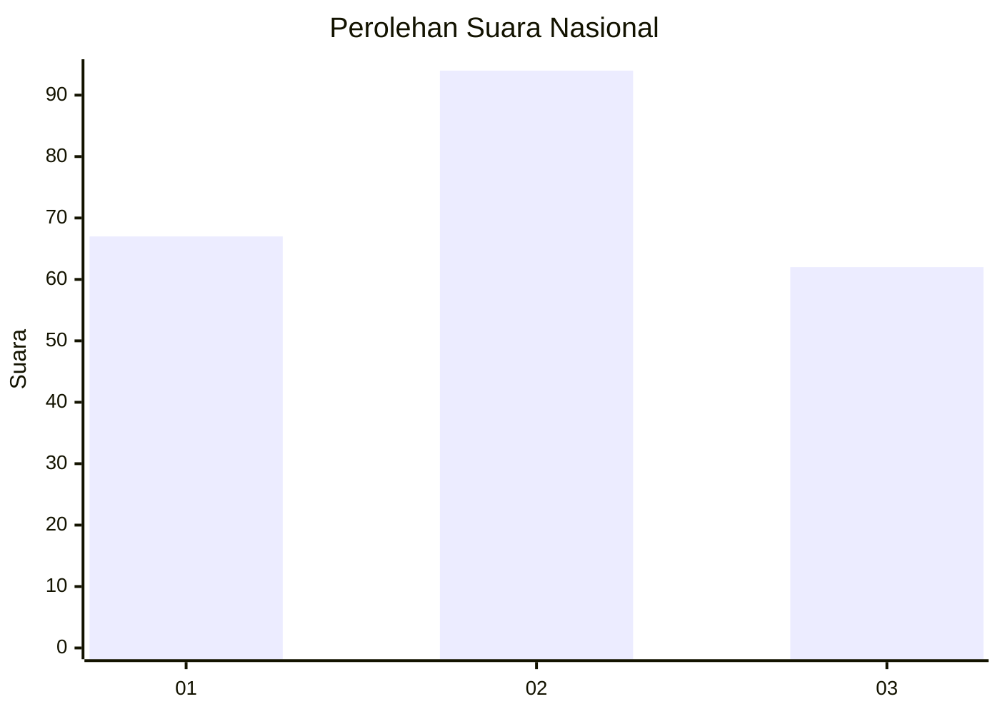
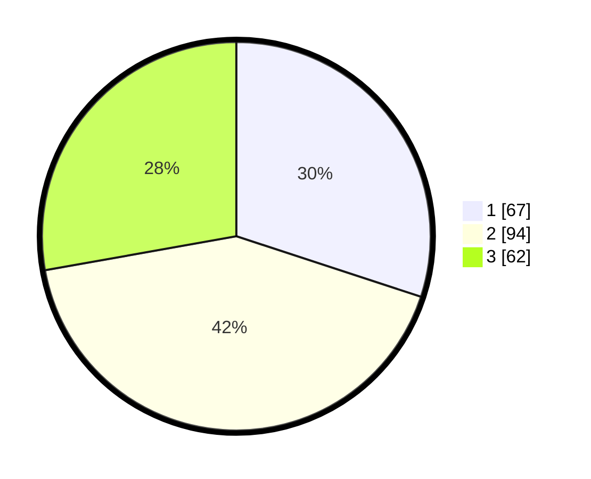

# Hasil

## Grafik

## Tabel

| No.    | Nama Paslon    | Suara | Suara (raw) | Persentase |
|:------ |:-------------- | -----:| -----------:| ----------:|
| 100025 | ANIES MUHAIMIN | 67    | [67][p-1]   | 30,04      |
| 100026 | PRABOWO GIBRAN | 94    | [94][p-2]   | 42,15      |
| 100027 | GANJAR MAHFUD  | 62    | [62][p-3]   | 27,80      |

[p-1]: https://github.com/gigit-pemilu/pemilu-2024/blob/main/pilpres/hitung-suara/sub/31-dki-jakarta/sub/72-jakarta-utara/sub/02-tanjung-priok/sub/1006-sunter-agung/sub/143-tps/sub/paslon-1.txt
[p-2]: https://github.com/gigit-pemilu/pemilu-2024/blob/main/pilpres/hitung-suara/sub/31-dki-jakarta/sub/72-jakarta-utara/sub/02-tanjung-priok/sub/1006-sunter-agung/sub/143-tps/sub/paslon-2.txt
[p-3]: https://github.com/gigit-pemilu/pemilu-2024/blob/main/pilpres/hitung-suara/sub/31-dki-jakarta/sub/72-jakarta-utara/sub/02-tanjung-priok/sub/1006-sunter-agung/sub/143-tps/sub/paslon-3.txt

## Foto C Plano

https://sirekap-obj-formc.kpu.go.id/6483/pemilu/ppwp/31/72/02/10/06/3172021006143-20240216-144032--daa77341-f489-4bef-91ef-f344354b8f48.jpg

https://sirekap-obj-formc.kpu.go.id/6483/pemilu/ppwp/31/72/02/10/06/3172021006143-20240214-220303--2dc55e8e-cc8d-4664-a715-ec567ef1f988.jpg

https://sirekap-obj-formc.kpu.go.id/6483/pemilu/ppwp/31/72/02/10/06/3172021006143-20240214-220458--47ae18b1-c246-4a9c-8a1e-4170786b1582.jpg

## Metadata

| Key        | Value               |
| ---------- | ------------------- |
| Time Stamp | 2024-02-21 17:00:00 |

