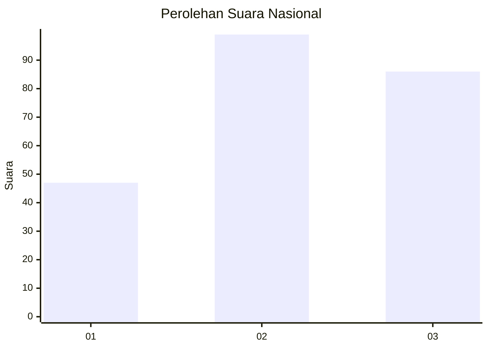
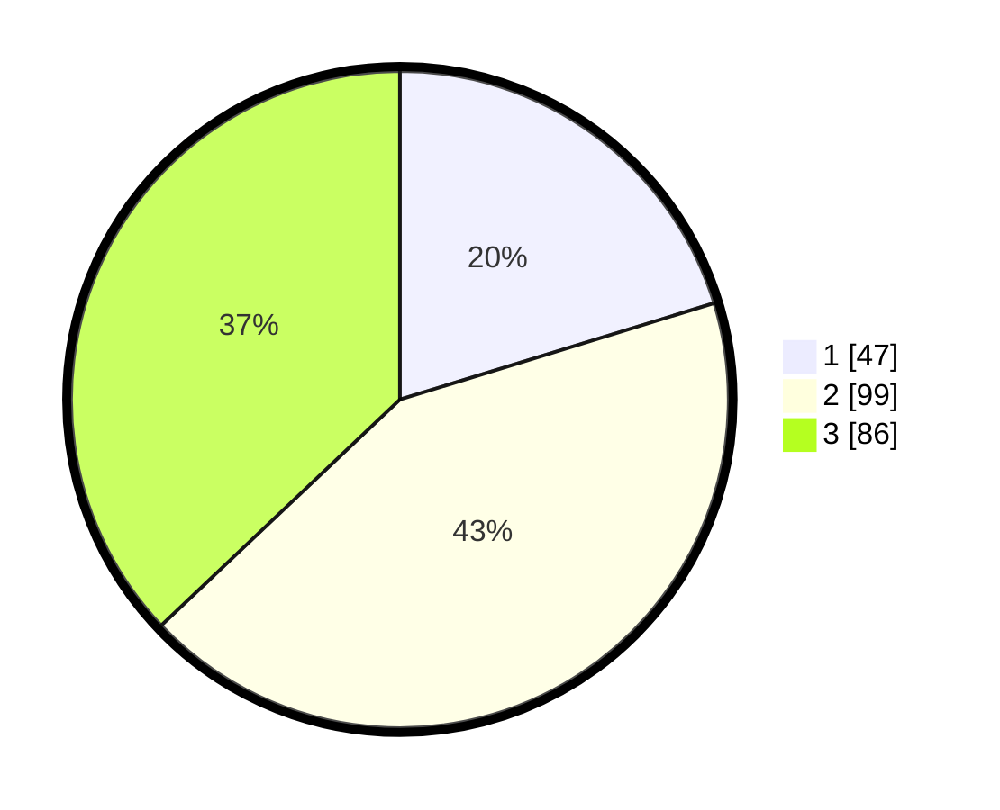

# Hasil

## Grafik

## Tabel

| No.    | Nama Paslon    | Suara | Suara (raw) | Persentase |
|:------ |:-------------- | -----:| -----------:| ----------:|
| 100025 | ANIES MUHAIMIN | 47    | [47][p-1]   | 20,26      |
| 100026 | PRABOWO GIBRAN | 99    | [99][p-2]   | 42,67      |
| 100027 | GANJAR MAHFUD  | 86    | [86][p-3]   | 37,07      |

[p-1]: https://github.com/gigit-pemilu/pemilu-2024/blob/main/pilpres/hitung-suara/sub/31-dki-jakarta/sub/72-jakarta-utara/sub/02-tanjung-priok/sub/1006-sunter-agung/sub/162-tps/sub/paslon-1.txt
[p-2]: https://github.com/gigit-pemilu/pemilu-2024/blob/main/pilpres/hitung-suara/sub/31-dki-jakarta/sub/72-jakarta-utara/sub/02-tanjung-priok/sub/1006-sunter-agung/sub/162-tps/sub/paslon-2.txt
[p-3]: https://github.com/gigit-pemilu/pemilu-2024/blob/main/pilpres/hitung-suara/sub/31-dki-jakarta/sub/72-jakarta-utara/sub/02-tanjung-priok/sub/1006-sunter-agung/sub/162-tps/sub/paslon-3.txt

## Foto C Plano

https://sirekap-obj-formc.kpu.go.id/b344/pemilu/ppwp/31/72/02/10/06/3172021006162-20240214-220412--880b40aa-8964-4b72-a21f-cc53c0fc9422.jpg

https://sirekap-obj-formc.kpu.go.id/b344/pemilu/ppwp/31/72/02/10/06/3172021006162-20240214-220323--b854fa1d-8aa7-4b8f-a8fb-977261bf9d10.jpg

https://sirekap-obj-formc.kpu.go.id/b344/pemilu/ppwp/31/72/02/10/06/3172021006162-20240214-215942--776683ce-bfc1-4c6d-8b77-d2e1bc3b4daf.jpg

## Metadata

| Key        | Value               |
| ---------- | ------------------- |
| Time Stamp | 2024-02-21 17:00:00 |

