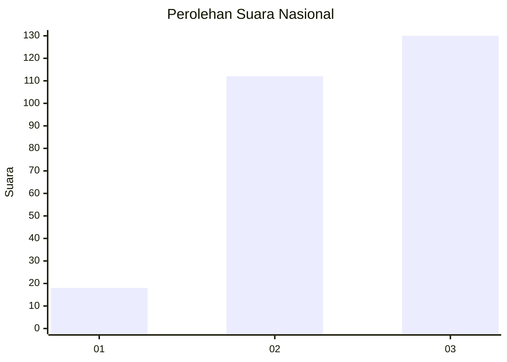
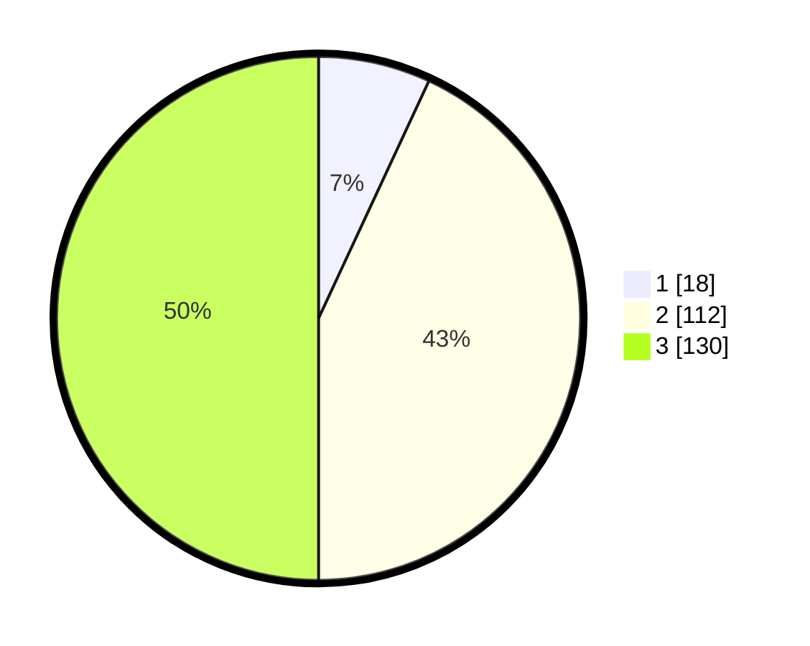

# Hasil

## Grafik

## Tabel

| No.    | Nama Paslon    | Suara | Suara (raw) | Persentase |
|:------ |:-------------- | -----:| -----------:| ----------:|
| 100025 | ANIES MUHAIMIN | 18    | [18][p-1]   | 6,92       |
| 100026 | PRABOWO GIBRAN | 112   | [112][p-2]  | 43,08      |
| 100027 | GANJAR MAHFUD  | 130   | [130][p-3]  | 50,00      |

[p-1]: https://github.com/gigit-pemilu/pemilu-2024/blob/main/pilpres/hitung-suara/sub/31-dki-jakarta/sub/72-jakarta-utara/sub/02-tanjung-priok/sub/1006-sunter-agung/sub/168-tps/sub/paslon-1.txt
[p-2]: https://github.com/gigit-pemilu/pemilu-2024/blob/main/pilpres/hitung-suara/sub/31-dki-jakarta/sub/72-jakarta-utara/sub/02-tanjung-priok/sub/1006-sunter-agung/sub/168-tps/sub/paslon-2.txt
[p-3]: https://github.com/gigit-pemilu/pemilu-2024/blob/main/pilpres/hitung-suara/sub/31-dki-jakarta/sub/72-jakarta-utara/sub/02-tanjung-priok/sub/1006-sunter-agung/sub/168-tps/sub/paslon-3.txt

## Foto C Plano

https://sirekap-obj-formc.kpu.go.id/5405/pemilu/ppwp/31/72/02/10/06/3172021006168-20240215-221529--49ff2866-f2bd-4844-9ce5-eb1d71710fbe.jpg

https://sirekap-obj-formc.kpu.go.id/5405/pemilu/ppwp/31/72/02/10/06/3172021006168-20240215-210517--881cd2ce-d7ea-40c0-a95c-b987957f1370.jpg

https://sirekap-obj-formc.kpu.go.id/5405/pemilu/ppwp/31/72/02/10/06/3172021006168-20240215-210550--bd8a9f97-3a2f-4f22-a99b-8c2d60d3f77f.jpg

## Metadata

| Key        | Value               |
| ---------- | ------------------- |
| Time Stamp | 2024-02-21 17:00:00 |

