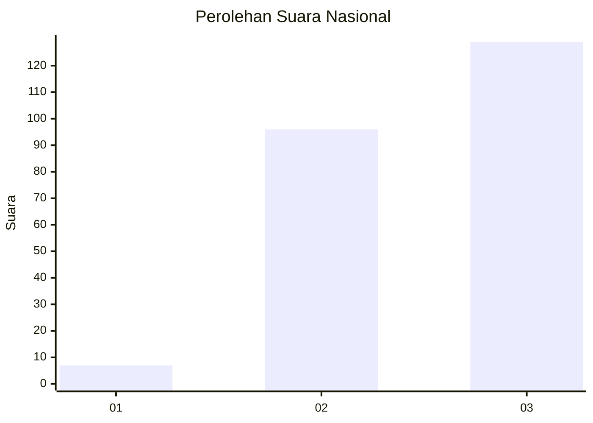
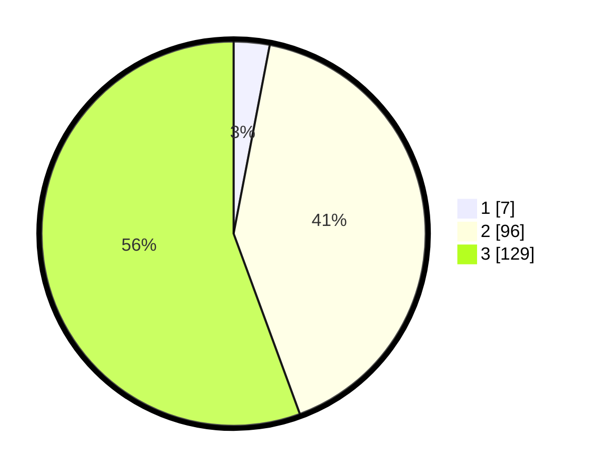

# Hasil

## Grafik

## Tabel

| No.    | Nama Paslon    | Suara | Suara (raw) | Persentase |
|:------ |:-------------- | -----:| -----------:| ----------:|
| 100025 | ANIES MUHAIMIN | 7     | [7][p-1]    | 3,02       |
| 100026 | PRABOWO GIBRAN | 96    | [96][p-2]   | 41,38      |
| 100027 | GANJAR MAHFUD  | 129   | [129][p-3]  | 55,60      |

[p-1]: https://github.com/gigit-pemilu/pemilu-2024/blob/main/pilpres/hitung-suara/sub/31-dki-jakarta/sub/72-jakarta-utara/sub/02-tanjung-priok/sub/1006-sunter-agung/sub/170-tps/sub/paslon-1.txt
[p-2]: https://github.com/gigit-pemilu/pemilu-2024/blob/main/pilpres/hitung-suara/sub/31-dki-jakarta/sub/72-jakarta-utara/sub/02-tanjung-priok/sub/1006-sunter-agung/sub/170-tps/sub/paslon-2.txt
[p-3]: https://github.com/gigit-pemilu/pemilu-2024/blob/main/pilpres/hitung-suara/sub/31-dki-jakarta/sub/72-jakarta-utara/sub/02-tanjung-priok/sub/1006-sunter-agung/sub/170-tps/sub/paslon-3.txt

## Foto C Plano

https://sirekap-obj-formc.kpu.go.id/23f2/pemilu/ppwp/31/72/02/10/06/3172021006170-20240215-010603--c8464d8d-1268-4db2-874b-1fcb1360add1.jpg

https://sirekap-obj-formc.kpu.go.id/23f2/pemilu/ppwp/31/72/02/10/06/3172021006170-20240215-010610--d71b5830-5a32-43c3-89e4-aac2b1708ab1.jpg

https://sirekap-obj-formc.kpu.go.id/23f2/pemilu/ppwp/31/72/02/10/06/3172021006170-20240215-010616--78ff53dd-cb80-4803-aa01-e25005863f84.jpg

## Metadata

| Key        | Value               |
| ---------- | ------------------- |
| Time Stamp | 2024-02-21 17:00:00 |

