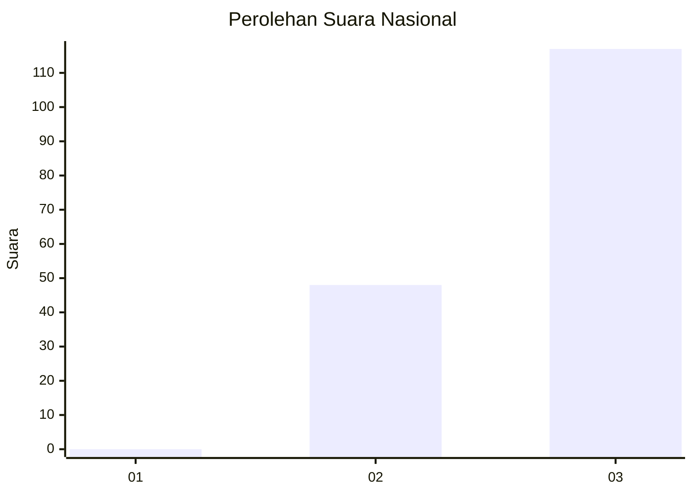
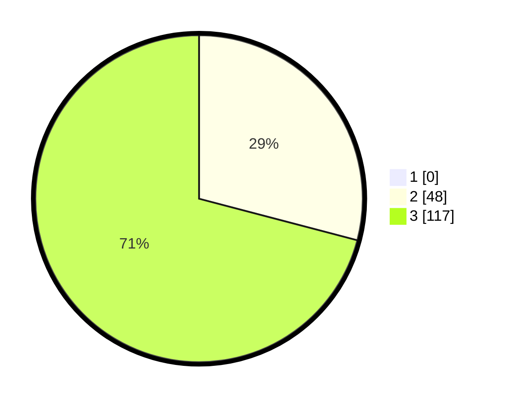

# Hasil

## Grafik

## Tabel

| No.    | Nama Paslon    | Suara | Suara (raw) | Persentase |
|:------ |:-------------- | -----:| -----------:| ----------:|
| 100025 | ANIES MUHAIMIN | 0     | [0][p-1]    | 0,00       |
| 100026 | PRABOWO GIBRAN | 48    | [48][p-2]   | 29,09      |
| 100027 | GANJAR MAHFUD  | 117   | [117][p-3]  | 70,91      |

[p-1]: https://github.com/gigit-pemilu/pemilu-2024/blob/main/pilpres/hitung-suara/sub/31-dki-jakarta/sub/72-jakarta-utara/sub/02-tanjung-priok/sub/1006-sunter-agung/sub/181-tps/sub/paslon-1.txt
[p-2]: https://github.com/gigit-pemilu/pemilu-2024/blob/main/pilpres/hitung-suara/sub/31-dki-jakarta/sub/72-jakarta-utara/sub/02-tanjung-priok/sub/1006-sunter-agung/sub/181-tps/sub/paslon-2.txt
[p-3]: https://github.com/gigit-pemilu/pemilu-2024/blob/main/pilpres/hitung-suara/sub/31-dki-jakarta/sub/72-jakarta-utara/sub/02-tanjung-priok/sub/1006-sunter-agung/sub/181-tps/sub/paslon-3.txt

## Foto C Plano

https://sirekap-obj-formc.kpu.go.id/dc74/pemilu/ppwp/31/72/02/10/06/3172021006181-20240214-214233--cd18dcb4-6f42-467b-bf49-7398bd9e53b2.jpg

https://sirekap-obj-formc.kpu.go.id/dc74/pemilu/ppwp/31/72/02/10/06/3172021006181-20240214-214241--ac54d2a5-5624-4255-b281-bb420ea68b63.jpg

https://sirekap-obj-formc.kpu.go.id/dc74/pemilu/ppwp/31/72/02/10/06/3172021006181-20240214-214250--6f17cdba-5368-4be2-935d-275a276c2b07.jpg

## Metadata

| Key        | Value               |
| ---------- | ------------------- |
| Time Stamp | 2024-02-21 17:00:00 |

