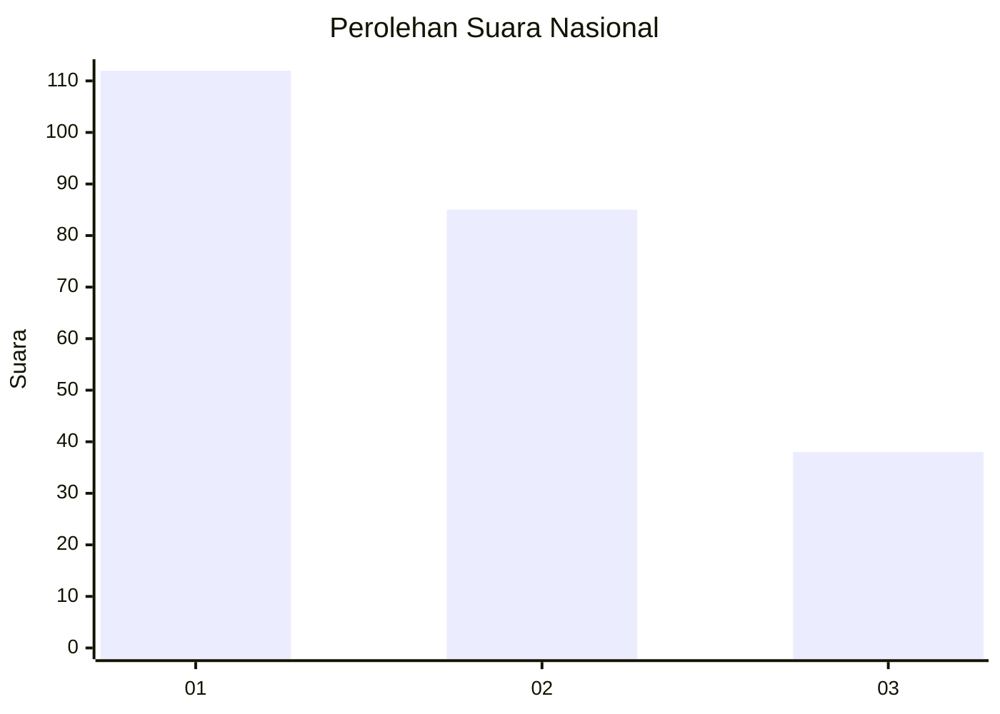
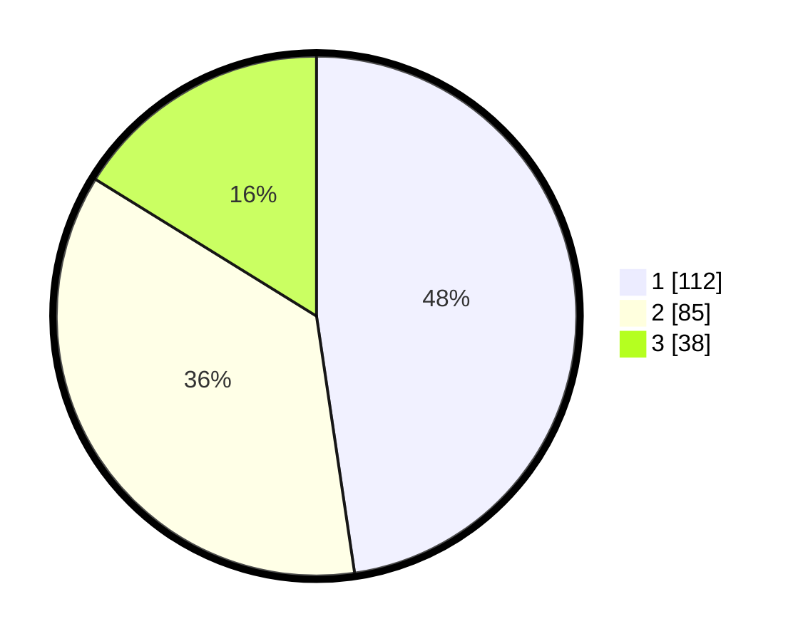

# Hasil

## Grafik

## Tabel

| No.    | Nama Paslon    | Suara | Suara (raw) | Persentase |
|:------ |:-------------- | -----:| -----------:| ----------:|
| 100025 | ANIES MUHAIMIN | 112   | [112][p-1]  | 47,66      |
| 100026 | PRABOWO GIBRAN | 85    | [85][p-2]   | 36,17      |
| 100027 | GANJAR MAHFUD  | 38    | [38][p-3]   | 16,17      |

[p-1]: https://github.com/gigit-pemilu/pemilu-2024/blob/main/pilpres/hitung-suara/sub/31-dki-jakarta/sub/72-jakarta-utara/sub/02-tanjung-priok/sub/1006-sunter-agung/sub/183-tps/sub/paslon-1.txt
[p-2]: https://github.com/gigit-pemilu/pemilu-2024/blob/main/pilpres/hitung-suara/sub/31-dki-jakarta/sub/72-jakarta-utara/sub/02-tanjung-priok/sub/1006-sunter-agung/sub/183-tps/sub/paslon-2.txt
[p-3]: https://github.com/gigit-pemilu/pemilu-2024/blob/main/pilpres/hitung-suara/sub/31-dki-jakarta/sub/72-jakarta-utara/sub/02-tanjung-priok/sub/1006-sunter-agung/sub/183-tps/sub/paslon-3.txt

## Foto C Plano

https://sirekap-obj-formc.kpu.go.id/db74/pemilu/ppwp/31/72/02/10/06/3172021006183-20240214-192202--0327ec28-cb3e-4681-bdcc-4a3d84d5063e.jpg

https://sirekap-obj-formc.kpu.go.id/db74/pemilu/ppwp/31/72/02/10/06/3172021006183-20240214-192310--57435a01-7639-45d5-a6ec-ce6bbdba70ef.jpg

https://sirekap-obj-formc.kpu.go.id/db74/pemilu/ppwp/31/72/02/10/06/3172021006183-20240214-192412--6c10bf01-bbbe-4778-ad0c-c0054f7ac372.jpg

## Metadata

| Key        | Value               |
| ---------- | ------------------- |
| Time Stamp | 2024-02-21 17:00:00 |

