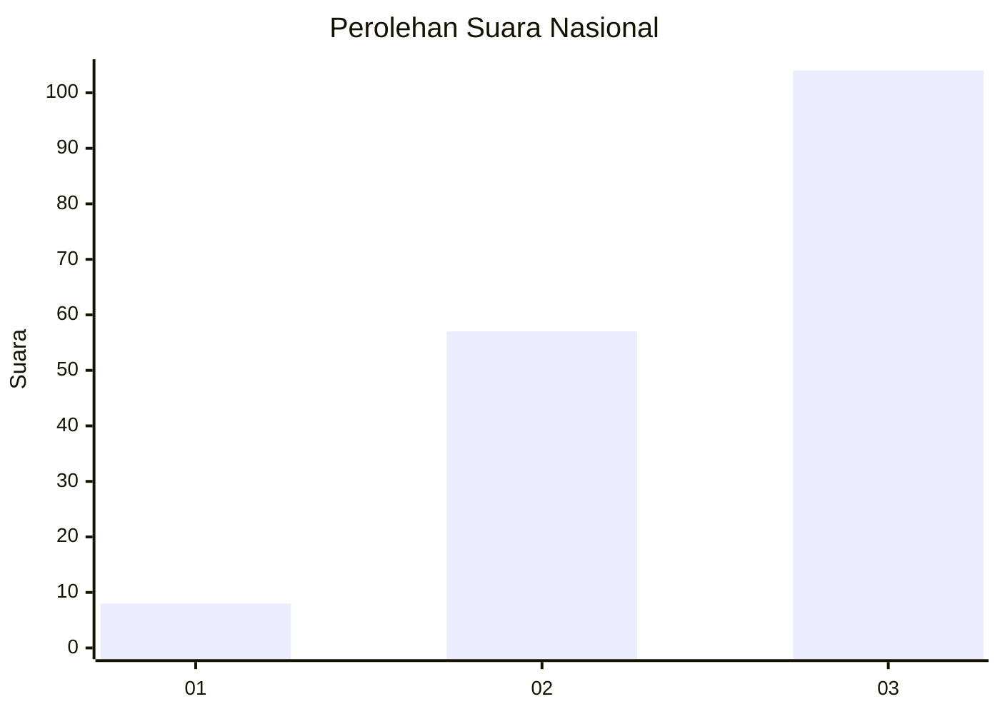
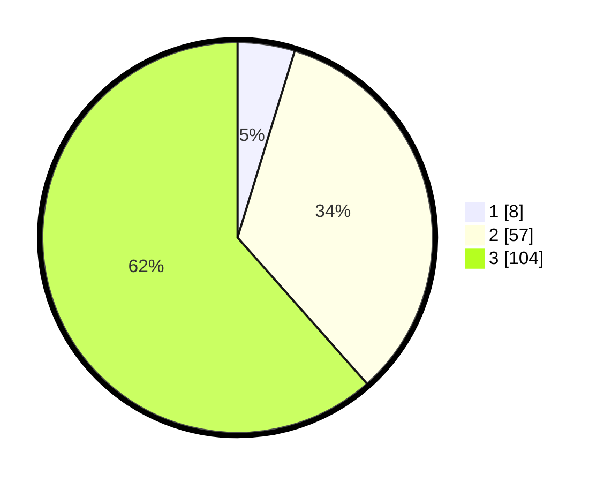

# Hasil

## Grafik

## Tabel

| No.    | Nama Paslon    | Suara | Suara (raw) | Persentase |
|:------ |:-------------- | -----:| -----------:| ----------:|
| 100025 | ANIES MUHAIMIN | 8     | [8][p-1]    | 4,73       |
| 100026 | PRABOWO GIBRAN | 57    | [57][p-2]   | 33,73      |
| 100027 | GANJAR MAHFUD  | 104   | [104][p-3]  | 61,54      |

[p-1]: https://github.com/gigit-pemilu/pemilu-2024/blob/main/pilpres/hitung-suara/sub/31-dki-jakarta/sub/72-jakarta-utara/sub/02-tanjung-priok/sub/1006-sunter-agung/sub/197-tps/sub/paslon-1.txt
[p-2]: https://github.com/gigit-pemilu/pemilu-2024/blob/main/pilpres/hitung-suara/sub/31-dki-jakarta/sub/72-jakarta-utara/sub/02-tanjung-priok/sub/1006-sunter-agung/sub/197-tps/sub/paslon-2.txt
[p-3]: https://github.com/gigit-pemilu/pemilu-2024/blob/main/pilpres/hitung-suara/sub/31-dki-jakarta/sub/72-jakarta-utara/sub/02-tanjung-priok/sub/1006-sunter-agung/sub/197-tps/sub/paslon-3.txt

## Foto C Plano

https://sirekap-obj-formc.kpu.go.id/8684/pemilu/ppwp/31/72/02/10/06/3172021006197-20240218-162314--420056bf-0381-4784-9e0b-04a00820c545.jpg

https://sirekap-obj-formc.kpu.go.id/8684/pemilu/ppwp/31/72/02/10/06/3172021006197-20240218-162531--448a5fa1-795d-4576-82ba-510f06737437.jpg

https://sirekap-obj-formc.kpu.go.id/8684/pemilu/ppwp/31/72/02/10/06/3172021006197-20240218-162707--61fed449-bebc-4c6e-820e-8829bc8d1b59.jpg

## Metadata

| Key        | Value               |
| ---------- | ------------------- |
| Time Stamp | 2024-02-21 17:00:00 |

