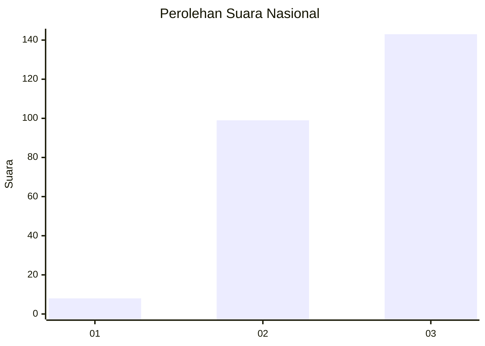
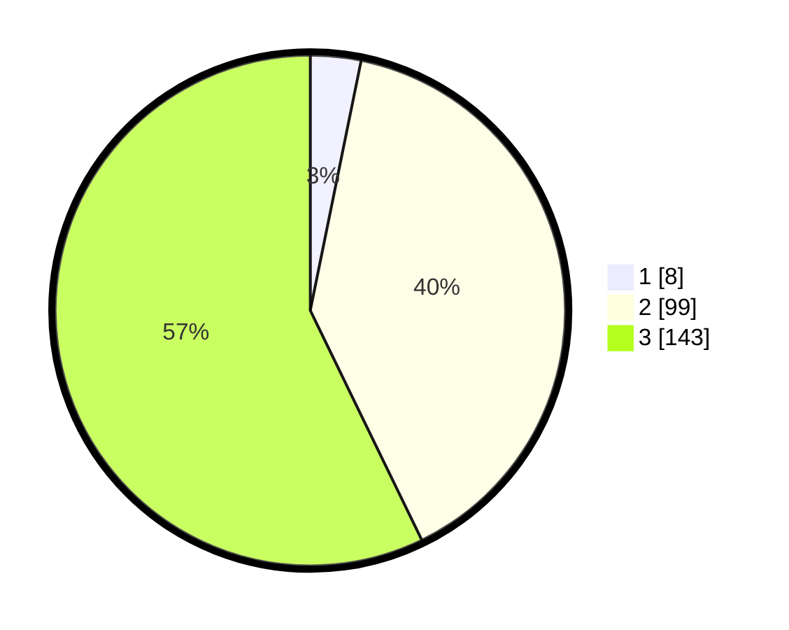

# Hasil

## Grafik

## Tabel

| No.    | Nama Paslon    | Suara | Suara (raw) | Persentase |
|:------ |:-------------- | -----:| -----------:| ----------:|
| 100025 | ANIES MUHAIMIN | 8     | [8][p-1]    | 3,20       |
| 100026 | PRABOWO GIBRAN | 99    | [99][p-2]   | 39,60      |
| 100027 | GANJAR MAHFUD  | 143   | [143][p-3]  | 57,20      |

[p-1]: https://github.com/gigit-pemilu/pemilu-2024/blob/main/pilpres/hitung-suara/sub/31-dki-jakarta/sub/72-jakarta-utara/sub/02-tanjung-priok/sub/1006-sunter-agung/sub/228-tps/sub/paslon-1.txt
[p-2]: https://github.com/gigit-pemilu/pemilu-2024/blob/main/pilpres/hitung-suara/sub/31-dki-jakarta/sub/72-jakarta-utara/sub/02-tanjung-priok/sub/1006-sunter-agung/sub/228-tps/sub/paslon-2.txt
[p-3]: https://github.com/gigit-pemilu/pemilu-2024/blob/main/pilpres/hitung-suara/sub/31-dki-jakarta/sub/72-jakarta-utara/sub/02-tanjung-priok/sub/1006-sunter-agung/sub/228-tps/sub/paslon-3.txt

## Foto C Plano

https://sirekap-obj-formc.kpu.go.id/5263/pemilu/ppwp/31/72/02/10/06/3172021006228-20240214-190715--43d6244d-55a7-43fb-8c85-456660cb3132.jpg

https://sirekap-obj-formc.kpu.go.id/5263/pemilu/ppwp/31/72/02/10/06/3172021006228-20240214-190700--27b4081d-2a96-46a1-8c6d-acb3443cdbdb.jpg

https://sirekap-obj-formc.kpu.go.id/5263/pemilu/ppwp/31/72/02/10/06/3172021006228-20240214-190644--7f9567b5-ae8b-4408-a0e8-a1f277e68b5f.jpg

## Metadata

| Key        | Value               |
| ---------- | ------------------- |
| Time Stamp | 2024-02-21 17:00:00 |

