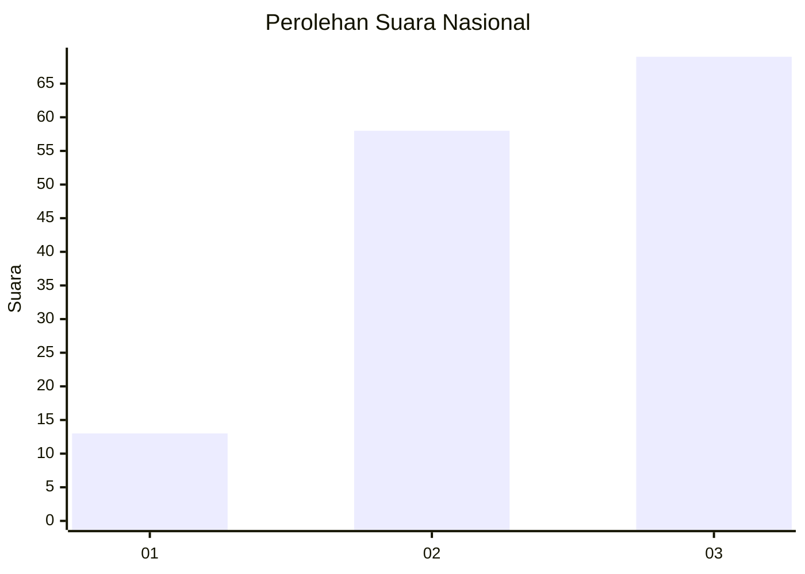
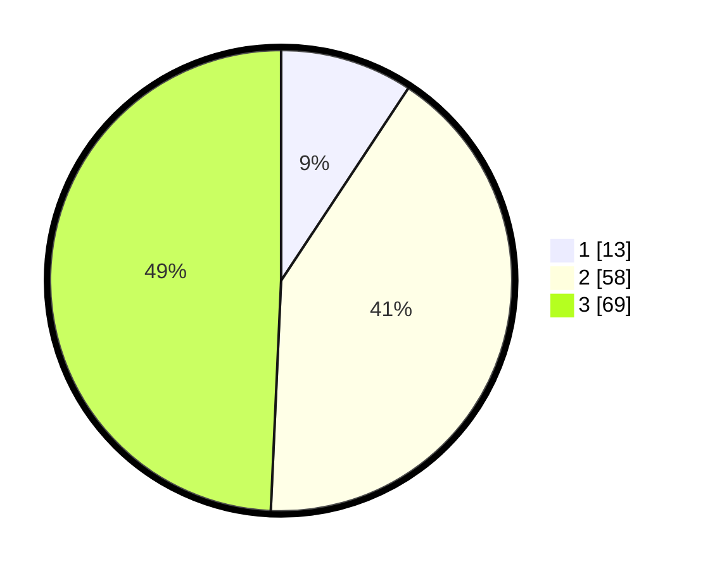

# Hasil

## Grafik

## Tabel

| No.    | Nama Paslon    | Suara | Suara (raw) | Persentase |
|:------ |:-------------- | -----:| -----------:| ----------:|
| 100025 | ANIES MUHAIMIN | 13    | [13][p-1]   | 9,29       |
| 100026 | PRABOWO GIBRAN | 58    | [58][p-2]   | 41,43      |
| 100027 | GANJAR MAHFUD  | 69    | [69][p-3]   | 49,29      |

[p-1]: https://github.com/gigit-pemilu/pemilu-2024/blob/main/pilpres/hitung-suara/sub/31-dki-jakarta/sub/72-jakarta-utara/sub/02-tanjung-priok/sub/1006-sunter-agung/sub/231-tps/sub/paslon-1.txt
[p-2]: https://github.com/gigit-pemilu/pemilu-2024/blob/main/pilpres/hitung-suara/sub/31-dki-jakarta/sub/72-jakarta-utara/sub/02-tanjung-priok/sub/1006-sunter-agung/sub/231-tps/sub/paslon-2.txt
[p-3]: https://github.com/gigit-pemilu/pemilu-2024/blob/main/pilpres/hitung-suara/sub/31-dki-jakarta/sub/72-jakarta-utara/sub/02-tanjung-priok/sub/1006-sunter-agung/sub/231-tps/sub/paslon-3.txt

## Foto C Plano

https://sirekap-obj-formc.kpu.go.id/e222/pemilu/ppwp/31/72/02/10/06/3172021006231-20240214-205004--326c2438-e68d-4d6b-a880-26ed98fd86d4.jpg

https://sirekap-obj-formc.kpu.go.id/e222/pemilu/ppwp/31/72/02/10/06/3172021006231-20240214-202831--2c8aa528-c9fc-48f4-bc52-57f8a86052ed.jpg

https://sirekap-obj-formc.kpu.go.id/e222/pemilu/ppwp/31/72/02/10/06/3172021006231-20240214-202916--3e024381-8539-44da-b597-d9531a4a9ed4.jpg

## Metadata

| Key        | Value               |
| ---------- | ------------------- |
| Time Stamp | 2024-02-21 17:00:00 |

