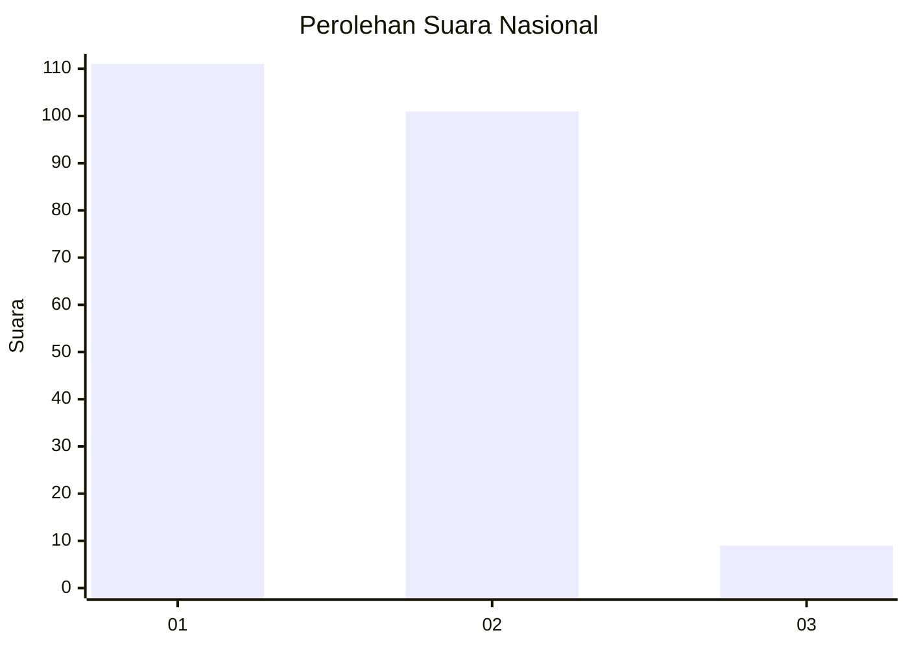
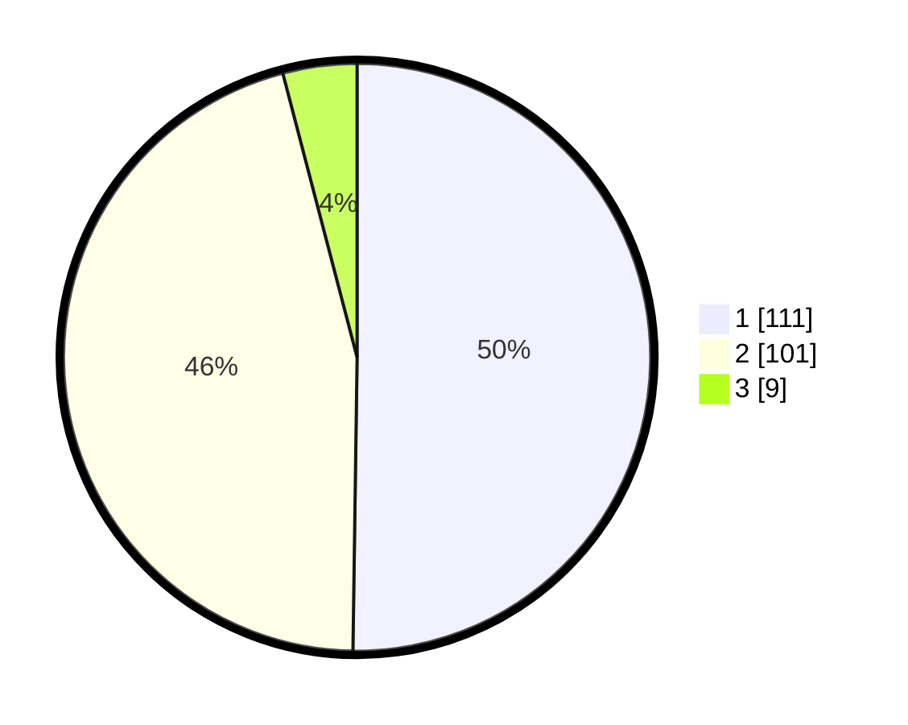

# Hasil

## Grafik

## Tabel

| No.    | Nama Paslon    | Suara | Suara (raw) | Persentase |
|:------ |:-------------- | -----:| -----------:| ----------:|
| 100025 | ANIES MUHAIMIN | 111   | [111][p-1]  | 50,23      |
| 100026 | PRABOWO GIBRAN | 101   | [101][p-2]  | 45,70      |
| 100027 | GANJAR MAHFUD  | 9     | [9][p-3]    | 4,07       |

[p-1]: https://github.com/gigit-pemilu/pemilu-2024/blob/main/pilpres/hitung-suara/sub/31-dki-jakarta/sub/72-jakarta-utara/sub/02-tanjung-priok/sub/1007-warakas/sub/025-tps/sub/paslon-1.txt
[p-2]: https://github.com/gigit-pemilu/pemilu-2024/blob/main/pilpres/hitung-suara/sub/31-dki-jakarta/sub/72-jakarta-utara/sub/02-tanjung-priok/sub/1007-warakas/sub/025-tps/sub/paslon-2.txt
[p-3]: https://github.com/gigit-pemilu/pemilu-2024/blob/main/pilpres/hitung-suara/sub/31-dki-jakarta/sub/72-jakarta-utara/sub/02-tanjung-priok/sub/1007-warakas/sub/025-tps/sub/paslon-3.txt

## Foto C Plano

https://sirekap-obj-formc.kpu.go.id/a323/pemilu/ppwp/31/72/02/10/07/3172021007025-20240215-010054--d37ca87b-f41b-4c3f-8008-91ceff5aa1af.jpg

https://sirekap-obj-formc.kpu.go.id/a323/pemilu/ppwp/31/72/02/10/07/3172021007025-20240215-010218--959d1aaa-da75-427d-9e4a-fd95f171c7d0.jpg

https://sirekap-obj-formc.kpu.go.id/a323/pemilu/ppwp/31/72/02/10/07/3172021007025-20240215-010306--6155ed3e-fb65-455c-b239-9f09fcb6ffa0.jpg

## Metadata

| Key        | Value               |
| ---------- | ------------------- |
| Time Stamp | 2024-02-15 09:00:24 |

