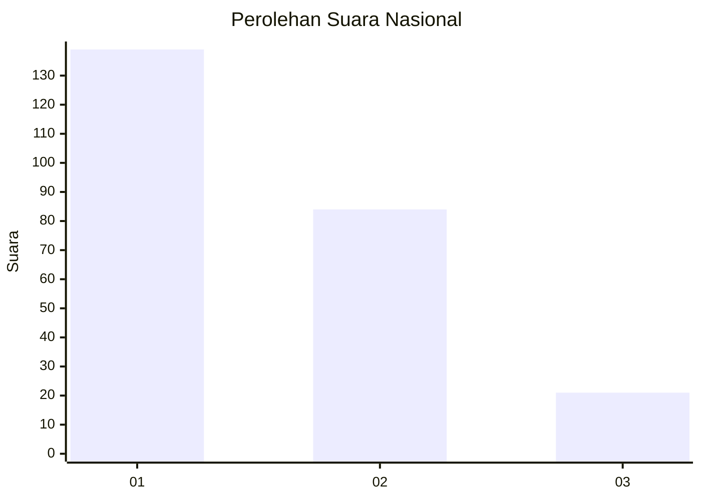
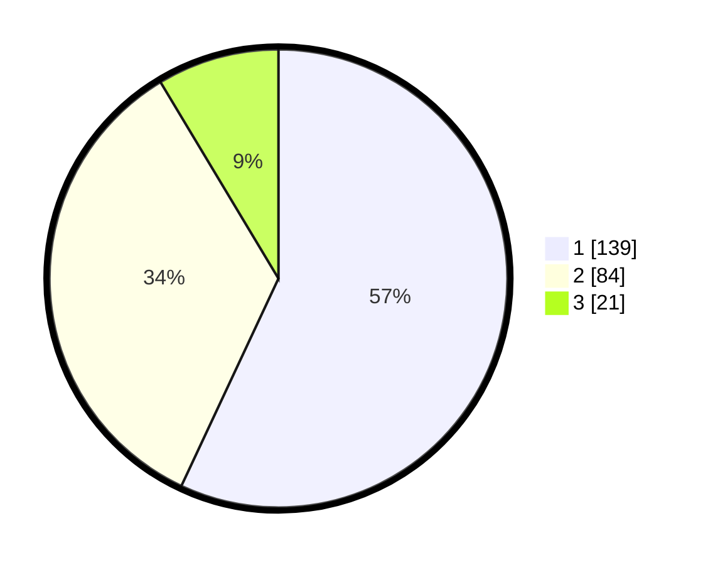

# Hasil

## Grafik

## Tabel

| No.    | Nama Paslon    | Suara | Suara (raw) | Persentase |
|:------ |:-------------- | -----:| -----------:| ----------:|
| 100025 | ANIES MUHAIMIN | 139   | [139][p-1]  | 56,97      |
| 100026 | PRABOWO GIBRAN | 84    | [84][p-2]   | 34,43      |
| 100027 | GANJAR MAHFUD  | 21    | [21][p-3]   | 8,61       |

[p-1]: https://github.com/gigit-pemilu/pemilu-2024/blob/main/pilpres/hitung-suara/sub/31-dki-jakarta/sub/72-jakarta-utara/sub/02-tanjung-priok/sub/1007-warakas/sub/062-tps/sub/paslon-1.txt
[p-2]: https://github.com/gigit-pemilu/pemilu-2024/blob/main/pilpres/hitung-suara/sub/31-dki-jakarta/sub/72-jakarta-utara/sub/02-tanjung-priok/sub/1007-warakas/sub/062-tps/sub/paslon-2.txt
[p-3]: https://github.com/gigit-pemilu/pemilu-2024/blob/main/pilpres/hitung-suara/sub/31-dki-jakarta/sub/72-jakarta-utara/sub/02-tanjung-priok/sub/1007-warakas/sub/062-tps/sub/paslon-3.txt

## Foto C Plano

https://sirekap-obj-formc.kpu.go.id/0650/pemilu/ppwp/31/72/02/10/07/3172021007062-20240218-193046--aca264a8-edef-4edc-bea9-ffd20d7abf9e.jpg

https://sirekap-obj-formc.kpu.go.id/0650/pemilu/ppwp/31/72/02/10/07/3172021007062-20240218-192449--17f08678-9b13-47e4-8532-d7b7fb4014cc.jpg

https://sirekap-obj-formc.kpu.go.id/0650/pemilu/ppwp/31/72/02/10/07/3172021007062-20240218-191938--b51639bf-8482-4640-b004-22b59ad73057.jpg

## Metadata

| Key        | Value               |
| ---------- | ------------------- |
| Time Stamp | 2024-02-21 17:00:00 |

