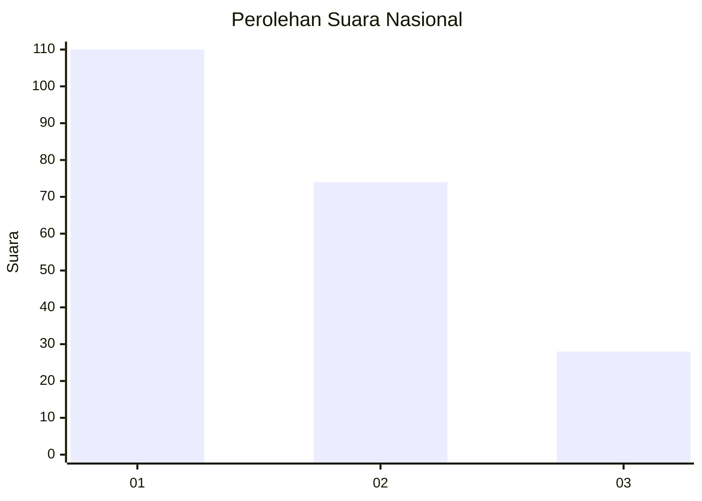
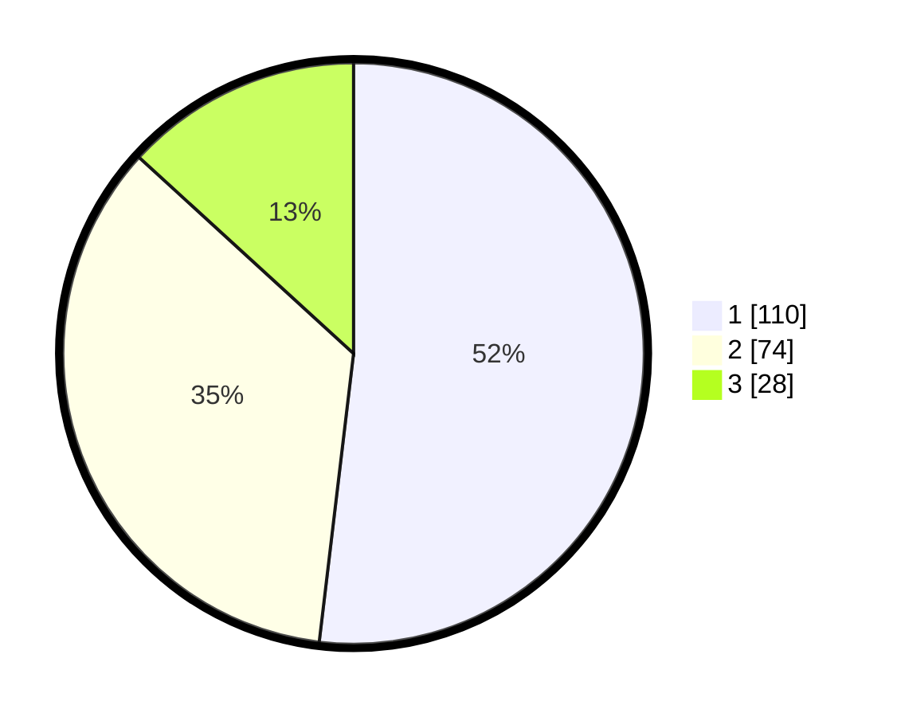

# Hasil

## Grafik

## Tabel

| No.    | Nama Paslon    | Suara | Suara (raw) | Persentase |
|:------ |:-------------- | -----:| -----------:| ----------:|
| 100025 | ANIES MUHAIMIN | 110   | [110][p-1]  | 51,89      |
| 100026 | PRABOWO GIBRAN | 74    | [74][p-2]   | 34,91      |
| 100027 | GANJAR MAHFUD  | 28    | [28][p-3]   | 13,21      |

[p-1]: https://github.com/gigit-pemilu/pemilu-2024/blob/main/pilpres/hitung-suara/sub/31-dki-jakarta/sub/72-jakarta-utara/sub/02-tanjung-priok/sub/1007-warakas/sub/065-tps/sub/paslon-1.txt
[p-2]: https://github.com/gigit-pemilu/pemilu-2024/blob/main/pilpres/hitung-suara/sub/31-dki-jakarta/sub/72-jakarta-utara/sub/02-tanjung-priok/sub/1007-warakas/sub/065-tps/sub/paslon-2.txt
[p-3]: https://github.com/gigit-pemilu/pemilu-2024/blob/main/pilpres/hitung-suara/sub/31-dki-jakarta/sub/72-jakarta-utara/sub/02-tanjung-priok/sub/1007-warakas/sub/065-tps/sub/paslon-3.txt

## Foto C Plano

https://sirekap-obj-formc.kpu.go.id/2d88/pemilu/ppwp/31/72/02/10/07/3172021007065-20240214-155444--f9a0e450-5897-4aef-8723-1c58e6365262.jpg

https://sirekap-obj-formc.kpu.go.id/2d88/pemilu/ppwp/31/72/02/10/07/3172021007065-20240214-155809--ffeb1725-9afc-4708-85f7-89344ab4642f.jpg

https://sirekap-obj-formc.kpu.go.id/2d88/pemilu/ppwp/31/72/02/10/07/3172021007065-20240214-160129--5cd196d7-1f3f-4e85-bb2a-ad5483bcb1dc.jpg

## Metadata

| Key        | Value               |
| ---------- | ------------------- |
| Time Stamp | 2024-02-21 16:00:00 |

