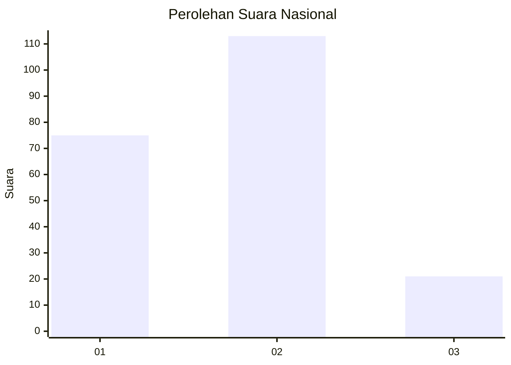

# Hasil

## Grafik

## Tabel

| No.    | Nama Paslon    | Suara | Suara (raw) | Persentase |
|:------ |:-------------- | -----:| -----------:| ----------:|
| 100025 | ANIES MUHAIMIN | 75    | [75][p-1]   | 35,89      |
| 100026 | PRABOWO GIBRAN | 113   | [113][p-2]  | 54,07      |
| 100027 | GANJAR MAHFUD  | 21    | [21][p-3]   | 10,05      |

[p-1]: https://github.com/gigit-pemilu/pemilu-2024/blob/main/pilpres/hitung-suara/sub/31-dki-jakarta/sub/72-jakarta-utara/sub/02-tanjung-priok/sub/1007-warakas/sub/072-tps/sub/paslon-1.txt
[p-2]: https://github.com/gigit-pemilu/pemilu-2024/blob/main/pilpres/hitung-suara/sub/31-dki-jakarta/sub/72-jakarta-utara/sub/02-tanjung-priok/sub/1007-warakas/sub/072-tps/sub/paslon-2.txt
[p-3]: https://github.com/gigit-pemilu/pemilu-2024/blob/main/pilpres/hitung-suara/sub/31-dki-jakarta/sub/72-jakarta-utara/sub/02-tanjung-priok/sub/1007-warakas/sub/072-tps/sub/paslon-3.txt

## Foto C Plano

https://sirekap-obj-formc.kpu.go.id/1eb8/pemilu/ppwp/31/72/02/10/07/3172021007072-20240214-223534--958f890a-27ec-48a5-b994-aa645ba4dd23.jpg

https://sirekap-obj-formc.kpu.go.id/1eb8/pemilu/ppwp/31/72/02/10/07/3172021007072-20240214-223711--26d0bf94-48ca-4fa1-91b3-3cc9b8c9b407.jpg

https://sirekap-obj-formc.kpu.go.id/1eb8/pemilu/ppwp/31/72/02/10/07/3172021007072-20240214-223908--a9ceeaf1-fffd-453c-aa4d-286bdda2ac6c.jpg

## Metadata

| Key        | Value               |
| ---------- | ------------------- |
| Time Stamp | 2024-02-21 17:00:00 |

