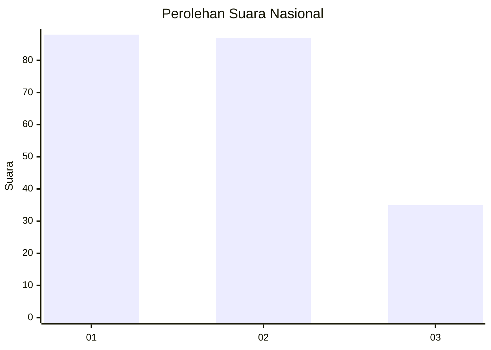
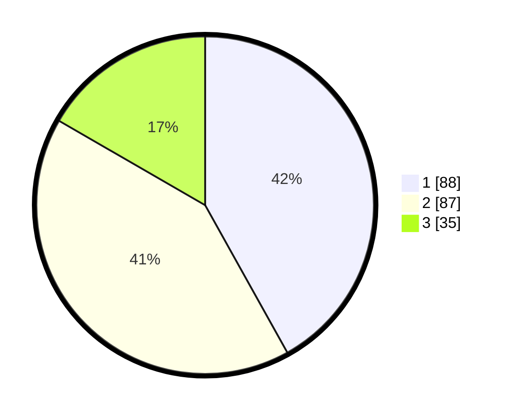

# Hasil

## Grafik

## Tabel

| No.    | Nama Paslon    | Suara | Suara (raw) | Persentase |
|:------ |:-------------- | -----:| -----------:| ----------:|
| 100025 | ANIES MUHAIMIN | 88    | [88][p-1]   | 41,90      |
| 100026 | PRABOWO GIBRAN | 87    | [87][p-2]   | 41,43      |
| 100027 | GANJAR MAHFUD  | 35    | [35][p-3]   | 16,67      |

[p-1]: https://github.com/gigit-pemilu/pemilu-2024/blob/main/pilpres/hitung-suara/sub/31-dki-jakarta/sub/72-jakarta-utara/sub/02-tanjung-priok/sub/1007-warakas/sub/077-tps/sub/paslon-1.txt
[p-2]: https://github.com/gigit-pemilu/pemilu-2024/blob/main/pilpres/hitung-suara/sub/31-dki-jakarta/sub/72-jakarta-utara/sub/02-tanjung-priok/sub/1007-warakas/sub/077-tps/sub/paslon-2.txt
[p-3]: https://github.com/gigit-pemilu/pemilu-2024/blob/main/pilpres/hitung-suara/sub/31-dki-jakarta/sub/72-jakarta-utara/sub/02-tanjung-priok/sub/1007-warakas/sub/077-tps/sub/paslon-3.txt

## Foto C Plano

https://sirekap-obj-formc.kpu.go.id/81fe/pemilu/ppwp/31/72/02/10/07/3172021007077-20240214-215332--67a695ce-c8bb-49e4-909b-42658c972d60.jpg

https://sirekap-obj-formc.kpu.go.id/81fe/pemilu/ppwp/31/72/02/10/07/3172021007077-20240214-215249--16592daf-7da7-4388-a62c-06b84e20b98b.jpg

https://sirekap-obj-formc.kpu.go.id/81fe/pemilu/ppwp/31/72/02/10/07/3172021007077-20240214-215205--f41cf7bb-7ffb-4a20-8342-02a02e80c5c2.jpg

## Metadata

| Key        | Value               |
| ---------- | ------------------- |
| Time Stamp | 2024-02-21 15:00:00 |

