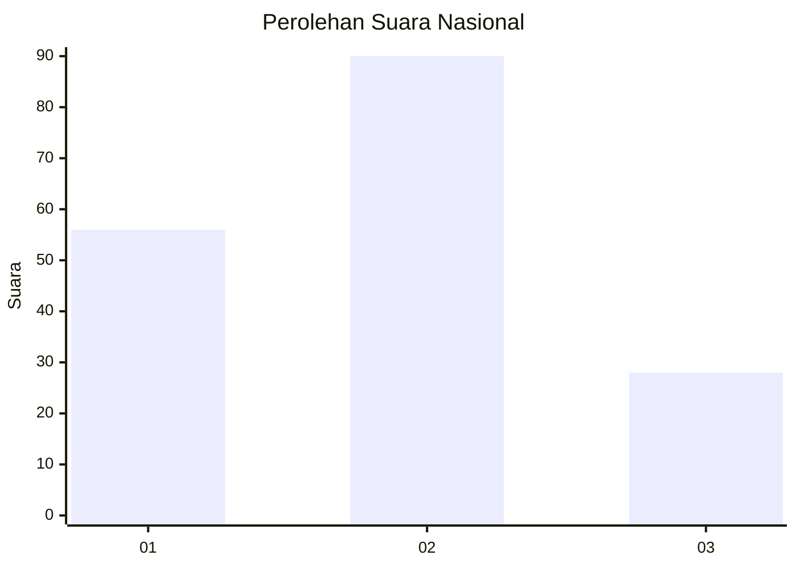
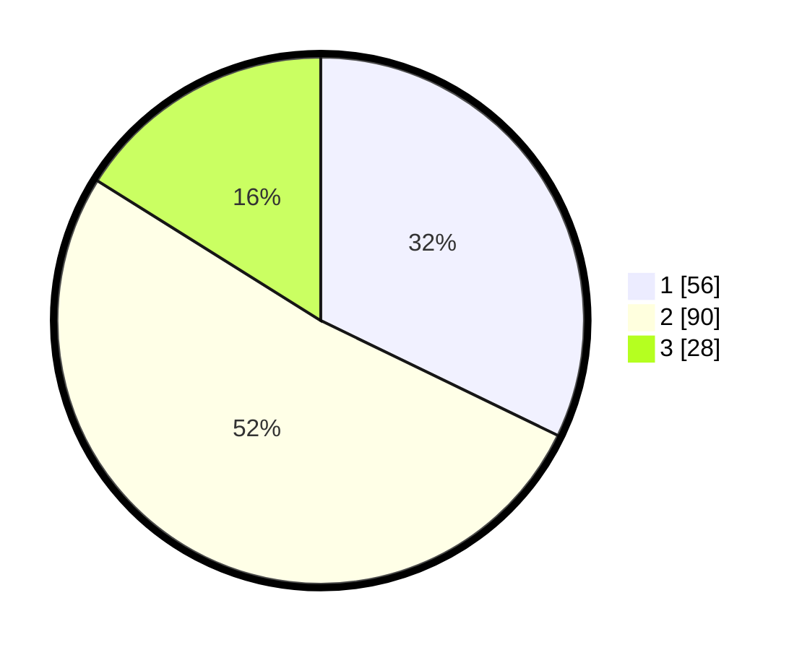

# Hasil

## Grafik

## Tabel

| No.    | Nama Paslon    | Suara | Suara (raw) | Persentase |
|:------ |:-------------- | -----:| -----------:| ----------:|
| 100025 | ANIES MUHAIMIN | 56    | [56][p-1]   | 32,18      |
| 100026 | PRABOWO GIBRAN | 90    | [90][p-2]   | 51,72      |
| 100027 | GANJAR MAHFUD  | 28    | [28][p-3]   | 16,09      |

[p-1]: https://github.com/gigit-pemilu/pemilu-2024/blob/main/pilpres/hitung-suara/sub/31-dki-jakarta/sub/72-jakarta-utara/sub/02-tanjung-priok/sub/1007-warakas/sub/114-tps/sub/paslon-1.txt
[p-2]: https://github.com/gigit-pemilu/pemilu-2024/blob/main/pilpres/hitung-suara/sub/31-dki-jakarta/sub/72-jakarta-utara/sub/02-tanjung-priok/sub/1007-warakas/sub/114-tps/sub/paslon-2.txt
[p-3]: https://github.com/gigit-pemilu/pemilu-2024/blob/main/pilpres/hitung-suara/sub/31-dki-jakarta/sub/72-jakarta-utara/sub/02-tanjung-priok/sub/1007-warakas/sub/114-tps/sub/paslon-3.txt

## Foto C Plano

https://sirekap-obj-formc.kpu.go.id/604d/pemilu/ppwp/31/72/02/10/07/3172021007114-20240214-215311--2b3291c3-1665-42f4-ba72-2c239fed0872.jpg

https://sirekap-obj-formc.kpu.go.id/604d/pemilu/ppwp/31/72/02/10/07/3172021007114-20240214-215502--d341b129-ecb7-4de4-a207-e91b577e161d.jpg

https://sirekap-obj-formc.kpu.go.id/604d/pemilu/ppwp/31/72/02/10/07/3172021007114-20240214-215621--e4db6a3a-2458-44f6-a1c7-aeb3e09dd94b.jpg

## Metadata

| Key        | Value               |
| ---------- | ------------------- |
| Time Stamp | 2024-02-21 17:00:00 |

