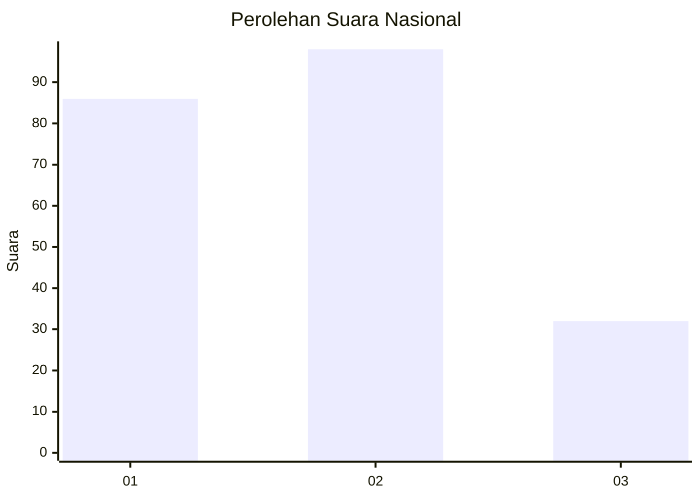
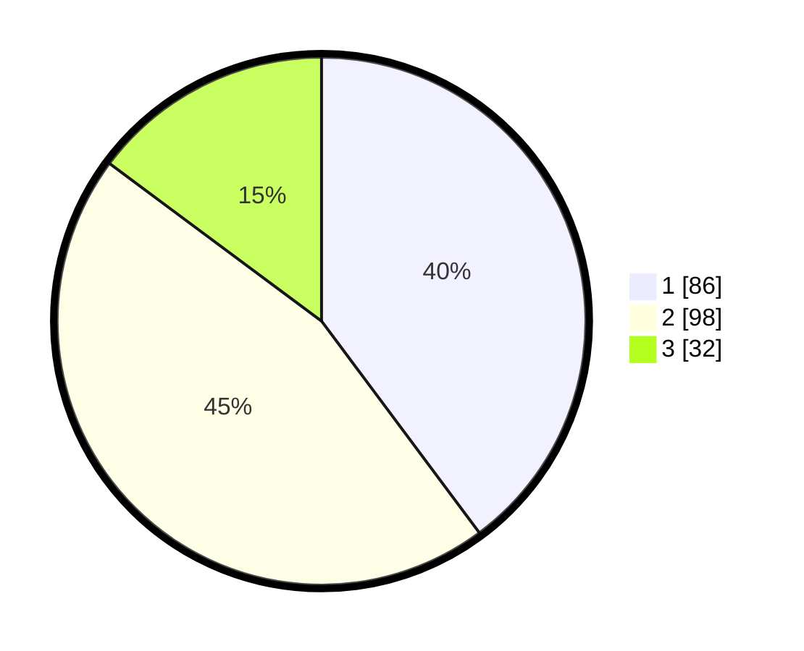

# Hasil

## Grafik

## Tabel

| No.    | Nama Paslon    | Suara | Suara (raw) | Persentase |
|:------ |:-------------- | -----:| -----------:| ----------:|
| 100025 | ANIES MUHAIMIN | 86    | [86][p-1]   | 39,81      |
| 100026 | PRABOWO GIBRAN | 98    | [98][p-2]   | 45,37      |
| 100027 | GANJAR MAHFUD  | 32    | [32][p-3]   | 14,81      |

[p-1]: https://github.com/gigit-pemilu/pemilu-2024/blob/main/pilpres/hitung-suara/sub/31-dki-jakarta/sub/72-jakarta-utara/sub/02-tanjung-priok/sub/1007-warakas/sub/140-tps/sub/paslon-1.txt
[p-2]: https://github.com/gigit-pemilu/pemilu-2024/blob/main/pilpres/hitung-suara/sub/31-dki-jakarta/sub/72-jakarta-utara/sub/02-tanjung-priok/sub/1007-warakas/sub/140-tps/sub/paslon-2.txt
[p-3]: https://github.com/gigit-pemilu/pemilu-2024/blob/main/pilpres/hitung-suara/sub/31-dki-jakarta/sub/72-jakarta-utara/sub/02-tanjung-priok/sub/1007-warakas/sub/140-tps/sub/paslon-3.txt

## Foto C Plano

https://sirekap-obj-formc.kpu.go.id/98f7/pemilu/ppwp/31/72/02/10/07/3172021007140-20240214-222708--b387e766-5149-4785-9b59-b72df7368c7d.jpg

https://sirekap-obj-formc.kpu.go.id/98f7/pemilu/ppwp/31/72/02/10/07/3172021007140-20240214-213705--16934457-2b19-4f1b-bc2a-93b5007bfc70.jpg

https://sirekap-obj-formc.kpu.go.id/98f7/pemilu/ppwp/31/72/02/10/07/3172021007140-20240214-214008--2ddd1d02-0553-4eea-96f3-9150aad6e1b0.jpg

## Metadata

| Key        | Value               |
| ---------- | ------------------- |
| Time Stamp | 2024-02-21 16:00:00 |

