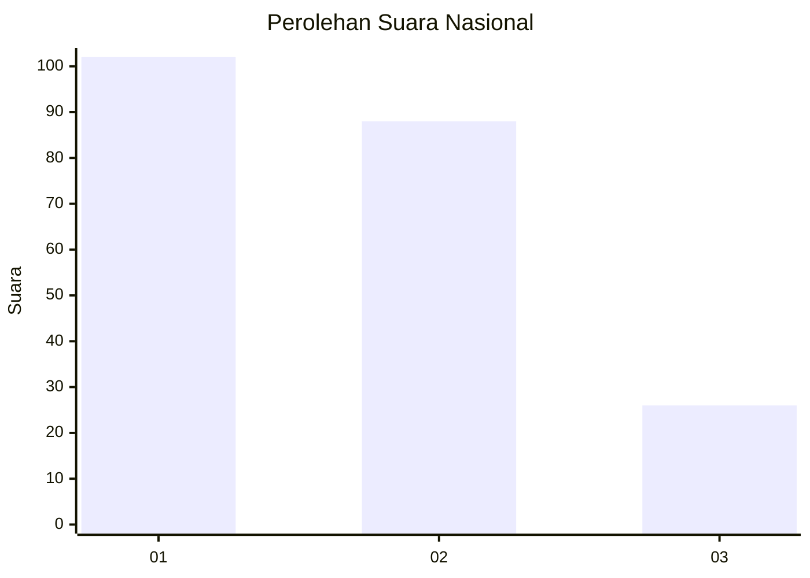
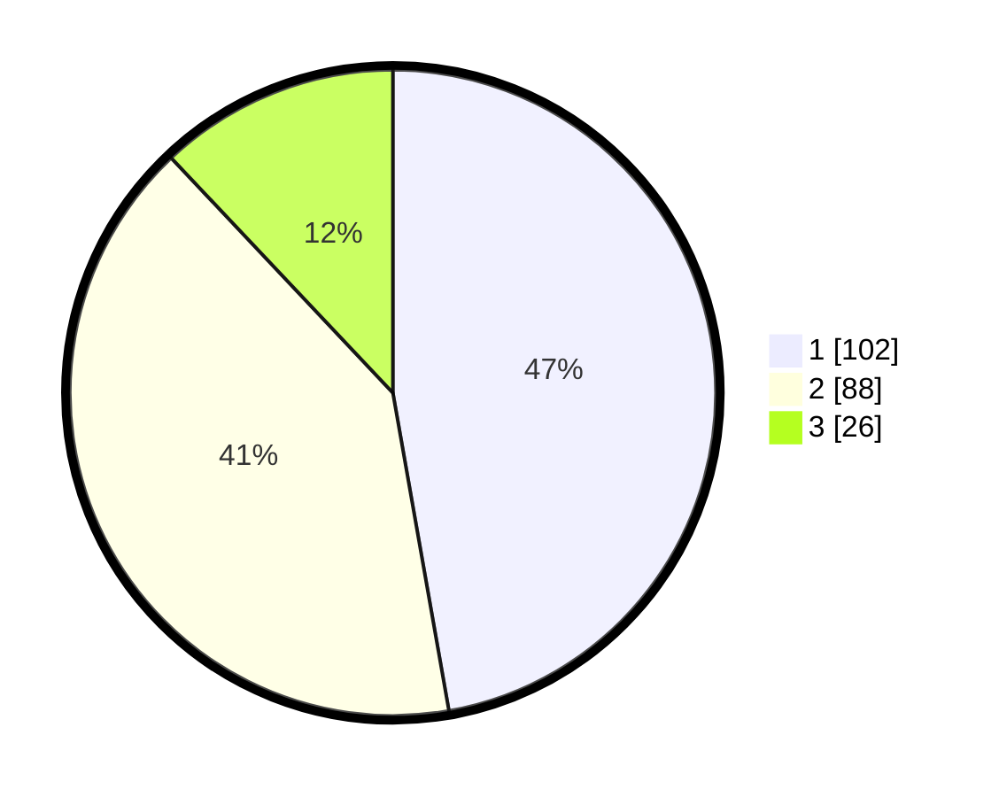

# Hasil

## Grafik

## Tabel

| No. | Nama Paslon    | Suara | Suara (raw) | Persentase |
|:--- |:-------------- | -----:| -----------:| ----------:|
| 1   | ANIES MUHAIMIN | 102   | [102][p-1]  | 47,22      |
| 2   | PRABOWO GIBRAN | 88    | [88][p-2]   | 40,74      |
| 3   | GANJAR MAHFUD  | 26    | [26][p-3]   | 12,04      |

[p-1]: https://github.com/gigit-pemilu/pemilu-2024/blob/main/pilpres/hitung-suara/sub/31-dki-jakarta/sub/72-jakarta-utara/sub/03-koja/sub/1001-koja/sub/007-tps/sub/paslon-1.txt
[p-2]: https://github.com/gigit-pemilu/pemilu-2024/blob/main/pilpres/hitung-suara/sub/31-dki-jakarta/sub/72-jakarta-utara/sub/03-koja/sub/1001-koja/sub/007-tps/sub/paslon-2.txt
[p-3]: https://github.com/gigit-pemilu/pemilu-2024/blob/main/pilpres/hitung-suara/sub/31-dki-jakarta/sub/72-jakarta-utara/sub/03-koja/sub/1001-koja/sub/007-tps/sub/paslon-3.txt

## Foto C Plano

https://sirekap-obj-formc.kpu.go.id/8a4d/pemilu/ppwp/31/72/03/10/01/3172031001007-20240214-184823--97da300f-fb8b-464d-bc1f-e53d99eae7ed.jpg

https://sirekap-obj-formc.kpu.go.id/8a4d/pemilu/ppwp/31/72/03/10/01/3172031001007-20240214-185525--3ff8fbbd-3825-438c-9989-be05769634d0.jpg

https://sirekap-obj-formc.kpu.go.id/8a4d/pemilu/ppwp/31/72/03/10/01/3172031001007-20240214-185406--5e0dcdc5-5781-4a2c-a218-f2484e012317.jpg

## Metadata

| Key        | Value               |
| ---------- | ------------------- |
| Time Stamp | 2024-02-16 14:30:33 |

