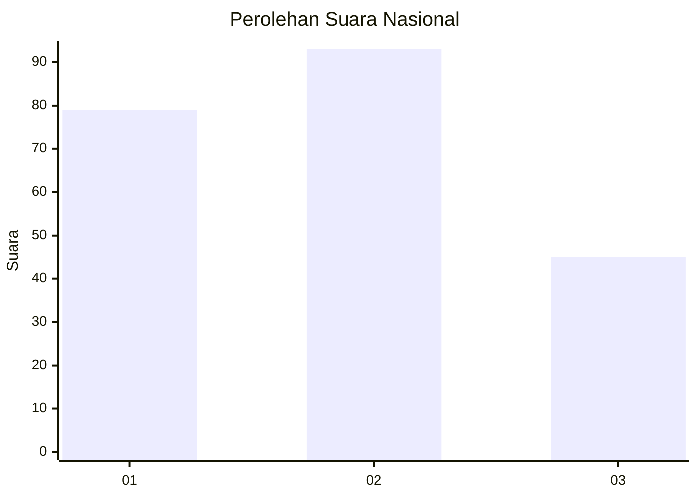
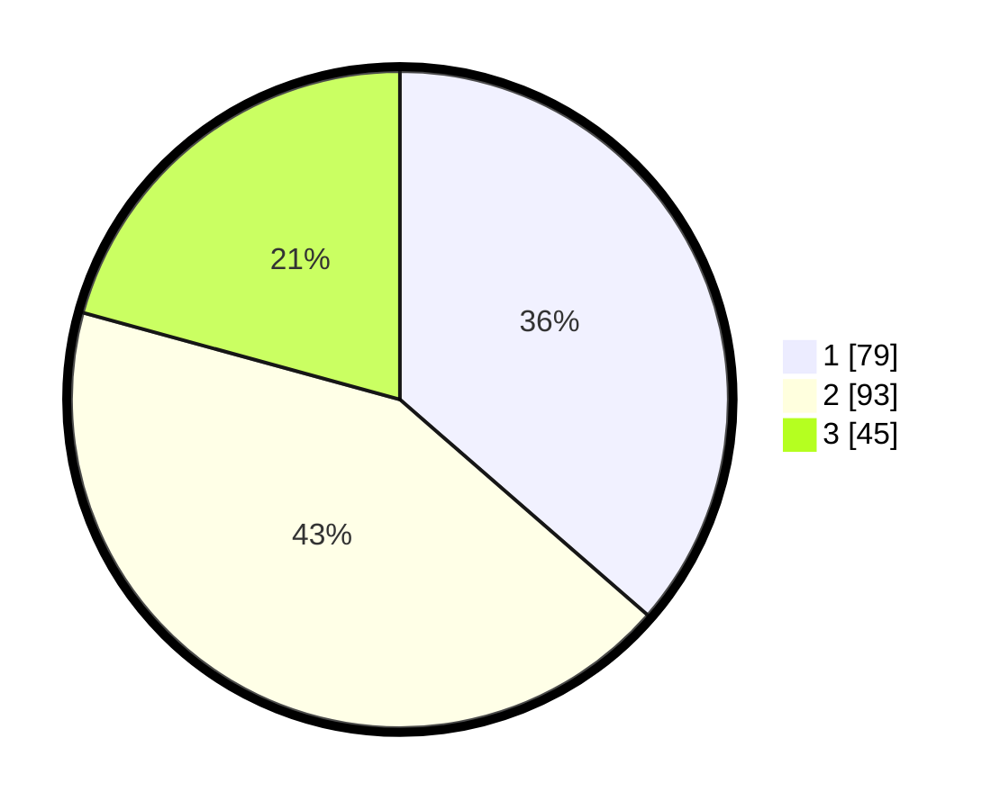

# Hasil

## Grafik

## Tabel

| No.    | Nama Paslon    | Suara | Suara (raw) | Persentase |
|:------ |:-------------- | -----:| -----------:| ----------:|
| 100025 | ANIES MUHAIMIN | 79    | [79][p-1]   | 36,41      |
| 100026 | PRABOWO GIBRAN | 93    | [93][p-2]   | 42,86      |
| 100027 | GANJAR MAHFUD  | 45    | [45][p-3]   | 20,74      |

[p-1]: https://github.com/gigit-pemilu/pemilu-2024/blob/main/pilpres/hitung-suara/sub/31-dki-jakarta/sub/72-jakarta-utara/sub/03-koja/sub/1001-koja/sub/018-tps/sub/paslon-1.txt
[p-2]: https://github.com/gigit-pemilu/pemilu-2024/blob/main/pilpres/hitung-suara/sub/31-dki-jakarta/sub/72-jakarta-utara/sub/03-koja/sub/1001-koja/sub/018-tps/sub/paslon-2.txt
[p-3]: https://github.com/gigit-pemilu/pemilu-2024/blob/main/pilpres/hitung-suara/sub/31-dki-jakarta/sub/72-jakarta-utara/sub/03-koja/sub/1001-koja/sub/018-tps/sub/paslon-3.txt

## Foto C Plano

https://sirekap-obj-formc.kpu.go.id/703e/pemilu/ppwp/31/72/03/10/01/3172031001018-20240214-212220--0a44ad70-e126-4cc4-95eb-a1acdf5ba5b8.jpg

https://sirekap-obj-formc.kpu.go.id/703e/pemilu/ppwp/31/72/03/10/01/3172031001018-20240214-212354--a6207d28-f5f3-47a0-afc7-b2343d4a3067.jpg

https://sirekap-obj-formc.kpu.go.id/703e/pemilu/ppwp/31/72/03/10/01/3172031001018-20240214-212452--43e3fde8-0779-403b-aa09-948d76b302b1.jpg

## Metadata

| Key        | Value               |
| ---------- | ------------------- |
| Time Stamp | 2024-02-20 15:00:00 |

