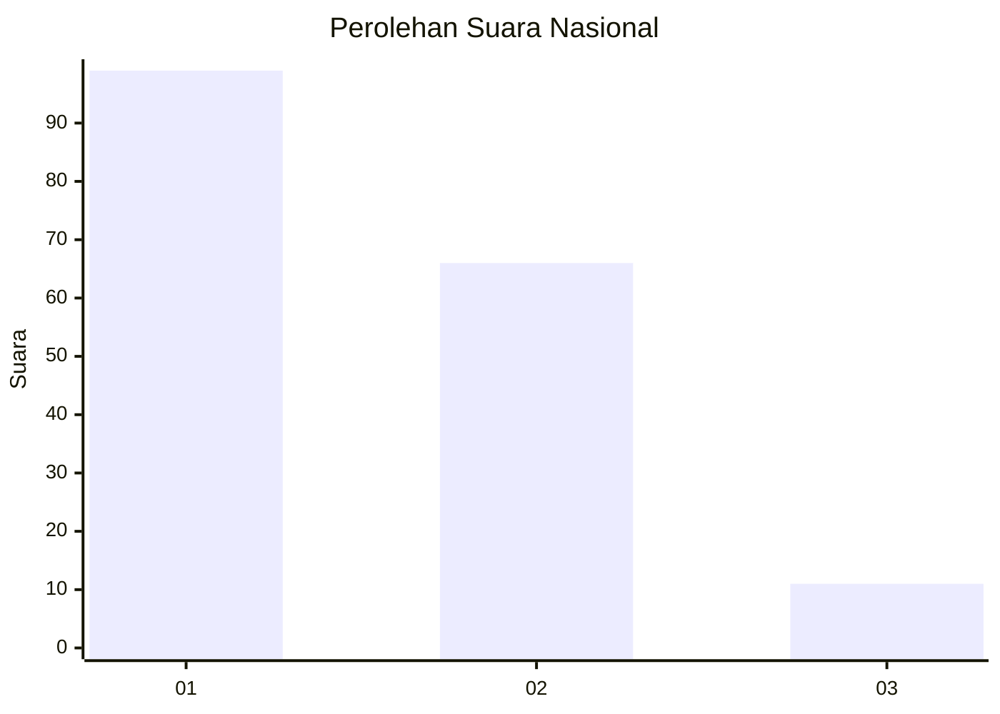
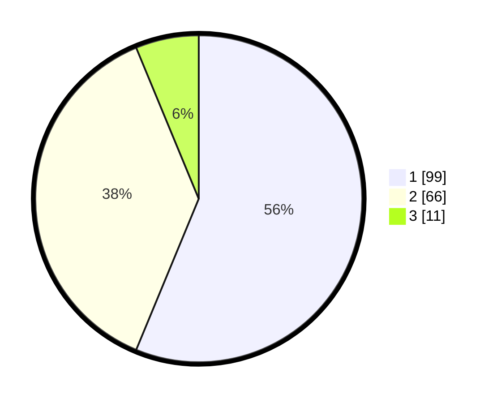

# Hasil

## Grafik

## Tabel

| No.    | Nama Paslon    | Suara | Suara (raw) | Persentase |
|:------ |:-------------- | -----:| -----------:| ----------:|
| 100025 | ANIES MUHAIMIN | 99    | [99][p-1]   | 56,25      |
| 100026 | PRABOWO GIBRAN | 66    | [66][p-2]   | 37,50      |
| 100027 | GANJAR MAHFUD  | 11    | [11][p-3]   | 6,25       |

[p-1]: https://github.com/gigit-pemilu/pemilu-2024/blob/main/pilpres/hitung-suara/sub/31-dki-jakarta/sub/72-jakarta-utara/sub/03-koja/sub/1001-koja/sub/038-tps/sub/paslon-1.txt
[p-2]: https://github.com/gigit-pemilu/pemilu-2024/blob/main/pilpres/hitung-suara/sub/31-dki-jakarta/sub/72-jakarta-utara/sub/03-koja/sub/1001-koja/sub/038-tps/sub/paslon-2.txt
[p-3]: https://github.com/gigit-pemilu/pemilu-2024/blob/main/pilpres/hitung-suara/sub/31-dki-jakarta/sub/72-jakarta-utara/sub/03-koja/sub/1001-koja/sub/038-tps/sub/paslon-3.txt

## Foto C Plano

https://sirekap-obj-formc.kpu.go.id/3021/pemilu/ppwp/31/72/03/10/01/3172031001038-20240214-221340--3258658f-72d3-4acd-813d-837bc6347cad.jpg

https://sirekap-obj-formc.kpu.go.id/3021/pemilu/ppwp/31/72/03/10/01/3172031001038-20240214-221529--12be661f-16f1-4e8d-8279-801d81cf2de9.jpg

https://sirekap-obj-formc.kpu.go.id/3021/pemilu/ppwp/31/72/03/10/01/3172031001038-20240214-221749--0571eeba-0c45-4be7-9429-4735707c769f.jpg

## Metadata

| Key        | Value               |
| ---------- | ------------------- |
| Time Stamp | 2024-02-20 16:00:00 |

