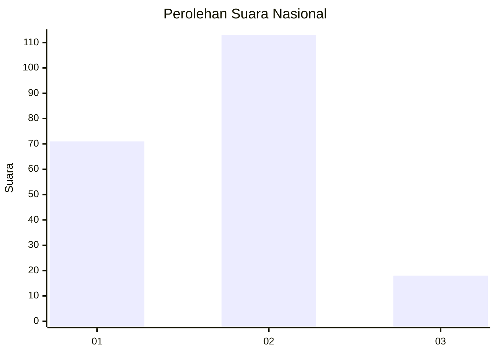
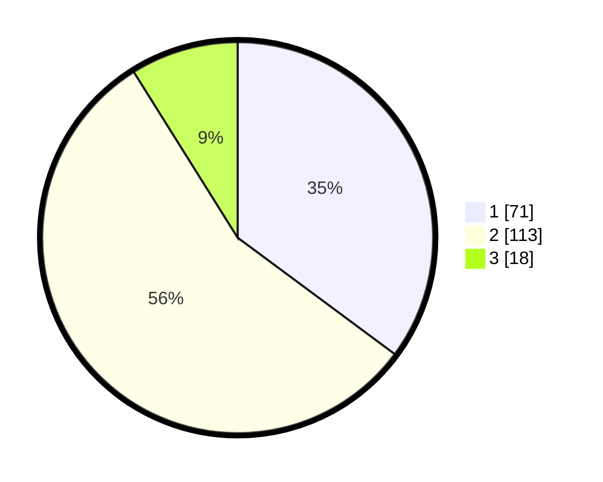

# Hasil

## Grafik

## Tabel

| No.    | Nama Paslon    | Suara | Suara (raw) | Persentase |
|:------ |:-------------- | -----:| -----------:| ----------:|
| 100025 | ANIES MUHAIMIN | 71    | [71][p-1]   | 35,15      |
| 100026 | PRABOWO GIBRAN | 113   | [113][p-2]  | 55,94      |
| 100027 | GANJAR MAHFUD  | 18    | [18][p-3]   | 8,91       |

[p-1]: https://github.com/gigit-pemilu/pemilu-2024/blob/main/pilpres/hitung-suara/sub/31-dki-jakarta/sub/72-jakarta-utara/sub/03-koja/sub/1001-koja/sub/054-tps/sub/paslon-1.txt
[p-2]: https://github.com/gigit-pemilu/pemilu-2024/blob/main/pilpres/hitung-suara/sub/31-dki-jakarta/sub/72-jakarta-utara/sub/03-koja/sub/1001-koja/sub/054-tps/sub/paslon-2.txt
[p-3]: https://github.com/gigit-pemilu/pemilu-2024/blob/main/pilpres/hitung-suara/sub/31-dki-jakarta/sub/72-jakarta-utara/sub/03-koja/sub/1001-koja/sub/054-tps/sub/paslon-3.txt

## Foto C Plano

https://sirekap-obj-formc.kpu.go.id/8d86/pemilu/ppwp/31/72/03/10/01/3172031001054-20240214-162232--db446cb8-2813-46ff-985c-98d00e34b6d0.jpg

https://sirekap-obj-formc.kpu.go.id/8d86/pemilu/ppwp/31/72/03/10/01/3172031001054-20240214-202533--168cc511-0983-4b04-84a7-b3185080be88.jpg

https://sirekap-obj-formc.kpu.go.id/8d86/pemilu/ppwp/31/72/03/10/01/3172031001054-20240214-202558--ae1a37ab-7314-44ab-9f2f-1bd16bc8266e.jpg

## Metadata

| Key        | Value               |
| ---------- | ------------------- |
| Time Stamp | 2024-02-20 16:00:00 |

