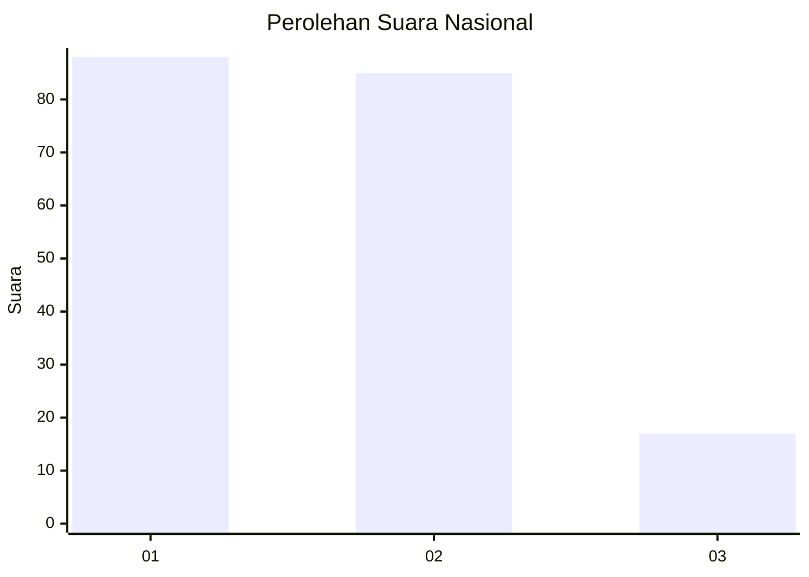
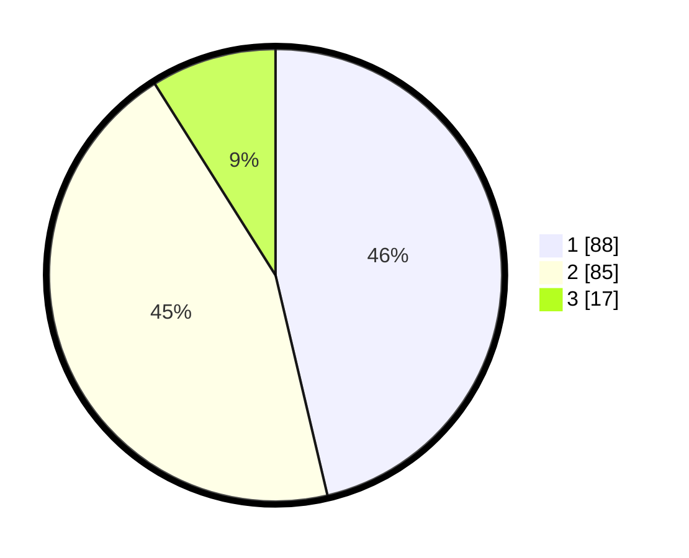

# Hasil

## Grafik

## Tabel

| No.    | Nama Paslon    | Suara | Suara (raw) | Persentase |
|:------ |:-------------- | -----:| -----------:| ----------:|
| 100025 | ANIES MUHAIMIN | 88    | [88][p-1]   | 46,32      |
| 100026 | PRABOWO GIBRAN | 85    | [85][p-2]   | 44,74      |
| 100027 | GANJAR MAHFUD  | 17    | [17][p-3]   | 8,95       |

[p-1]: https://github.com/gigit-pemilu/pemilu-2024/blob/main/pilpres/hitung-suara/sub/31-dki-jakarta/sub/72-jakarta-utara/sub/03-koja/sub/1001-koja/sub/058-tps/sub/paslon-1.txt
[p-2]: https://github.com/gigit-pemilu/pemilu-2024/blob/main/pilpres/hitung-suara/sub/31-dki-jakarta/sub/72-jakarta-utara/sub/03-koja/sub/1001-koja/sub/058-tps/sub/paslon-2.txt
[p-3]: https://github.com/gigit-pemilu/pemilu-2024/blob/main/pilpres/hitung-suara/sub/31-dki-jakarta/sub/72-jakarta-utara/sub/03-koja/sub/1001-koja/sub/058-tps/sub/paslon-3.txt

## Foto C Plano

https://sirekap-obj-formc.kpu.go.id/11d0/pemilu/ppwp/31/72/03/10/01/3172031001058-20240214-230535--4e385aee-5d53-46d2-a481-bee9e4339a06.jpg

https://sirekap-obj-formc.kpu.go.id/11d0/pemilu/ppwp/31/72/03/10/01/3172031001058-20240214-230557--50c4b55e-2561-45ca-a6b0-fed61f49b1ca.jpg

https://sirekap-obj-formc.kpu.go.id/11d0/pemilu/ppwp/31/72/03/10/01/3172031001058-20240214-230619--8f3fc762-11e5-473f-99f0-8ffeacdaa210.jpg

## Metadata

| Key        | Value               |
| ---------- | ------------------- |
| Time Stamp | 2024-02-20 16:00:00 |

