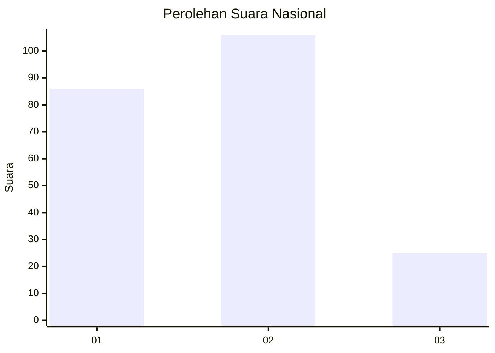
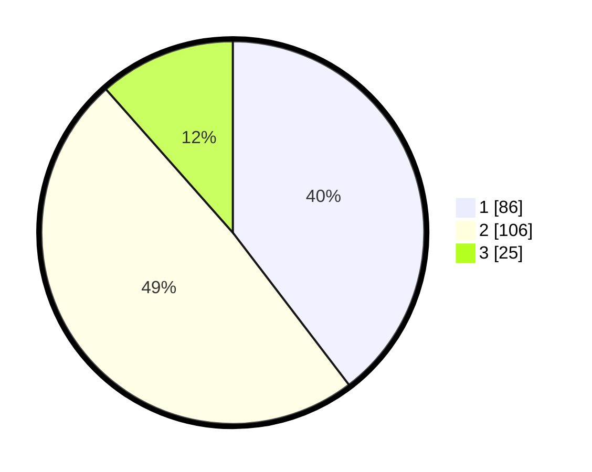

# Hasil

## Grafik

## Tabel

| No.    | Nama Paslon    | Suara | Suara (raw) | Persentase |
|:------ |:-------------- | -----:| -----------:| ----------:|
| 100025 | ANIES MUHAIMIN | 86    | [86][p-1]   | 39,63      |
| 100026 | PRABOWO GIBRAN | 106   | [106][p-2]  | 48,85      |
| 100027 | GANJAR MAHFUD  | 25    | [25][p-3]   | 11,52      |

[p-1]: https://github.com/gigit-pemilu/pemilu-2024/blob/main/pilpres/hitung-suara/sub/31-dki-jakarta/sub/72-jakarta-utara/sub/03-koja/sub/1002-tugu-utara/sub/021-tps/sub/paslon-1.txt
[p-2]: https://github.com/gigit-pemilu/pemilu-2024/blob/main/pilpres/hitung-suara/sub/31-dki-jakarta/sub/72-jakarta-utara/sub/03-koja/sub/1002-tugu-utara/sub/021-tps/sub/paslon-2.txt
[p-3]: https://github.com/gigit-pemilu/pemilu-2024/blob/main/pilpres/hitung-suara/sub/31-dki-jakarta/sub/72-jakarta-utara/sub/03-koja/sub/1002-tugu-utara/sub/021-tps/sub/paslon-3.txt

## Foto C Plano

https://sirekap-obj-formc.kpu.go.id/30a7/pemilu/ppwp/31/72/03/10/02/3172031002021-20240214-191432--09d9d69e-80d4-4969-90ec-30a3fea50a04.jpg

https://sirekap-obj-formc.kpu.go.id/30a7/pemilu/ppwp/31/72/03/10/02/3172031002021-20240214-184927--45e67e48-233b-46aa-bb97-7b228df386b2.jpg

https://sirekap-obj-formc.kpu.go.id/30a7/pemilu/ppwp/31/72/03/10/02/3172031002021-20240214-191135--29c005b7-aeb8-4795-8d82-a577e7ed7504.jpg

## Metadata

| Key        | Value               |
| ---------- | ------------------- |
| Time Stamp | 2024-02-20 16:00:00 |

