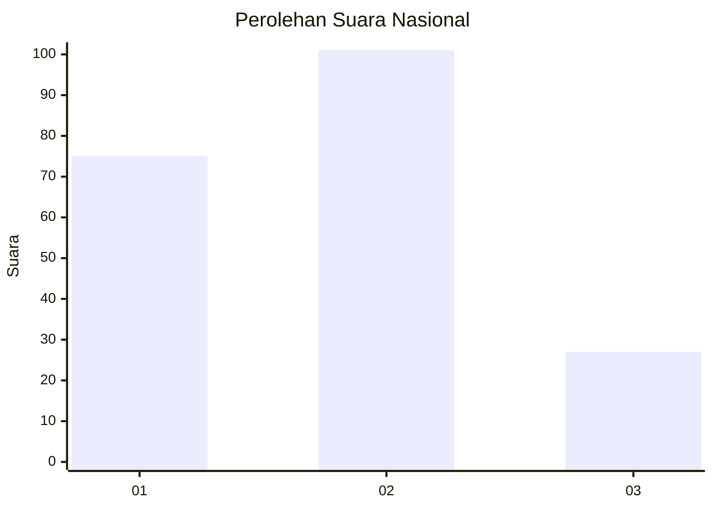
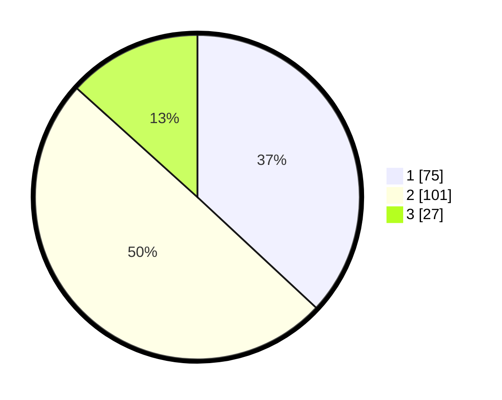

# Hasil

## Grafik

## Tabel

| No.    | Nama Paslon    | Suara | Suara (raw) | Persentase |
|:------ |:-------------- | -----:| -----------:| ----------:|
| 100025 | ANIES MUHAIMIN | 75    | [75][p-1]   | 36,95      |
| 100026 | PRABOWO GIBRAN | 101   | [101][p-2]  | 49,75      |
| 100027 | GANJAR MAHFUD  | 27    | [27][p-3]   | 13,30      |

[p-1]: https://github.com/gigit-pemilu/pemilu-2024/blob/main/pilpres/hitung-suara/sub/31-dki-jakarta/sub/72-jakarta-utara/sub/03-koja/sub/1002-tugu-utara/sub/034-tps/sub/paslon-1.txt
[p-2]: https://github.com/gigit-pemilu/pemilu-2024/blob/main/pilpres/hitung-suara/sub/31-dki-jakarta/sub/72-jakarta-utara/sub/03-koja/sub/1002-tugu-utara/sub/034-tps/sub/paslon-2.txt
[p-3]: https://github.com/gigit-pemilu/pemilu-2024/blob/main/pilpres/hitung-suara/sub/31-dki-jakarta/sub/72-jakarta-utara/sub/03-koja/sub/1002-tugu-utara/sub/034-tps/sub/paslon-3.txt

## Foto C Plano

https://sirekap-obj-formc.kpu.go.id/dd68/pemilu/ppwp/31/72/03/10/02/3172031002034-20240215-032944--2c9b9bf2-95c2-4585-8101-3e2117b56bca.jpg

https://sirekap-obj-formc.kpu.go.id/dd68/pemilu/ppwp/31/72/03/10/02/3172031002034-20240215-032901--c06ff9b6-df7d-465a-8909-6b71a1cccabd.jpg

https://sirekap-obj-formc.kpu.go.id/dd68/pemilu/ppwp/31/72/03/10/02/3172031002034-20240215-032815--fff67573-f6e0-4ba7-b4b1-4f7e9f2d1c37.jpg

## Metadata

| Key        | Value               |
| ---------- | ------------------- |
| Time Stamp | 2024-02-20 16:00:00 |

