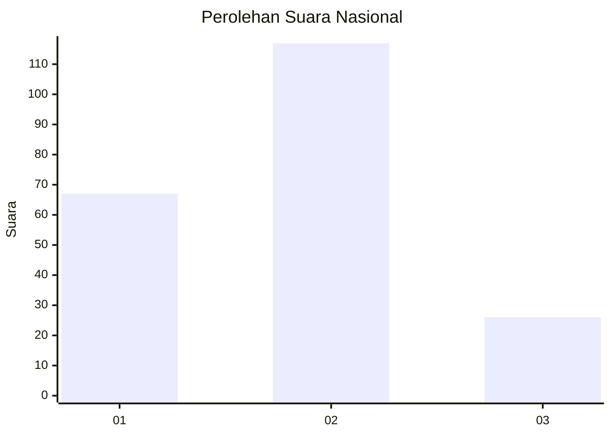
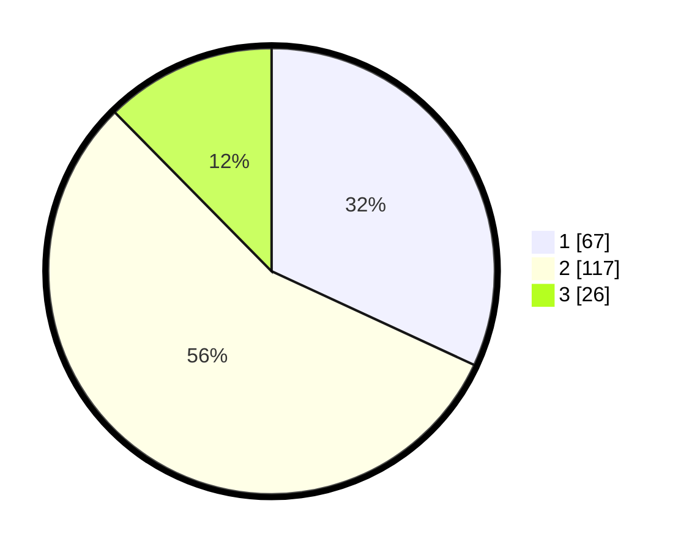

# Hasil

## Grafik

## Tabel

| No.    | Nama Paslon    | Suara | Suara (raw) | Persentase |
|:------ |:-------------- | -----:| -----------:| ----------:|
| 100025 | ANIES MUHAIMIN | 67    | [67][p-1]   | 31,90      |
| 100026 | PRABOWO GIBRAN | 117   | [117][p-2]  | 55,71      |
| 100027 | GANJAR MAHFUD  | 26    | [26][p-3]   | 12,38      |

[p-1]: https://github.com/gigit-pemilu/pemilu-2024/blob/main/pilpres/hitung-suara/sub/31-dki-jakarta/sub/72-jakarta-utara/sub/03-koja/sub/1002-tugu-utara/sub/058-tps/sub/paslon-1.txt
[p-2]: https://github.com/gigit-pemilu/pemilu-2024/blob/main/pilpres/hitung-suara/sub/31-dki-jakarta/sub/72-jakarta-utara/sub/03-koja/sub/1002-tugu-utara/sub/058-tps/sub/paslon-2.txt
[p-3]: https://github.com/gigit-pemilu/pemilu-2024/blob/main/pilpres/hitung-suara/sub/31-dki-jakarta/sub/72-jakarta-utara/sub/03-koja/sub/1002-tugu-utara/sub/058-tps/sub/paslon-3.txt

## Foto C Plano

https://sirekap-obj-formc.kpu.go.id/248b/pemilu/ppwp/31/72/03/10/02/3172031002058-20240214-204807--b1720818-9d33-4837-9f17-e4da1a47ee9b.jpg

https://sirekap-obj-formc.kpu.go.id/248b/pemilu/ppwp/31/72/03/10/02/3172031002058-20240214-205959--15a7c552-f70b-4c4a-83a6-22b75b0d731a.jpg

https://sirekap-obj-formc.kpu.go.id/248b/pemilu/ppwp/31/72/03/10/02/3172031002058-20240214-210159--98e0dfdd-a71f-418a-adf6-e6bb359996a2.jpg

## Metadata

| Key        | Value               |
| ---------- | ------------------- |
| Time Stamp | 2024-02-20 16:00:00 |

