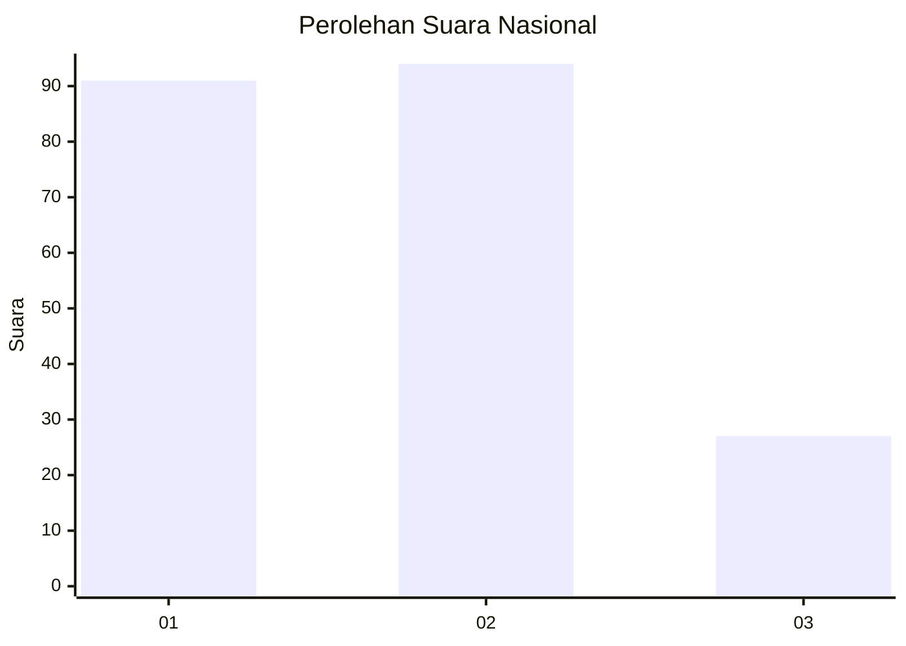
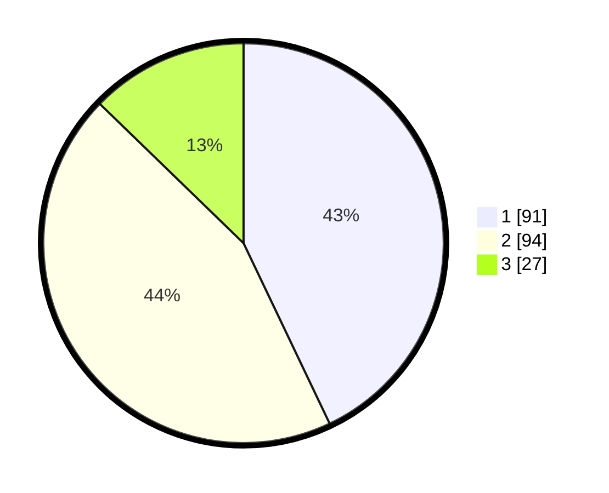

# Hasil

## Grafik

## Tabel

| No.    | Nama Paslon    | Suara | Suara (raw) | Persentase |
|:------ |:-------------- | -----:| -----------:| ----------:|
| 100025 | ANIES MUHAIMIN | 91    | [91][p-1]   | 42,92      |
| 100026 | PRABOWO GIBRAN | 94    | [94][p-2]   | 44,34      |
| 100027 | GANJAR MAHFUD  | 27    | [27][p-3]   | 12,74      |

[p-1]: https://github.com/gigit-pemilu/pemilu-2024/blob/main/pilpres/hitung-suara/sub/31-dki-jakarta/sub/72-jakarta-utara/sub/03-koja/sub/1002-tugu-utara/sub/063-tps/sub/paslon-1.txt
[p-2]: https://github.com/gigit-pemilu/pemilu-2024/blob/main/pilpres/hitung-suara/sub/31-dki-jakarta/sub/72-jakarta-utara/sub/03-koja/sub/1002-tugu-utara/sub/063-tps/sub/paslon-2.txt
[p-3]: https://github.com/gigit-pemilu/pemilu-2024/blob/main/pilpres/hitung-suara/sub/31-dki-jakarta/sub/72-jakarta-utara/sub/03-koja/sub/1002-tugu-utara/sub/063-tps/sub/paslon-3.txt

## Foto C Plano

https://sirekap-obj-formc.kpu.go.id/3de8/pemilu/ppwp/31/72/03/10/02/3172031002063-20240214-215358--e8026767-3ef4-4da7-bfeb-f9c329ebba5a.jpg

https://sirekap-obj-formc.kpu.go.id/3de8/pemilu/ppwp/31/72/03/10/02/3172031002063-20240214-215525--ab918c9b-beff-418e-8a3e-a8a0adc8d730.jpg

https://sirekap-obj-formc.kpu.go.id/3de8/pemilu/ppwp/31/72/03/10/02/3172031002063-20240214-215636--73540593-aa79-44ef-b82c-4793d44b724d.jpg

## Metadata

| Key        | Value               |
| ---------- | ------------------- |
| Time Stamp | 2024-02-20 16:00:00 |

