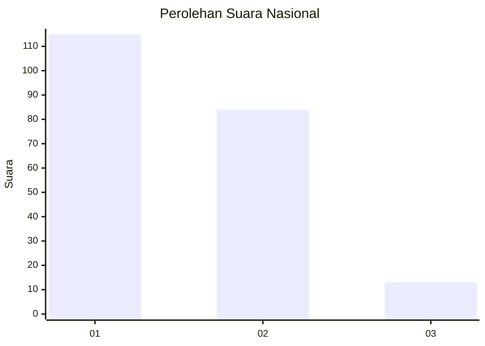
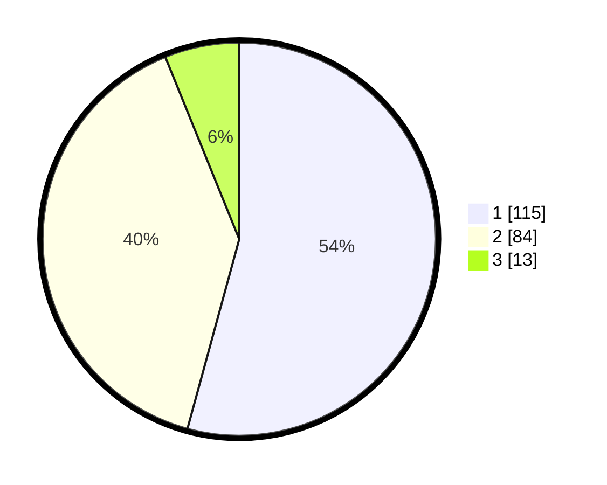

# Hasil

## Grafik

## Tabel

| No.    | Nama Paslon    | Suara | Suara (raw) | Persentase |
|:------ |:-------------- | -----:| -----------:| ----------:|
| 100025 | ANIES MUHAIMIN | 115   | [115][p-1]  | 54,25      |
| 100026 | PRABOWO GIBRAN | 84    | [84][p-2]   | 39,62      |
| 100027 | GANJAR MAHFUD  | 13    | [13][p-3]   | 6,13       |

[p-1]: https://github.com/gigit-pemilu/pemilu-2024/blob/main/pilpres/hitung-suara/sub/31-dki-jakarta/sub/72-jakarta-utara/sub/03-koja/sub/1002-tugu-utara/sub/088-tps/sub/paslon-1.txt
[p-2]: https://github.com/gigit-pemilu/pemilu-2024/blob/main/pilpres/hitung-suara/sub/31-dki-jakarta/sub/72-jakarta-utara/sub/03-koja/sub/1002-tugu-utara/sub/088-tps/sub/paslon-2.txt
[p-3]: https://github.com/gigit-pemilu/pemilu-2024/blob/main/pilpres/hitung-suara/sub/31-dki-jakarta/sub/72-jakarta-utara/sub/03-koja/sub/1002-tugu-utara/sub/088-tps/sub/paslon-3.txt

## Foto C Plano

https://sirekap-obj-formc.kpu.go.id/b401/pemilu/ppwp/31/72/03/10/02/3172031002088-20240215-013857--2661ee8b-00a7-43ad-9c11-7cc1054abf86.jpg

https://sirekap-obj-formc.kpu.go.id/b401/pemilu/ppwp/31/72/03/10/02/3172031002088-20240215-114227--130686d7-ee2c-49a5-b943-6f0bf0af649d.jpg

https://sirekap-obj-formc.kpu.go.id/b401/pemilu/ppwp/31/72/03/10/02/3172031002088-20240215-115329--13efd3ca-05a3-4e66-8b7b-97f763571706.jpg

## Metadata

| Key        | Value               |
| ---------- | ------------------- |
| Time Stamp | 2024-02-20 16:00:00 |

