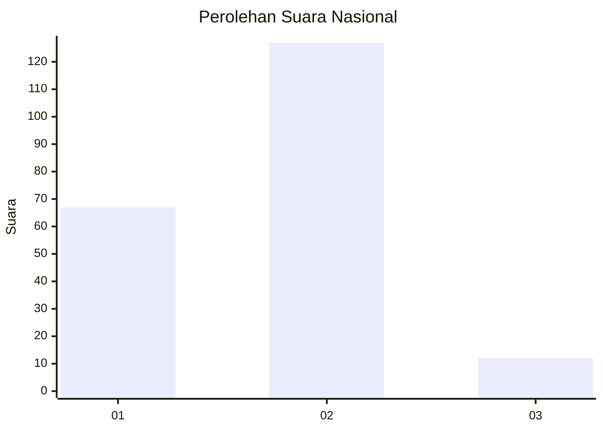
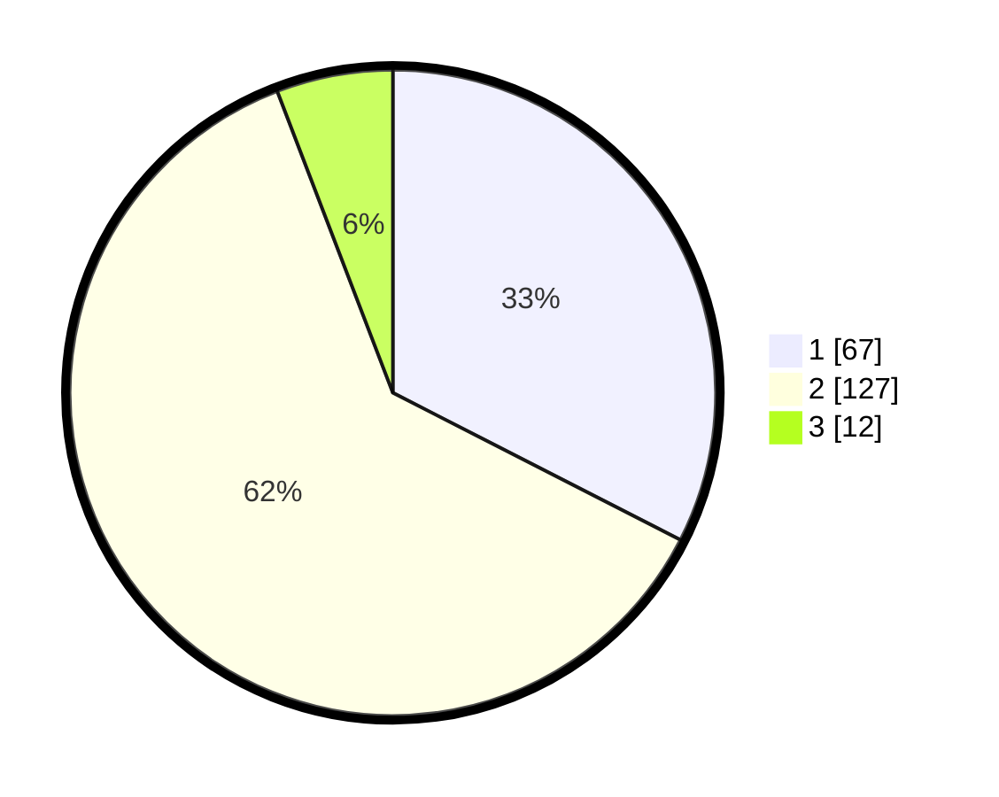

# Hasil

## Grafik

## Tabel

| No.    | Nama Paslon    | Suara | Suara (raw) | Persentase |
|:------ |:-------------- | -----:| -----------:| ----------:|
| 100025 | ANIES MUHAIMIN | 67    | [67][p-1]   | 32,52      |
| 100026 | PRABOWO GIBRAN | 127   | [127][p-2]  | 61,65      |
| 100027 | GANJAR MAHFUD  | 12    | [12][p-3]   | 5,83       |

[p-1]: https://github.com/gigit-pemilu/pemilu-2024/blob/main/pilpres/hitung-suara/sub/31-dki-jakarta/sub/72-jakarta-utara/sub/03-koja/sub/1002-tugu-utara/sub/094-tps/sub/paslon-1.txt
[p-2]: https://github.com/gigit-pemilu/pemilu-2024/blob/main/pilpres/hitung-suara/sub/31-dki-jakarta/sub/72-jakarta-utara/sub/03-koja/sub/1002-tugu-utara/sub/094-tps/sub/paslon-2.txt
[p-3]: https://github.com/gigit-pemilu/pemilu-2024/blob/main/pilpres/hitung-suara/sub/31-dki-jakarta/sub/72-jakarta-utara/sub/03-koja/sub/1002-tugu-utara/sub/094-tps/sub/paslon-3.txt

## Foto C Plano

https://sirekap-obj-formc.kpu.go.id/151f/pemilu/ppwp/31/72/03/10/02/3172031002094-20240214-160103--6ca57b80-7e82-4862-a4c1-270e6907a516.jpg

https://sirekap-obj-formc.kpu.go.id/151f/pemilu/ppwp/31/72/03/10/02/3172031002094-20240214-160118--5bdc34b4-6f13-472d-b7d9-a0dde7ad16d1.jpg

https://sirekap-obj-formc.kpu.go.id/151f/pemilu/ppwp/31/72/03/10/02/3172031002094-20240214-191542--dcc87ffd-3039-474e-af38-371c188aa95a.jpg

## Metadata

| Key        | Value               |
| ---------- | ------------------- |
| Time Stamp | 2024-02-20 16:00:00 |

