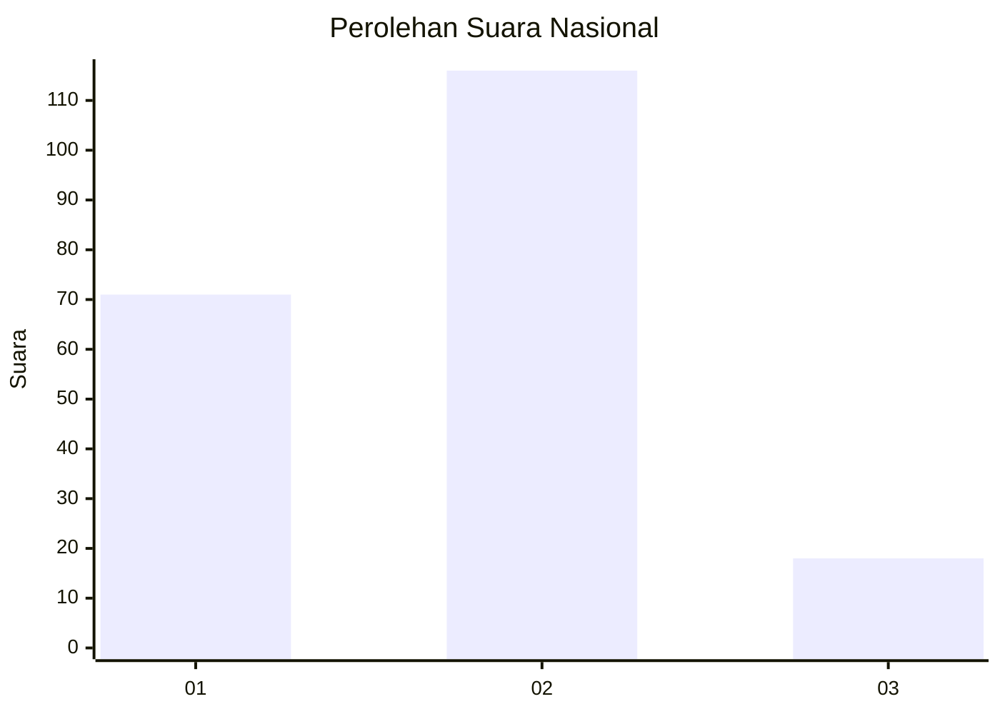
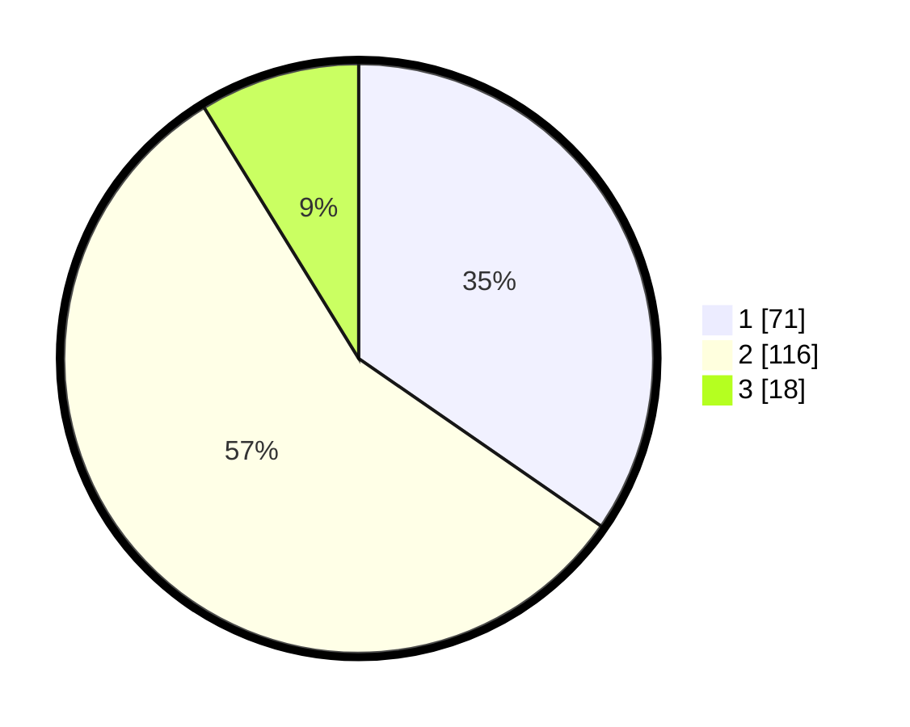

# Hasil

## Grafik

## Tabel

| No.    | Nama Paslon    | Suara | Suara (raw) | Persentase |
|:------ |:-------------- | -----:| -----------:| ----------:|
| 100025 | ANIES MUHAIMIN | 71    | [71][p-1]   | 34,63      |
| 100026 | PRABOWO GIBRAN | 116   | [116][p-2]  | 56,59      |
| 100027 | GANJAR MAHFUD  | 18    | [18][p-3]   | 8,78       |

[p-1]: https://github.com/gigit-pemilu/pemilu-2024/blob/main/pilpres/hitung-suara/sub/31-dki-jakarta/sub/72-jakarta-utara/sub/03-koja/sub/1002-tugu-utara/sub/095-tps/sub/paslon-1.txt
[p-2]: https://github.com/gigit-pemilu/pemilu-2024/blob/main/pilpres/hitung-suara/sub/31-dki-jakarta/sub/72-jakarta-utara/sub/03-koja/sub/1002-tugu-utara/sub/095-tps/sub/paslon-2.txt
[p-3]: https://github.com/gigit-pemilu/pemilu-2024/blob/main/pilpres/hitung-suara/sub/31-dki-jakarta/sub/72-jakarta-utara/sub/03-koja/sub/1002-tugu-utara/sub/095-tps/sub/paslon-3.txt

## Foto C Plano

https://sirekap-obj-formc.kpu.go.id/4edb/pemilu/ppwp/31/72/03/10/02/3172031002095-20240216-122834--091facfc-da35-49ad-8f30-03bf9c4ff9c3.jpg

https://sirekap-obj-formc.kpu.go.id/4edb/pemilu/ppwp/31/72/03/10/02/3172031002095-20240216-123028--6cde7238-dfa4-4d06-9579-de8d0c9ead0b.jpg

https://sirekap-obj-formc.kpu.go.id/4edb/pemilu/ppwp/31/72/03/10/02/3172031002095-20240214-203609--d8025602-75d8-475a-a990-e741cd34eac5.jpg

## Metadata

| Key        | Value               |
| ---------- | ------------------- |
| Time Stamp | 2024-02-20 15:00:00 |

