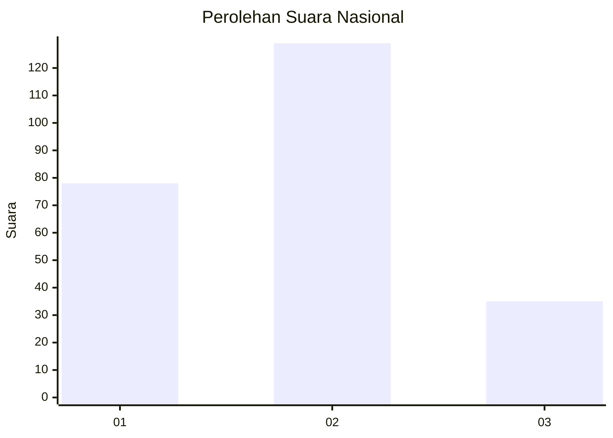
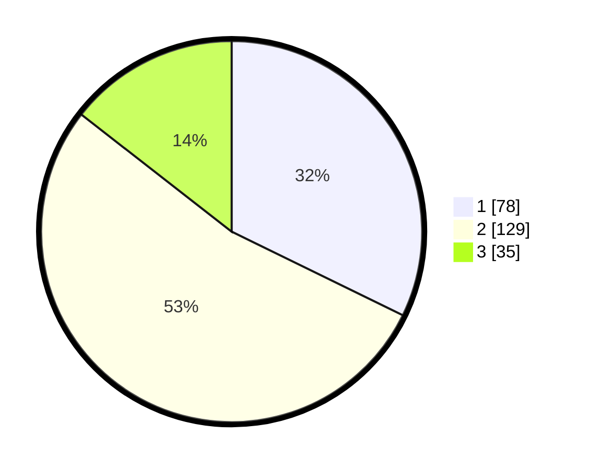

# Hasil

## Grafik

## Tabel

| No.    | Nama Paslon    | Suara | Suara (raw) | Persentase |
|:------ |:-------------- | -----:| -----------:| ----------:|
| 100025 | ANIES MUHAIMIN | 78    | [78][p-1]   | 32,23      |
| 100026 | PRABOWO GIBRAN | 129   | [129][p-2]  | 53,31      |
| 100027 | GANJAR MAHFUD  | 35    | [35][p-3]   | 14,46      |

[p-1]: https://github.com/gigit-pemilu/pemilu-2024/blob/main/pilpres/hitung-suara/sub/31-dki-jakarta/sub/72-jakarta-utara/sub/03-koja/sub/1002-tugu-utara/sub/103-tps/sub/paslon-1.txt
[p-2]: https://github.com/gigit-pemilu/pemilu-2024/blob/main/pilpres/hitung-suara/sub/31-dki-jakarta/sub/72-jakarta-utara/sub/03-koja/sub/1002-tugu-utara/sub/103-tps/sub/paslon-2.txt
[p-3]: https://github.com/gigit-pemilu/pemilu-2024/blob/main/pilpres/hitung-suara/sub/31-dki-jakarta/sub/72-jakarta-utara/sub/03-koja/sub/1002-tugu-utara/sub/103-tps/sub/paslon-3.txt

## Foto C Plano

https://sirekap-obj-formc.kpu.go.id/d4cc/pemilu/ppwp/31/72/03/10/02/3172031002103-20240215-134638--b78210c6-cfb1-4b61-9080-d6f5e6b5c65f.jpg

https://sirekap-obj-formc.kpu.go.id/d4cc/pemilu/ppwp/31/72/03/10/02/3172031002103-20240215-134645--48e3725d-fbae-48d3-af20-848a7b5cb503.jpg

https://sirekap-obj-formc.kpu.go.id/d4cc/pemilu/ppwp/31/72/03/10/02/3172031002103-20240215-174805--76d9564f-6ab0-411e-8776-70c85b2004de.jpg

## Metadata

| Key        | Value               |
| ---------- | ------------------- |
| Time Stamp | 2024-02-15 18:00:26 |

